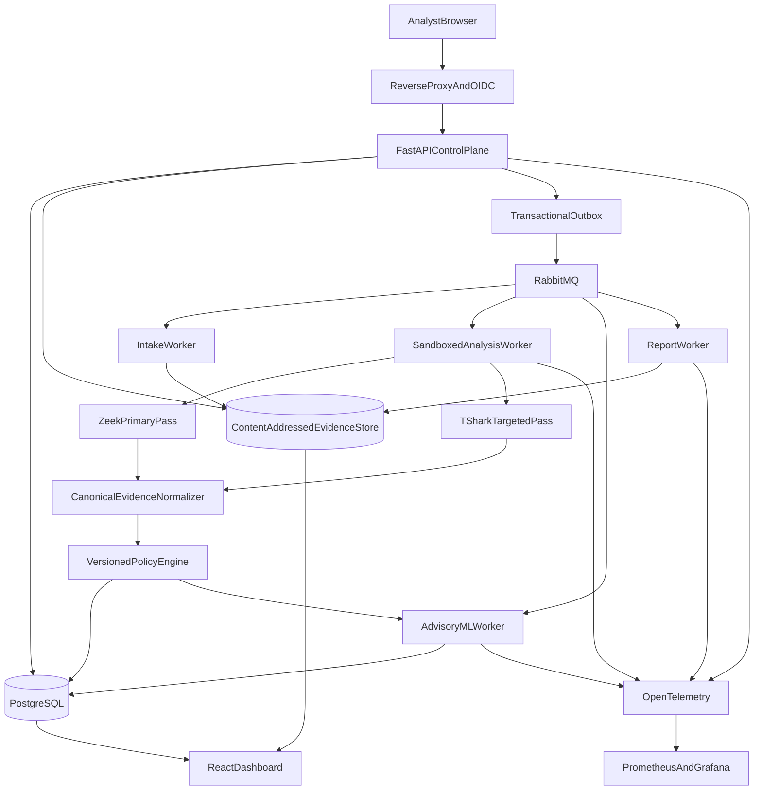

# SecureMail Technical Design

**Status:** Proposed technical baseline  
**Source requirements:** [OBJECTIVE.MD](./OBJECTIVE.MD)  
**Research cutoff:** 2 September 2026  
**Deployment assumption:** Offline/on-premise and open-source-first

## 1. Purpose

SecureMail is an AI-assisted passive network-forensics platform for assessing the
cryptographic security posture of SMTP, IMAP, and POP3 traffic captured in PCAP
or PCAPNG files.

This document:

1. maps every requested deliverable to established solutions;
2. recommends an implementable technology stack and architecture;
3. defines standard engineering, security, forensic, and ML practices; and
4. proposes enhancements and a phased delivery roadmap.

The design is **deterministic first and AI assisted**. Protocol facts and
standards-based findings are produced by versioned rules. ML may identify unusual
behavior and help prioritize work, but it must not decide whether an RFC or
cryptographic requirement was violated.

## 2. Scope and non-goals

### 2.1 In scope

- Offline ingestion of PCAP and PCAPNG evidence.
- Passive identification of SMTP, IMAP, and POP3 on standard and nonstandard
  ports.
- Best-effort bidirectional TCP stream reconstruction.
- Detection and validation of SMTP `STARTTLS`, IMAP `STARTTLS`, and POP3 `STLS`
  transitions.
- Parsing of observable TLS handshakes and X.509 certificate chains.
- Versioned cryptographic and email-policy checks.
- Evidence-linked findings, posture scoring, anomaly detection, prioritization,
  dashboards, and JSON/HTML/PDF reports.
- Single-node analyst deployments initially, with a path to multi-node scale.

### 2.2 Non-goals

- Breaking encryption or recovering plaintext without authorized key material.
- Replacing packet-level forensic tools such as Wireshark.
- Treating missing evidence as proof that a session was secure.
- Active scanning of mail servers in the default workflow.
- Automatically changing server configuration.
- Letting an ML model or LLM make final compliance, attribution, legal, or
  incident-response decisions.

### 2.3 Critical feasibility constraints

The objective uses words such as “complete” and “validate.” Passive evidence
cannot guarantee those outcomes in every capture.

1. **Capture quality limits reconstruction.** Missing packets, asymmetric
   routing, truncation, midstream capture, packet drops, conflicting
   retransmissions, or malformed fragmentation can make a stream incomplete or
   ambiguous.
2. **TLS 1.3 hides most handshake messages.** Messages after `ServerHello`,
   including the server certificate, are encrypted. Without authorized session
   secrets or equivalent endpoint telemetry, certificate extraction and
   certificate-signature analysis are normally unavailable for TLS 1.3.
3. **ECH further reduces passive visibility.** Encrypted ClientHello can hide
   SNI and other client-hello metadata used for endpoint identity and
   correlation.
4. **Historical certificate validation needs historical context.** A defensible
   “valid at capture time” result requires the capture timestamp, reference
   identity, trust-store snapshot, intermediates, and time-appropriate revocation
   evidence. SMTP relay policy may also require historical MX, DNSSEC/TLSA, or
   MTA-STS evidence.
5. **Opportunistic SMTP is context dependent.** Cleartext fallback on port 25 is
   not by itself proof of non-compliance unless DANE, MTA-STS, REQUIRETLS, or an
   organizational policy required authenticated TLS.

SecureMail must use explicit evidence states:

- `observed`: directly decoded from captured bytes;
- `verified`: independently checked against a named policy or trust source;
- `inferred`: derived from observable protocol facts;
- `incomplete`: affected by capture loss or truncation;
- `conflicting`: multiple valid reconstructions or evidence sources disagree;
- `not_observable`: encrypted or absent from the capture by protocol design;
- `indeterminate`: required context is unavailable.

“No weakness detected” must never be rendered as “secure” when relevant checks
are incomplete, not observable, or indeterminate.

## 3. Established solution landscape

No established open-source or commercial product was verified to provide the
full requested workflow as one integrated, email-specific application. SecureMail
should integrate mature analyzers and build only the normalization, policy,
scoring, evidence, and workflow layers that are specific to this objective.

### 3.1 Recommended foundation

| Solution | Role | Maturity | License | Decision |
|---|---|---:|---|---|
| [Zeek](https://zeek.org/) | Stateful connection, email-protocol, TLS, and X.509 metadata analysis | High | BSD-style | Primary analyzer |
| [TShark/Wireshark](https://www.wireshark.org/docs/man-pages/tshark.html) | Deep protocol decoding, reassembly cross-checks, frame-level evidence, PCAPNG tooling | High | GPL-2.0-or-later | Targeted second pass and analyst verification |
| [Arkime](https://arkime.com/) | Searchable packet/session retention and PCAP pivoting | High | Apache-2.0 | Optional production integration |
| [Malcolm](https://github.com/cisagov/Malcolm) | Integrated Zeek, Suricata, Arkime, and OpenSearch reference deployment | High but resource-heavy | Apache-2.0 umbrella; components vary | Prototype/reference, not the SecureMail domain layer |
| [Suricata](https://suricata.io/) | IDS corroboration, SMTP/TLS telemetry, signatures, EVE JSON | High | GPL-2.0 | Optional phase-two evidence source |
| [nDPI](https://github.com/ntop/nDPI) | Port-independent protocol classification and supplemental TLS risk signals | High | LGPL-3.0 | Optional classifier |
| [Python cryptography](https://cryptography.io/en/latest/x509/verification/) | X.509 parsing and policy-controlled path validation | High | Apache-2.0/BSD | Primary application library |
| [OpenSSL](https://docs.openssl.org/) | Low-level certificate verification and independent cross-check | High | Apache-2.0 | Adapter/diagnostic tool |
| [pkilint](https://github.com/digicert/pkilint) | RFC 5280 and profile linting | Medium-high | MIT | Optional structural linting |
| [ZLint](https://github.com/zmap/zlint) | Web-PKI and CA/B Forum certificate linting | High for Web PKI | Apache-2.0 | Optional; filter irrelevant Web-PKI rules |
| [OpenSearch](https://opensearch.org/) | Distributed search, faceting, dashboards, and anomaly detection | High | Apache-2.0 | Defer until PostgreSQL limits are measured |
| [scikit-learn](https://scikit-learn.org/stable/modules/outlier_detection.html) | Transparent statistical and anomaly models | High | BSD-3-Clause | Primary ML library |
| [River](https://riverml.xyz/) | Online/streaming anomaly models | Medium-high | BSD-3-Clause | Future continuous-ingestion option |
| [WeasyPrint](https://weasyprint.org/) | HTML-to-PDF rendering | High | BSD-3-Clause | Primary PDF renderer |

### 3.2 Alternatives and commercial benchmarks

- **NetworkMiner** is useful for analyst cross-checking and reconstructed mail
  artifacts. Some automation and PCAPNG features are edition dependent; it is
  not a complete cryptographic posture engine.
- **Xplico** demonstrates reconstruction of SMTP, IMAP, and POP3 content, but its
  age and narrower maintenance profile make it a validation reference rather
  than a primary dependency.
- **Security Onion** and **Malcolm** demonstrate mature SOC integration around
  Zeek, Suricata, packet retention, and dashboards. Neither supplies the
  email-specific policy, historical PKI, confidence, and report model required
  here.
- **Corelight** is the closest commercial benchmark for operationalized
  Zeek-derived telemetry and air-gapped network security monitoring.
- **ExtraHop RevealX**, **NetWitness Network**, **Darktrace**, **Vectra AI**, and
  **Stamus Clear NDR** are useful benchmarks for packet analytics, NDR,
  behavior baselining, and prioritization. Their proprietary models and
  licensing conflict with the open-source-first requirement, and no reviewed
  vendor documentation established the complete SecureMail deliverable set.
- **EndaceProbe** is relevant when lossless, high-rate capture retention is
  required, but it is a capture appliance rather than an email cryptographic
  posture analyzer.

Commercial products should be used as product-quality benchmarks, not assumed to
provide protocol coverage or forensic guarantees without a proof of concept.

## 4. Deliverable-to-solution assessment

### 4.1 Email protocol and stream processing

| Objective deliverable | Established capability | SecureMail responsibility | Delivery status |
|---|---|---|---|
| Identify SMTP, IMAP, and POP3 | Zeek protocol analyzers; TShark dissectors; optional nDPI classification | Normalize evidence, add confidence, resolve analyzer disagreement, and support nonstandard ports | MVP |
| Detect and validate STARTTLS/STLS | Zeek email events and TShark command/response fields | Implement protocol-specific state machines for advertised → requested → accepted → TLS, plaintext fallback, repeated upgrade, and post-upgrade command errors | MVP |
| Reconstruct complete TCP streams | Zeek and TShark perform stateful TCP reassembly | Record gaps, truncation, retransmissions, overlap conflicts, direction, and reconstruction confidence; preserve ambiguity | MVP, best effort |
| Identify implicit TLS | Zeek/TShark TLS plus service/port metadata | Correlate ports 465/993/995 with decoded protocol and avoid port-only conclusions | MVP |

STARTTLS validation must be protocol aware:

- SMTP: inspect `EHLO` capabilities, `STARTTLS`, the `220` response, immediate
  TLS transition, and fresh post-TLS `EHLO`.
- IMAP: inspect capabilities, tagged `STARTTLS` command and response, prevent
  commands during the transition, and expect capability refresh.
- POP3: inspect `CAPA`, `STLS`, authorization state, positive response, and
  capability refresh.

A passive trace can detect evidence consistent with stripping or downgrade, but
cannot prove that an attacker removed a capability unless a trustworthy expected
policy or historical baseline is available.

### 4.2 TLS and cryptographic metadata

| Objective deliverable | Established capability | SecureMail responsibility | Delivery status |
|---|---|---|---|
| Reconstruct TLS handshakes | Zeek summarizes; TShark exposes detailed handshake trees | Build canonical handshake records with frame references and visibility flags | MVP where observable |
| Detect negotiated TLS version | Zeek, TShark, and Suricata fields | Resolve legacy record version versus `supported_versions`; evaluate against effective-dated policy | MVP |
| Identify negotiated cipher suite | Zeek/TShark extraction and IANA registry | Versioned IANA mapping and policy evaluation; do not treat “registered” as “secure” | MVP |
| Identify key exchange | TShark key-share/group/signature fields; Zeek selected curve/group data | Infer exchange by TLS version; TLS 1.3 cipher-suite names do not encode key exchange or authentication | MVP where observable |
| Detect deprecated protocols and algorithms | IETF/NIST rules can evaluate extracted facts | Maintain signed, effective-dated rule packs and separate IETF, NIST, historical, and organization profiles | MVP |
| Identify insecure configurations | General analyzers expose facts but not full email context | Build rules for cleartext authentication, failed upgrade, fallback, identity errors, missing policy evidence, and role-specific behavior | MVP |
| Assess forward secrecy | Exchange/group/PSK facts can often be extracted | Report TLS-version-aware result and `indeterminate` for ticket-key reuse, ephemeral-key reuse, or missing handshake evidence | MVP |

Forward-secrecy interpretation:

- TLS 1.2 ECDHE normally provides forward secrecy.
- TLS 1.2 static RSA, static DH, and static ECDH do not.
- Normal TLS 1.3 (EC)DHE exchanges provide forward secrecy.
- TLS 1.3 PSK-only modes and 0-RTT require separate treatment.
- A PCAP cannot establish secure erasure, ticket-key rotation, or ephemeral-key
  reuse from a single observation.

### 4.3 X.509 certificate analysis

| Objective deliverable | Established capability | SecureMail responsibility | Delivery status |
|---|---|---|---|
| Extract X.509 certificates | Zeek file analysis, TShark, and Suricata | Store DER bytes by content hash and link exact frames/session | Conditional MVP |
| Validate certificate chain | `cryptography`, OpenSSL, Zeek validation policy | Select reference identity, trust profile, verification time, intermediates, and revocation evidence; preserve each result separately | Conditional MVP |
| Analyze expiration | Standard X.509 parsers | Distinguish validity at capture time, validity now, not-yet-valid, and expiry warning window | Conditional MVP |
| Analyze public-key algorithm and size | `cryptography`/OpenSSL | Map algorithms to effective security strength; avoid comparing RSA and ECC raw bit lengths | Conditional MVP |
| Identify signature algorithm | X.509 and TLS `CertificateVerify` fields | Store certificate-signature and handshake-signature algorithms separately | Conditional MVP |
| Detect certificate vulnerabilities | pkilint/ZLint plus custom policy | Evaluate RFC 5280 structure, constraints, EKU, SAN/identity, weak signatures/keys, chain quality, and policy applicability | Conditional MVP |

“Conditional” means the certificate was observable and the necessary validation
context exists. The result model must not silently convert unavailable
certificate evidence into a pass.

Certificate validation produces independent fields:

- `certificate_observed`;
- `syntax_valid`;
- `path_valid_at_capture_time`;
- `path_valid_at_analysis_time`;
- `identity_match`;
- `revocation_status` (`good`, `revoked`, `unknown`, or `stale`);
- `trust_profile_id` and `trust_store_digest`;
- `indeterminate_reasons`.

Network retrieval of AIA intermediates, OCSP, CRLs, DNS, MTA-STS, or CT data is
disabled by default. Authorized enrichment must be imported, hashed, timestamped,
and retained as evidence. Current network lookups must not be presented as
historical proof.

### 4.4 AI, prioritization, and posture

| Objective deliverable | Established capability | SecureMail responsibility | Delivery status |
|---|---|---|---|
| AI cryptographic risk classification | Generic supervised models exist; no representative public email-TLS risk corpus was verified | Keep vulnerability classification deterministic; train operational priority models only after defensible labels exist | Future/shadow mode |
| TLS anomaly detection | Robust statistics, Isolation Forest, LOF, River, and OpenSearch RCF | Build site/role baselines, explain concrete deviations, and control drift/false positives | Phase two |
| Security posture scoring | No universal standard score exists | Publish a transparent, versioned score derived from deterministic severity, confidence, exposure, recurrence, asset criticality, and blast radius | MVP |
| Threat prioritization | SIEM/NDR products provide proprietary prioritization | Keep deterministic severity, evidence confidence, anomaly level, and analyst priority separate | MVP, then ML-assisted |
| Mitigation recommendations | Standards and vendor guidance provide source material | Curate versioned recommendation templates linked to finding codes; optionally use a local LLM only to rewrite verified content | MVP templates; later LLM |
| Prioritized findings | Generic case-management patterns | Deduplicate sessions into endpoint findings, preserve evidence, support exceptions and analyst adjudication | MVP |
| Posture assessment | Dashboards aggregate findings | Include coverage denominators and unknown/not-observable counts by protocol, asset, domain, and time window | MVP |

There is no defensible basis for training a model merely to rediscover exact rules
such as “TLS 1.0 is deprecated.” ML adds value when predicting an operational
outcome—such as remediation SLA—or detecting behavior unusual for a specific
environment.

### 4.5 Reports and dashboards

| Objective deliverable | Established capability | SecureMail responsibility | Delivery status |
|---|---|---|---|
| JSON report | Pydantic JSON Schema and canonical JSON standards | Define the authoritative versioned evidence/report schema | MVP |
| HTML report | Jinja2 and browser-safe HTML/CSS | Render a self-contained, escaped, deterministic view of canonical JSON | MVP |
| PDF report | WeasyPrint or headless Chromium | Render from the same HTML; pin fonts and renderer version | MVP |
| Interactive dashboard | React/ECharts; optional Arkime/OpenSearch | Build case, session, evidence, posture, trend, and drill-down workflows | MVP |
| Packet/session pivot | Arkime and Wireshark | Export minimal supporting PCAP slices and deep links where deployed | Phase two |

JSON is authoritative. HTML and PDF are deterministic presentations of the same
report model, not independently assembled reports.

## 5. Recommended architecture

### 5.1 Component and data flow



### 5.2 Processing stages

1. **Evidence intake**
   - Validate file signatures and structure, not only extension or MIME type.
   - Compute SHA-256 before analysis.
   - Preserve the original bytes in an immutable content-addressed path.
   - Record case, custodian, source, capture point, timezone, interface, snap
     length, capture filters, packet drops, clock source, and transfer history.
   - Create a read-only working copy and a conversion manifest if PCAPNG must be
     normalized for a tool.
2. **Capture preflight**
   - Inspect packet counts, interfaces, timestamp resolution, truncation,
     malformed blocks, duplicate packets, and basic protocol distribution.
   - Reject resource-policy violations early.
3. **Primary analysis**
   - Run a pinned Zeek image without network access.
   - Produce structured connection, protocol, TLS, X.509, file, and notice logs.
   - Preserve raw analyzer output as an immutable artifact.
4. **Targeted corroboration**
   - Invoke TShark with a fixed argument array and bounded field selection.
   - Analyze only sessions requiring detailed frame evidence or decoder
     corroboration; avoid unbounded full-tree JSON for large captures.
5. **Normalization**
   - Convert analyzer-specific records to versioned Pydantic schemas.
   - Link every fact to capture hash, flow key, direction, frame numbers, byte
     offsets where available, analyzer version, and confidence.
6. **Deterministic evaluation**
   - Apply named and effective-dated email, TLS, X.509, and organization policy
     profiles.
   - Produce finding codes, severity, evidence confidence, rationale, standards
     references, and remediation template IDs.
7. **Advisory analytics**
   - Aggregate endpoint/time-window features.
   - Produce a separate novelty/anomaly score and reason codes.
   - Never suppress or rewrite deterministic findings.
8. **Reporting and visualization**
   - Freeze a canonical JSON report.
   - Render self-contained HTML and PDF.
   - Expose dashboards that separate observed facts, deterministic conclusions,
     ML output, and analyst decisions.

### 5.3 Clean application boundaries

The Python application should use dependency inversion and a single composition
root:

```text
API routers
  -> application operations/use cases
    -> domain rules and schemas
      -> Protocol-defined ports
        -> PostgreSQL, artifact, queue, analyzer, report, and ML adapters
```

- Routers validate HTTP input, invoke one application operation, and map typed
  results to HTTP responses.
- Application operations orchestrate workflows but do not import database,
  Celery, Zeek, or TShark implementations.
- Domain rule functions are pure where possible and accept/return Pydantic
  models or frozen dataclasses.
- Adapters implement small `Protocol` interfaces.
- The application lifespan/composition module creates concrete dependencies.
- CPU-heavy or subprocess analysis never runs in a FastAPI request process.

Suggested project layout:

```text
src/securemail/
  api/                 # FastAPI routers, dependencies, response schemas
  application/         # RORO use cases and workflow orchestration
  domain/
    evidence/          # Canonical packet, flow, handshake, certificate models
    policies/          # Pure, effective-dated rule evaluators
    findings/          # Finding, score, recommendation models
  ports/               # Protocol interfaces for persistence and analyzers
  adapters/
    analyzers/         # Zeek and TShark subprocess adapters
    persistence/       # SQLAlchemy repositories
    artifacts/         # Content-addressed evidence storage
    queue/             # Celery/RabbitMQ integration
    reports/           # JSON, Jinja2, WeasyPrint
    ml/                # Feature and model adapters
  workers/             # Idempotent task entry points
  bootstrap.py         # Composition root
tests/
  unit/
  integration/
  golden_pcaps/
  end_to_end/
```

Avoid a generic `utils` package. Put code in the domain or adapter that owns the
responsibility.

### 5.4 Canonical data model

Core records:

- `Case`: authorization, scope, retention, owners, legal hold, and access policy.
- `Capture`: original hash, size, format, source metadata, custody events, and
  capture-quality summary.
- `AnalysisRun`: capture hash, configuration, image/tool digests, policy pack,
  trust store, model versions, timestamps, state, and errors.
- `Flow`: bidirectional five-tuple/flow key, role inference, protocol, frame
  ranges, and reconstruction quality.
- `EmailSession`: protocol commands/responses, upgrade transition, implicit TLS,
  and plaintext-risk facts.
- `TlsHandshake`: offered/selected parameters, groups, signatures, alerts,
  visibility, and completion status.
- `CertificateEvidence`: DER hash, parsed fields, chain position, source frames,
  and independent validation outcomes.
- `Finding`: stable code, policy/version, severity, confidence, evidence
  references, affected assets, and remediation ID.
- `AnomalyResult`: feature schema, model digest, score, threshold, cohort,
  concrete reason codes, and advisory label.
- `ReportManifest`: schema version, source records, artifact hashes, renderer
  versions, and signature/timestamp metadata.
- `AuditEvent`: append-only actor, action, target, result, and timestamp without
  sensitive message content.

All externally visible schemas are versioned. Raw analyzer output is retained so
new normalizers or policy packs can re-evaluate evidence without rerunning packet
parsing when compatible.

### 5.5 Idempotency and consistency

- Identify a deterministic run by at least
  `(capture_sha256, analyzer_bundle_digest, normalization_schema_version,
  policy_pack_version, trust_store_digest, configuration_digest)`.
- Queue IDs and artifact hashes, never multi-gigabyte file payloads.
- Workers may run more than once; writes must be upserts or otherwise
  idempotent.
- Store authoritative job state in PostgreSQL, not the Celery result backend.
- Use a transactional outbox so database state and task publication cannot
  diverge.
- Cancellation is cooperative and leaves a complete audit record.
- Partial failure produces a bounded, inspectable run state; it never silently
  drops a stage.

### 5.6 Scaling model

Scale across captures first. Each capture is an independent unit and can be sent
to a worker pool selected by file size and analyzer requirements.

Do not split one capture by byte offset or arbitrary time range because TCP
sessions cross boundaries. If single-capture parallelism becomes necessary:

1. preclassify packets using a symmetric bidirectional flow key;
2. keep every TCP flow on one worker;
3. preserve original frame numbers and timestamps; and
4. merge only canonical flow/session records, not partially reassembled streams.

Use PostgreSQL partitioning, staging tables, and `COPY` for high-volume session
records. Add OpenSearch for distributed faceting and full-text analyst workloads
only after benchmarks show that indexed PostgreSQL is insufficient. Add
ClickHouse only for measured, very-high-volume analytical aggregation.

## 6. Suggested technology stack

| Layer | Recommendation | Rationale | Important risks |
|---|---|---|---|
| Language/runtime | Python 3 with pinned minor version | Strong forensic/ML ecosystem and team fit | CPU work must stay outside API processes |
| API | FastAPI, Pydantic v2, Uvicorn | Typed schemas, OpenAPI, async I/O | Enforce body/stream limits and object authorization |
| Persistence | SQLAlchemy 2.0, asyncpg, Alembic | Typed async data layer and migrations | Avoid large evidence blobs in PostgreSQL |
| Primary analyzer | Zeek | Mature stateful protocol framework and structured logs | Native C++/libpcap packaging; parser sandbox required |
| Deep decoder | TShark/Editcap/Capinfos | Broad dissectors, reassembly, frame evidence, PCAPNG tools | GPL redistribution obligations; schema drift |
| PKI | `cryptography` with OpenSSL cross-check | Explicit verification time/store and Python API | Pin OpenSSL/trust stores; Rust/native wheels for air gap |
| Queue | Celery with RabbitMQ quorum queues | Mature long-task ecosystem and durable routing | At-least-once delivery requires idempotency; Erlang operations |
| Authoritative DB | PostgreSQL | Transactions, JSONB, GIN, partitioning, auditability | Tune bulk ingestion and retention partitions |
| Evidence store | Content-addressed local filesystem/NFS initially | Simple, offline, hash-addressed large artifacts | Need immutable permissions, quota, backup, and integrity scans |
| Search | PostgreSQL initially; OpenSearch later | Avoid premature operational complexity | OpenSearch has substantial JVM/cluster overhead |
| Frontend | React, TypeScript, Vite, TanStack Query/Table, Apache ECharts | Multi-user analyst UX and linked visualizations | Pin npm lockfiles and support offline package mirrors |
| Reports | Pydantic JSON, Jinja2 HTML, WeasyPrint PDF | One canonical model and reproducible render path | Pin Pango/fonts and test pagination |
| Authentication | Existing OIDC provider; Keycloak when none exists | Centralized identity, MFA, and roles | Keycloak adds operational weight |
| Telemetry | OpenTelemetry, Prometheus, Alertmanager, Grafana | Standard traces/metrics/alerts | Grafana stack licensing and cardinality review |
| Single-node packaging | Rootless Podman with Quadlet or Compose | Strong isolation and manageable on-prem deployment | Validate cgroup/seccomp support on target OS |
| Multi-node packaging | Air-gapped K3s and private OCI registry | Lightweight orchestration and signed offline bundles | Defer until HA/scale requirements justify it |
| Testing | pytest, Hypothesis, golden PCAPs, differential tests, Playwright | Covers pure rules, malformed input, parser differences, and UI | Curate lawful, non-sensitive capture corpus |
| ML | scikit-learn; MLflow optional | Transparent baselines and local operation | Labels, drift, leakage, and model governance |
| Optional local LLM | `llama.cpp` service with separately approved model | Offline narrative generation | Model license, hardware, prompt injection, and hallucination |

### 6.1 Deferred alternatives

- **Dramatiq/RabbitMQ:** simpler task API and viable, but Celery has the broader
  operational ecosystem. Reconsider if Celery complexity becomes a measured
  burden.
- **Temporal:** excellent durable workflow semantics, but too heavy for the MVP
  and self-hosted security controls need additional design.
- **Redis/Valkey queues:** simpler, but not preferred for long, durable forensic
  jobs. Do not add Redis only as a result backend.
- **Kafka:** justified only if SecureMail becomes a continuous high-volume
  sensor/event platform.
- **Scapy:** excellent for fixture generation and experimental dissectors, but
  not the production stream-reconstruction engine.
- **PyShark:** convenient wrapper, but direct pinned TShark invocation avoids an
  extra abstraction and XML/JSON overhead.
- **Streamlit:** useful for a research prototype, but weaker for durable
  multi-user case workflows and fine-grained authorization.
- **HTMX/Jinja UI:** lower complexity, but linked timelines, large virtualized
  tables, and multi-panel forensic drill-down favor React.
- **Headless Chromium PDF:** better browser parity, but significantly larger and
  requires frequent browser patching; retain as a tested fallback.

### 6.2 License and supply-chain controls

- Keep Zeek’s permissive core as the primary integration boundary.
- Treat TShark, Suricata, and Scapy as separately invoked GPL tools. Preserve
  notices, source-offer obligations where applicable, and obtain legal review
  before distributing a bundled appliance.
- RabbitMQ uses MPL-2.0; PostgreSQL, React, Vite, ECharts, `cryptography`,
  scikit-learn, and WeasyPrint use generally permissive licenses.
- Grafana, Loki, and Tempo licensing must be reviewed for the chosen deployment
  and redistribution model.
- JA4 family components do not all share one license. Review each fingerprint
  component and avoid assuming that JA4S/JA4+ has the same terms as JA4.
- ML runtime code and model weights have separate licenses; both must be
  approved and inventoried.
- Build an air-gap update bundle containing signed OCI images, Python wheels,
  OS packages, npm artifacts, trust stores, policy packs, vulnerability data,
  and model files.
- Pin images by digest, generate SBOMs, verify signatures, and test rollback.

## 7. Standards baseline

Policy rules must be data, not hard-coded parser behavior. Every rule includes a
stable ID, source, applicability, effective date, severity, rationale, and test
cases.

### 7.1 Email protocols and transport security

- [RFC 5321](https://www.rfc-editor.org/rfc/rfc5321.html): SMTP.
- [RFC 3207](https://www.rfc-editor.org/rfc/rfc3207.html): SMTP STARTTLS.
- [RFC 6409](https://www.rfc-editor.org/rfc/rfc6409.html): message submission.
- [RFC 8314](https://www.rfc-editor.org/rfc/rfc8314.html), updated by
  [RFC 8997](https://www.rfc-editor.org/rfc/rfc8997.html): TLS for email
  submission and access; implicit TLS is preferred for client access/submission.
- [RFC 7817](https://www.rfc-editor.org/rfc/rfc7817.html): historical email
  server identity guidance.
- [RFC 9051](https://www.rfc-editor.org/rfc/rfc9051.html): IMAP4rev2.
- [RFC 1939](https://www.rfc-editor.org/rfc/rfc1939.html) and
  [RFC 2449](https://www.rfc-editor.org/rfc/rfc2449.html): POP3 and CAPA.
- [RFC 2595](https://www.rfc-editor.org/rfc/rfc2595.html): TLS for IMAP, POP3,
  and ACAP, including POP3 STLS.
- [RFC 7672](https://www.rfc-editor.org/rfc/rfc7672.html): SMTP DANE.
- [RFC 8461](https://www.rfc-editor.org/rfc/rfc8461.html): MTA-STS.
- [RFC 8460](https://www.rfc-editor.org/rfc/rfc8460.html): SMTP TLS Reporting.
- [RFC 8689](https://www.rfc-editor.org/rfc/rfc8689.html): REQUIRETLS.
- [IANA Service Name and Port Registry](https://www.iana.org/assignments/service-names-port-numbers/service-names-port-numbers.xhtml):
  standard service ports. Ports are hints, not protocol proof.

Apply separate profiles for:

1. SMTP relay on port 25;
2. message submission on 465/587;
3. IMAP access on 143/993;
4. POP3 access on 110/995; and
5. organization-specific internal relays.

A client-access rule must not be applied blindly to opportunistic SMTP relay.

### 7.2 TLS and cryptography

- [BCP 195](https://www.rfc-editor.org/info/bcp195/): current IETF TLS/DTLS
  recommendations.
- [RFC 8996](https://www.rfc-editor.org/rfc/rfc8996.html): deprecates TLS 1.0
  and TLS 1.1.
- [RFC 9325](https://www.rfc-editor.org/rfc/rfc9325.html): secure use of TLS and
  DTLS.
- [RFC 9846](https://www.rfc-editor.org/rfc/rfc9846.html): current TLS 1.3
  specification as of the research cutoff.
- [RFC 9852](https://www.rfc-editor.org/rfc/rfc9852.html): TLS 1.3 for newly
  designed protocols; it does not automatically make TLS 1.2 non-conformant for
  existing email protocols.
- [RFC 10015](https://www.rfc-editor.org/rfc/rfc10015.html): updated TLS 1.2
  key-exchange requirements, including prohibition of static RSA and
  finite-field DH/DHE negotiation.
- [RFC 9155](https://www.rfc-editor.org/rfc/rfc9155.html): deprecates MD5 and
  SHA-1 use in TLS digital signatures.
- [RFC 9849](https://www.rfc-editor.org/rfc/rfc9849.html): Encrypted
  ClientHello.
- [RFC 10024](https://www.rfc-editor.org/rfc/rfc10024.html): hybrid
  ML-KEM/(EC)DHE groups for TLS.
- [IANA TLS Parameters](https://www.iana.org/assignments/tls-parameters/tls-parameters.xhtml):
  canonical identifiers and recommendation/discouragement flags.
- [NIST SP 800-52 Rev. 2](https://csrc.nist.gov/pubs/sp/800/52/r2/final):
  federal TLS profile. It is under NIST review as of May 2026 and must be a
  selectable profile, not a universal definition of security.
- [NIST SP 800-131A Rev. 2](https://csrc.nist.gov/pubs/sp/800/131/a/r2/final),
  [FIPS 186-5](https://csrc.nist.gov/pubs/fips/186-5/final), and
  [NIST SP 800-57 Part 1 Rev. 5](https://csrc.nist.gov/pubs/sp/800/57/pt1/r5/final):
  algorithm transition, signature, key-management, and security-strength
  guidance.

Maintain at least these profiles:

- `ietf_current`;
- `nist_federal`;
- `historical_at_capture`;
- `organization_<name>`.

Rules should identify as prohibited or failed under current general policy:

- SSL 2.0, SSL 3.0, TLS 1.0, and TLS 1.1;
- NULL, export, RC4, or less than 112-bit effective security;
- TLS 1.2 static RSA and finite-field DH/DHE key exchange under RFC 10015;
- MD5 or SHA-1 TLS digital signatures;
- RSA certificate keys below 2048 bits under current IETF guidance.

Rules should separately flag discouraged or profile-dependent cases such as CBC
without Encrypt-then-MAC, TLS compression, static ECDH, SHA-1/MD5 certificate
signatures, DSA generation, 3DES, deprecated curves, and insufficient effective
security. “Not FIPS-approved” and “cryptographically weak” are different
findings.

### 7.3 X.509 and identity

- [RFC 5280](https://www.rfc-editor.org/rfc/rfc5280.html): certificate and CRL
  profile and path validation.
- [RFC 9525](https://www.rfc-editor.org/rfc/rfc9525.html): current service
  identity rules, including SAN-based matching and removal of Common Name
  fallback.
- RFC 7817 may still be useful for a separately labeled historical email
  compatibility result.

SecureMail should report both the policy applied and the reference identity
source. SNI is evidence, not always the intended MX/service identity. A
certificate cannot be identity-validated merely against names contained in that
same certificate.

### 7.4 TCP, IP, and capture formats

- [RFC 9293](https://www.rfc-editor.org/rfc/rfc9293.html): TCP.
- [RFC 8200](https://www.rfc-editor.org/rfc/rfc8200.html): IPv6, including
  fragment handling.
- PCAP and PCAPNG remain IETF work items rather than final RFC standards at the
  research cutoff:
  [PCAP draft](https://datatracker.ietf.org/doc/draft-ietf-opsawg-pcap/) and
  [PCAPNG draft](https://datatracker.ietf.org/doc/draft-ietf-opsawg-pcapng/).

Prefer PCAPNG at intake when its interface and timestamp metadata is valuable,
but preserve it unchanged. A derived PCAP may lose interface, name-resolution,
comment, packet-drop, or decryption-secret metadata and therefore requires a
conversion manifest.

## 8. Standard engineering and forensic practices

### 8.1 Evidence integrity and chain of custody

Follow [NIST SP 800-86](https://csrc.nist.gov/pubs/sp/800/86/final),
[NIST IR 8387](https://www.nist.gov/publications/digital-evidence-preservation-considerations-evidence-handlers),
and the scope of ISO/IEC 27037, 27041, 27042, and 27043.

The product must:

- preserve the original file byte for byte and analyze verified working copies;
- compute SHA-256 at intake and verify fixity after transfer, restore, and
  export;
- record authorization, case ID, source/custodian, acquiring person,
  timestamp/timezone, capture point, interface, filters, snap length, packet
  drops, clock source/offset, and each custody event;
- use append-only, access-controlled custody records stored separately from the
  evidence file;
- detect `captured_len < original_len`, malformed blocks, packet gaps,
  conflicting retransmissions, and reassembly ambiguity;
- preserve competing interpretations where evidence does not support one
  deterministic TCP reconstruction;
- never “repair” the evidential original;
- export a manifest containing every artifact hash and tool/version digest.

### 8.2 Hostile-input processing

Treat every capture, decoded banner, certificate string, and report field as
hostile.

- Run analyzers as non-root in a network-disabled sandbox.
- Use read-only evidence mounts, read-only root filesystems, dropped Linux
  capabilities, seccomp, PID limits, CPU/memory quotas, timeouts, and bounded
  output.
- Reject impossible block lengths, excessive nesting, decompression bombs, and
  configured packet/stream/chain limits before large allocation.
- Stream large uploads to a quarantine location while hashing; do not load them
  into API memory.
- Never build analyzer commands through a shell. Use a fixed executable and
  argument list with allowlisted options.
- Escape all decoded content in dashboard, HTML, and PDF output.
- Keep report rendering isolated from packet analysis and the API.
- Disable outbound DNS, HTTP, AIA, OCSP, CRL, MTA-STS, model downloads, and
  telemetry in analysis workers.

Use [OWASP File Upload Cheat Sheet](https://cheatsheetseries.owasp.org/cheatsheets/File_Upload_Cheat_Sheet.html),
[OWASP ASVS 5.0](https://owasp.org/www-project-application-security-verification-standard/),
[OWASP API Security Top 10:2023](https://owasp.org/API-Security/editions/2023/en/0x11-t10/),
[NIST SSDF SP 800-218](https://csrc.nist.gov/pubs/sp/800/218/final), and
[NIST SP 800-228](https://csrc.nist.gov/pubs/sp/800/228/upd1/final) as secure
development and API baselines.

### 8.3 Authentication, authorization, and auditing

- Integrate with OIDC and require MFA according to organizational policy.
- Enforce authorization on every case, capture, run, finding, report, and
  export object; UI visibility is not authorization.
- Separate analyst, reviewer, case manager, evidence custodian, and platform
  administrator roles where required.
- Require step-up approval for evidence export, deletion, retention override,
  model/rule promotion, and trust-store changes.
- Encrypt captures, session secrets, extracted credentials, reports, and
  backups at rest.
- Record append-only audit events for access and state changes.
- Do not place packet payloads, credentials, private/session keys, or unnecessary
  personal data in application logs.
- Rate limit uploads, searches, exports, and expensive analysis actions.

### 8.4 Privacy and retention

Captured traffic may contain credentials, mail content, addresses, identifiers,
and organizational secrets. Offline deployment does not remove privacy duties.

- Require documented authority, purpose, case scope, and data owner before
  ingestion.
- Minimize stored payloads when cryptographic metadata is sufficient.
- Segregate cases and review access periodically.
- Configure retention by evidence class and jurisdiction.
- Support legal holds that suspend deletion.
- Verify deletion of working copies, caches, exports, backups, session keys,
  extracted payloads, and ML features after retention expires.
- Do not reuse case evidence for ML training without separate authorization,
  minimization, and governance.
- Support a DPIA or equivalent assessment where monitoring creates high privacy
  risk.

Relevant baselines include GDPR Articles 5, 25, 32, and 35,
the [NIST Privacy Framework](https://www.nist.gov/privacy-framework), and
ISO/IEC 27701. There is no universally correct retention period.

### 8.5 Reproducibility and report integrity

Every report must include:

- original and working-copy hashes;
- case, capture, and analysis-run identifiers;
- capture quality and visibility limitations;
- evidence/frame references for each finding;
- analyzer, OS/container, dependency, normalizer, rule-pack, trust-store, and
  model versions/digests;
- configuration, timezone, random seed, and relevant thresholds;
- applied standards profile and effective date;
- external evidence hashes and import provenance;
- observed facts, deterministic conclusions, ML outputs, and analyst conclusions
  as separate sections;
- stage errors, suppressed findings, exceptions, and indeterminate checks.

Use [RFC 8785](https://www.rfc-editor.org/rfc/rfc8785.html) canonical JSON before
hashing or signing JSON reports. Use RFC 3339/RFC 9557 timestamps and optionally
[W3C PROV](https://www.w3.org/TR/prov-overview/) for provenance. RFC 3161 trusted
timestamps may establish proof of existence. PDF/A is suitable for archival
presentation, but canonical JSON and evidence references remain authoritative.

### 8.6 Testing and validation

#### Deterministic and parser tests

- Unit-test every rule, transition, and policy-version boundary.
- Maintain golden captures for SMTP, IMAP, POP3, implicit TLS, STARTTLS/STLS
  success/failure, TLS 1.2/1.3, fragmented/reordered traffic, missing SYN/FIN,
  truncation, malformed records, IPv4/IPv6, and nonstandard ports.
- Differentially compare overlapping Zeek and TShark facts.
- Use Hypothesis for policy models, state machines, and bounded malformed-input
  generation.
- Fuzz ASN.1, TLS, capture-file, and TCP-reassembly boundaries in isolated
  harnesses.
- Test exact frame/evidence references, not only the final finding code.
- Test resource limits and prove graceful failure for oversized inputs.

#### Application tests

- Test operations against stubbed `Protocol` interfaces without a database.
- Integration-test PostgreSQL migrations, outbox behavior, queue redelivery,
  idempotency, artifact fixity, and analyzer adapters.
- Run end-to-end browser tests for upload, cancellation, finding review,
  evidence drill-down, authorization, and report export.
- Maintain report snapshot tests with pinned fonts/renderers.
- Include restore, legal-hold, retention, and disaster-recovery exercises.

#### Performance tests

Measure:

- ingest hashing throughput;
- packets and bytes analyzed per second by protocol mix;
- peak memory per GiB and per large TCP stream;
- queue wait and end-to-end completion time by capture-size class;
- PostgreSQL insert, query, and dashboard latency;
- report-generation time and size;
- concurrent analyst and worker capacity;
- behavior under malformed/resource-exhaustion cases.

Publish test hardware and configuration with all performance claims.

### 8.7 Observability and operations

- Propagate a case-safe correlation ID through API, outbox, queue, worker, and
  report stages.
- Emit structured JSON logs with secret/payload redaction.
- Trace stage duration and adapter calls with OpenTelemetry.
- Export bounded-cardinality metrics for queue depth, stage latency, failures,
  retries, worker resources, capture sizes, findings, and report jobs.
- Alert on stalled queues, repeated parser crashes, fixity failures, storage
  thresholds, backup failures, and policy/model signature failures.
- Back up PostgreSQL and evidence manifests; use storage-appropriate immutable
  snapshots for artifacts.
- Regularly test restore to an isolated environment and verify hashes.
- Define recovery-point and recovery-time objectives before introducing HA.

## 9. AI/ML design and governance

### 9.1 Authority boundary

Keep three primary outputs separate:

1. **Standards severity:** deterministic result from a named policy.
2. **Evidence confidence:** quality and completeness of the observation.
3. **Anomaly level:** deviation from an endpoint or peer-group baseline.

An optional fourth output—predicted remediation priority—must be named after its
actual target, not described as a probability that a system is “insecure.”

### 9.2 Feature design

Session features may include protocol/role, upgrade state, offered and selected
versions/ciphers/groups/signatures, AEAD and forward-secrecy indicators,
resumption/PSK/0-RTT, alerts, handshake duration, retransmissions, resets,
fingerprints, visible certificate properties, and capture quality.

Endpoint-window features may include TLS-version distribution, STARTTLS success
rate, cleartext ratio, weak-configuration ratio, failure rate, certificate or
fingerprint churn, first-seen values, rare client/server pairings, and deviation
from historical baseline.

Context features may include asset role, criticality, exposure, environment,
maintenance window, data sensitivity, accepted-risk expiry, capture point, and
visibility class.

Do not use raw IPs, names, serial numbers, or certificate identities as direct
supervised features unless encoding and validation show that the model is not
memorizing one organization.

### 9.3 Model progression

1. Start with median/MAD, quantiles, categorical rarity, and change-point rules.
2. Evaluate Isolation Forest on endpoint-window features after enough baseline
   history exists.
3. Compare any advanced model against these simple baselines.
4. Train supervised operational-priority models only after analysts produce
   consistent, independently governed labels.
5. Begin with regularized logistic regression; compare shallow gradient-boosted
   trees only when they provide measured benefit and stable explanations.
6. Deploy every learned model in shadow mode before it can affect workflow.

Avoid autoencoders and sequence models in early releases. They need more data,
are harder to explain, and can reproduce environment-specific noise.

### 9.4 Evaluation

For supervised models, report PR-AUC, per-tier precision/recall, critical recall,
precision at the analyst’s daily review budget, Brier score/calibration,
cost-weighted errors, and temporal/cross-organization holdouts.

Split data by time, endpoint/certificate family, and organization. Randomly
splitting repeated sessions leaks identity and produces misleading results.

For anomaly models, measure alerts per 1,000 endpoint-days, precision among top-K
reviewed anomalies, detection delay for seeded changes, stability during
maintenance, and separate performance for new versus established endpoints.

Every anomaly must explain concrete deviations, for example:

- “First TLS 1.0 selection for this MX in 180 days.”
- “Certificate issuer changed and handshake failures increased from 0.2% to
  18%.”
- “A new server fingerprint appeared in 4 of 2,800 sessions.”

### 9.5 False-positive and drift controls

- Gate conclusions on capture quality and observability.
- Deduplicate repeated sessions into endpoint-level findings.
- Use role/site peer groups and minimum-support thresholds.
- Add hysteresis and maintenance-window suppression.
- Support owner-approved exceptions with reason, reviewer, and expiry.
- Quarantine analyst feedback until reviewed; never retrain automatically from
  clicks or suppression.
- Monitor feature missingness, categorical novelty, score distribution, alert
  volume, visibility changes, and calibration.
- Treat sensor relocation or a new capture point as topology change before
  labeling it model drift.

### 9.6 Model and AI security

Version and hash the feature schema, dataset, label policy, training code, model,
calibrator, thresholds, recommendation templates, prompts, and local model
weights.

Address:

- malformed/fractured traffic and fingerprint mimicry;
- poisoned imported baselines or analyst feedback;
- model, trust-store, and policy-pack tampering;
- malicious ASN.1/certificate parser inputs;
- resource exhaustion;
- forged PCAP timestamps;
- NAT/load-balancer aggregation;
- indirect prompt injection from captured text; and
- evasion caused by TLS 1.3 and ECH visibility limits.

Use the [NIST AI RMF 1.0](https://www.nist.gov/publications/artificial-intelligence-risk-management-framework-ai-rmf-10),
[NIST AI 600-1](https://www.nist.gov/publications/artificial-intelligence-risk-management-framework-generative-artificial-intelligence),
ISO/IEC 42001, and ISO/IEC 23894 as governance references.

### 9.7 Optional local LLM

A local LLM may:

- summarize verified findings for an analyst or executive audience;
- explain a curated remediation template;
- group related findings; and
- answer questions over a bundled, versioned standards corpus with citations.

It must not:

- parse captures as the primary detector;
- decide compliance or final severity;
- execute generated commands;
- access the network;
- receive raw email bodies by default; or
- treat captured content as instructions.

Use schema-constrained input/output, fixed token limits, citation validation,
evidence IDs, an abstention path, and full model/prompt provenance.

## 10. Suggested enhancements

### 10.1 Highest priority

1. **Capture observability score**  
   Show what proportion of expected sessions, handshakes, and certificate checks
   were observable and why data was missing.
2. **As-of-capture versus current-policy comparison**  
   Separate “acceptable when captured” from “requires remediation today.”
3. **Evidence bundle per finding**  
   Export minimal packet slices, normalized facts, raw analyzer records, policy
   version, and hashes for independent verification.
4. **Cryptographic asset inventory/CBOM**  
   Track endpoints, versions, ciphers, groups, keys, certificates, issuers,
   fingerprints, owners, and first/last seen.
5. **Configuration regression and blast-radius views**  
   Identify when posture changed and quantify affected sessions, clients,
   domains, and assets.
6. **Exception workflow**  
   Require owner, business reason, compensating controls, reviewer, and expiry;
   automatically reopen expired exceptions.

### 10.2 Policy and ecosystem enrichment

- Import signed/historical DNS, MX, DNSSEC/TLSA, MTA-STS, and TLS-RPT evidence.
- Compare multiple sensor perspectives without duplicating findings.
- Import authorized endpoint/session-secret telemetry for TLS 1.3 visibility.
- Export stable finding codes and evidence links to SIEM/SOAR and case systems.
- Provide a configuration migration simulator that estimates compatibility and
  expected posture changes before rollout.
- Maintain a non-sensitive lab capture generator and public golden corpus.

### 10.3 Cryptographic agility

- Inventory Encrypted ClientHello visibility changes.
- Recognize standardized hybrid ML-KEM/(EC)DHE groups.
- Report PQC readiness and unknown algorithms without treating absence of PQC as
  a current email security failure.
- Make algorithm/group registries and policy packs independently updateable and
  signed.

## 11. Delivery roadmap

### Phase 0: Feasibility and evidence model

Deliver:

- representative lawful PCAP/PCAPNG corpus;
- verified Zeek/TShark field-coverage matrix;
- canonical evidence, observability, and finding schemas;
- SMTP/IMAP/POP3 upgrade state-machine specifications;
- initial IETF/NIST policy profiles;
- analyzer sandbox and performance baseline.

Exit criteria:

- golden examples cover every deterministic deliverable and major incomplete
  state;
- all reported facts link to frames and analyzer versions;
- known TLS 1.3/ECH limitations are represented without false passes;
- a 10+ GiB test capture fails safely or completes within documented resource
  bounds on target hardware.

### Phase 1: Deterministic single-node MVP

Deliver:

- FastAPI control plane, PostgreSQL, artifact store, and Celery/RabbitMQ;
- immutable intake and custody manifest;
- Zeek primary and targeted TShark analysis;
- protocol/STARTTLS/TLS/X.509 policy engine;
- transparent posture scoring and curated remediation;
- React case/session/finding dashboard;
- canonical JSON, self-contained HTML, and PDF reports;
- rootless offline deployment bundle.

Exit criteria:

- every MVP deliverable in Section 4 has automated acceptance tests;
- repeated jobs are idempotent;
- analyzer crashes cannot compromise API or evidence storage;
- report reruns with the same bundle/configuration are semantically identical
  and artifact hashes are reproducible where renderer metadata permits;
- authorization and audit tests cover every evidence/report operation.

### Phase 2: Hardened analyst beta

Deliver:

- OIDC/MFA integration, granular RBAC, retention, legal hold, and review flow;
- quotas, cancellation, resumable upload, and worker-size classes;
- Arkime/OpenSearch integration only if justified by measured analyst/search
  needs;
- statistical baselines and Isolation Forest in shadow/advisory mode;
- adjudication, exception, regression, and blast-radius workflows;
- offline DNS/MTA-STS/DANE/TLS-RPT enrichment;
- complete observability, backup, restore, and disaster-recovery runbooks.

Exit criteria:

- anomaly alerts meet an agreed top-K precision and analyst-volume budget;
- restore exercises verify all capture/report hashes;
- no critical finding can be suppressed by ML;
- legal hold and retention behavior is independently tested.

### Phase 3: Production scale and advanced assistance

Deliver:

- multi-node air-gapped K3s only when capacity/availability requires it;
- PostgreSQL HA, RabbitMQ quorum queues, redundant artifact storage, and private
  registry;
- measured flow-aware single-capture parallelism if capture-level scaling is
  insufficient;
- signed offline updates, SBOMs, vulnerability/trust-store refresh, and rollback;
- calibrated supervised priority model after adequate labels;
- constrained local LLM summaries;
- multi-sensor correlation and PQC/crypto-agility inventory.

Exit criteria:

- availability, recovery, throughput, and analyst-latency SLOs are met on target
  hardware;
- model performance is validated on temporal and organization-separated data;
- every model/rule/trust update is signed, reviewable, reversible, and auditable.

## 12. Deliverable traceability

| OBJECTIVE.MD deliverable | Design section | Planned state |
|---|---|---|
| Automatic SMTP/IMAP/POP3 identification | 4.1, 5.2 | MVP |
| STARTTLS negotiation detection and validation | 4.1, 7.1 | MVP |
| Complete TCP stream reconstruction | 2.3, 4.1, 7.4 | Best-effort MVP with completeness/conflict state |
| TLS handshake reconstruction | 2.3, 4.2 | MVP where observable |
| Negotiated TLS version | 4.2, 7.2 | MVP |
| Negotiated cipher suite | 4.2, 7.2 | MVP |
| Key exchange mechanism | 4.2, 7.2 | MVP where observable/inferable |
| X.509 certificate extraction | 2.3, 4.3 | Conditional MVP |
| Certificate chain validation | 4.3, 7.3 | Conditional MVP with named trust context |
| Certificate expiration analysis | 4.3 | Conditional MVP at capture and analysis time |
| Public-key algorithm and key length | 4.3, 7.2 | Conditional MVP |
| Digital-signature algorithm | 4.3 | Conditional MVP |
| Weak algorithms and deprecated TLS | 4.2, 7.2 | MVP via versioned rules |
| Insecure protocol configurations | 4.1, 4.2, 7.1 | MVP via role-specific rules |
| Forward secrecy assessment | 4.2 | MVP with indeterminate state |
| AI-based cryptographic risk scoring | 4.4, 9 | Deterministic transparent score first; learned priority later |
| AI-assisted TLS anomaly detection | 4.4, 9 | Phase two advisory feature |
| Prioritized security findings | 4.4, 9 | MVP deterministic; later ML-assisted |
| Comprehensive posture assessment | 4.4, 10 | MVP with coverage denominators |
| JSON, PDF, and HTML reports | 4.5, 8.5 | MVP |
| Interactive visualization dashboard | 4.5, 5, 6 | MVP |

All source deliverables are covered. “Conditional,” “where observable,” and
“best effort” are technical accuracy requirements, not deferred scope.

## 13. Decision summary

1. Use **Zeek as the primary analyzer** and **TShark as a targeted corroborating
   decoder**.
2. Build a **canonical evidence and policy layer** rather than another packet
   parser.
3. Start with **FastAPI, Celery/RabbitMQ, PostgreSQL, content-addressed evidence
   storage, React, and deterministic reports**.
4. Defer OpenSearch, Kubernetes, advanced ML, and an LLM until measured needs
   justify their operational and governance cost.
5. Make **capture quality, observability, provenance, and historical policy**
   first-class data.
6. Keep **deterministic standards findings authoritative** and ML explicitly
   advisory.
7. Treat report reproducibility, chain of custody, parser isolation, privacy,
   offline supply-chain updates, and licensing as product requirements from the
   first release.

## 14. Reference index

### Protocol and cryptography

- [IETF BCP 195](https://www.rfc-editor.org/info/bcp195/)
- [RFC 3207 — SMTP STARTTLS](https://www.rfc-editor.org/rfc/rfc3207.html)
- [RFC 8314 — TLS for Email Submission and Access](https://www.rfc-editor.org/rfc/rfc8314.html)
- [RFC 8996 — Deprecating TLS 1.0 and TLS 1.1](https://www.rfc-editor.org/rfc/rfc8996.html)
- [RFC 9325 — Recommendations for Secure Use of TLS and DTLS](https://www.rfc-editor.org/rfc/rfc9325.html)
- [RFC 9525 — Service Identity](https://www.rfc-editor.org/rfc/rfc9525.html)
- [RFC 9846 — TLS 1.3](https://www.rfc-editor.org/rfc/rfc9846.html)
- [RFC 9849 — Encrypted ClientHello](https://www.rfc-editor.org/rfc/rfc9849.html)
- [RFC 10015 — TLS 1.2 Key Exchange](https://www.rfc-editor.org/rfc/rfc10015.html)
- [IANA TLS Parameters](https://www.iana.org/assignments/tls-parameters/tls-parameters.xhtml)
- [NIST SP 800-52 Rev. 2](https://csrc.nist.gov/pubs/sp/800/52/r2/final)

### Forensics and secure engineering

- [NIST SP 800-86 — Integrating Forensic Techniques into Incident Response](https://csrc.nist.gov/pubs/sp/800/86/final)
- [NIST IR 8387 — Digital Evidence Preservation](https://www.nist.gov/publications/digital-evidence-preservation-considerations-evidence-handlers)
- [NIST SSDF SP 800-218](https://csrc.nist.gov/pubs/sp/800/218/final)
- [OWASP ASVS](https://owasp.org/www-project-application-security-verification-standard/)
- [OWASP API Security Top 10](https://owasp.org/API-Security/)
- [OWASP File Upload Cheat Sheet](https://cheatsheetseries.owasp.org/cheatsheets/File_Upload_Cheat_Sheet.html)

### Components

- [Zeek documentation](https://docs.zeek.org/en/current/)
- [TShark manual](https://www.wireshark.org/docs/man-pages/tshark.html)
- [Arkime documentation](https://arkime.com/)
- [Malcolm documentation](https://malcolm.fyi/docs/)
- [Python cryptography X.509 verification](https://cryptography.io/en/latest/x509/verification/)
- [Celery brokers](https://docs.celeryq.dev/en/stable/getting-started/backends-and-brokers/)
- [RabbitMQ quorum queues](https://www.rabbitmq.com/docs/quorum-queues)
- [PostgreSQL documentation](https://www.postgresql.org/docs/)
- [OpenSearch documentation](https://docs.opensearch.org/latest/)
- [WeasyPrint documentation](https://doc.courtbouillon.org/weasyprint/stable/)
- [scikit-learn outlier detection](https://scikit-learn.org/stable/modules/outlier_detection.html)
- [K3s air-gap installation](https://docs.k3s.io/installation/airgap)

References were selected from standards bodies, government guidance, and
official upstream documentation available at the research cutoff. Effective
dates and supersession must be rechecked whenever a policy pack is released.
