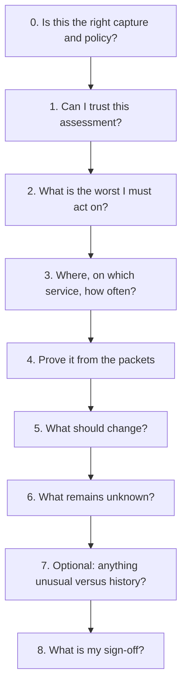
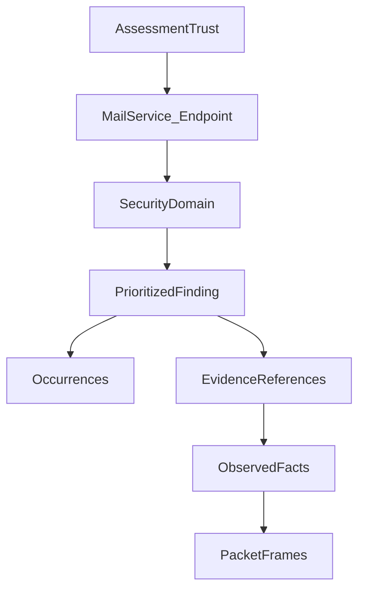
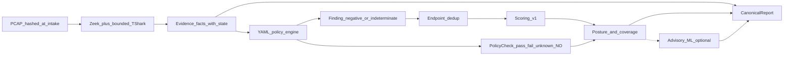

# Analyst evidence and risk tree

This document is the analyst-facing information architecture for SecureMail.
It describes what an analyst needs to judge cryptographic security of a
mailing system from a capture, how those needs are grouped, and how the
product should present them.

It is written **user to app**: the analyst’s questions come first; the
canonical records are the supporting evidence. It is **not** a description of
the current dashboard layout, and it does not treat the current UI as the
source of truth.

Canonical models live under `src/securemail/domain/`. Executable code and
tests win if this page and a fixture disagree.

---

## 1. What this tool can and cannot answer

SecureMail assesses the **cryptographic posture visible in captured SMTP,
IMAP, and POP3 traffic** (PCAP / PCAPNG). It does **not** measure the entire
mail system.

| The analyst can ask | SecureMail can answer |
|---|---|
| Was mail submitted or accessed in the clear? | Yes, when the session was reconstructed. |
| Did STARTTLS/STLS actually establish TLS? | Yes, via an explicit state machine. |
| Which TLS version, cipher, and key exchange were negotiated? | Yes, when the handshake is visible. |
| Does the presented server certificate chain and SAN match? | Yes, when the certificate is observable. |
| How complete is this assessment? | Yes — coverage and limitations are first-class. |
| Is this mail system “secure overall”? | **No.** Only observed cryptographic behaviour is judged. |
| Are SPF, DKIM, DMARC, phishing, malware, or accounts healthy? | **No.** Out of scope. |
| Is the server configured securely for clients we never saw? | **No.** Unseen capabilities are not a pass. |

**How bad is the mailing system?** The honest answer is always three parts
together:

1. **Security result** — weakness observed, check passed, or no conclusion.
2. **Confidence** — how strong the contributing evidence was.
3. **Visibility** — how much of the capture and policy surface we could see.

A high `risk_score` with complete coverage means “act on these endpoint
weaknesses.” A missing `risk_score` with limited coverage means “we cannot
yet say the system is healthy.” Those are different answers.

---

## 2. Four information lanes (never mix)

Keep these connected by evidence references, but never collapse them into one
score or one colour.

| Lane | Analyst meaning | Canonical home |
|---|---|---|
| **Observed facts** | What the capture contained. | `EvidenceDocument` arrays: `flows`, `sessions`, `handshakes`, `certificates`, `capture_preflight` |
| **Deterministic findings** | Policy judgments on those facts. | `findings[]` (session-level) and `posture.prioritized_findings[]` (endpoint-level) |
| **Statistics and coverage** | Counts, denominators, and “how complete.” | `policy_checks[]`, `posture.coverage`, `limitations` |
| **Advisory / notes** | Drift hints and human sign-off. Never rewrite findings. | `advisory`, `analyst_conclusions` |

Example of keeping the lanes distinct:

- **Fact:** handshake `version.selected = TLSv10`, `evidence_state = observed`.
- **Finding:** `TLS_NEGOTIATED_TLS10`, outcome `negative`, severity `high`.
- **Statistic:** 6 of 20 handshakes selected TLS 1.0; 2 version checks are
  `not_observable`.
- **Advisory (optional):** TLS version share shifted versus this endpoint’s
  history. That does not create or cancel the TLS 1.0 finding.

Passes are **not** emitted as findings. They appear only as
`policy_checks` with `outcome = pass`.

---

## 3. Evidence states — the first thing an analyst must trust

Every applicable evidence field carries one of seven states from
`EvidenceState` in `src/securemail/domain/evidence/run.py`.

| State | Plain meaning | May it support a weakness? | May it be treated as secure? |
|---|---|---|---|
| `observed` | Directly seen in the capture | Yes | Only if the *value* is healthy **and** the related check passed |
| `verified` | Observed and confirmed at evaluation | Yes (strongest basis) | Same as observed |
| `inferred` | Reconstructed from partial signals | Yes, with lower confidence | Same, with lower confidence |
| `incomplete` | Bytes or boundaries are missing | No — visibility limit | **No** |
| `conflicting` | Competing reconstructions | No — visibility limit | **No** |
| `not_observable` | Passive capture cannot see this | No — visibility limit | **No** |
| `indeterminate` | Not enough to classify | No — visibility limit | **No** |

TCP reconstruction uses a parallel enum `ReconstructionQuality`
(`complete` / `incomplete` / `conflicting`) on `Flow`. It maps onto
`EvidenceState` but names stream quality explicitly.

**Rule:** missing evidence is not a pass. `unknown` and `not_observable`
policy checks must never be folded into “checks passed” or coloured as
healthy.

---

## 4. Analyst journey: user questions, then app surfaces

The product should answer questions in this order. Do not start from JSON
models or from a “pretty dashboard.”



| Step | Analyst question | App should show first | Backend fields |
|---|---|---|---|
| 0 | Right capture? | Case/run identity, filename, SHA-256, policy profile | `manifest.case_id`, `analysis_run_id`, `source_capture_sha256`, `policy_profile`, `policy_pack_version` |
| 1 | Can I trust it? | Assessment state + limitations, **before** findings | `assessment_state`, `limitations.*`, `coverage.overall`, `stage_errors[]` |
| 2 | What is worst? | Endpoint-priority queue, score descending | `posture.prioritized_findings[]` |
| 3 | Where / how often? | Endpoint, service role, recurrence | `affected_endpoint`, `unique_occurrences`, `contributing_occurrences[]` |
| 4 | Prove it | Finding → evidence refs → flow/session/handshake/cert → frames | `evidence_references[]` joined on `uid` |
| 5 | What to change | Remediation family + standards + rationale | `remediation_id`, `standards[]`, `rationale` |
| 6 | What is unknown | Coverage matrix and not-observable facts | `unknown_count`, `not_observable_count`, `server_certificate_state` |
| 7 | Drift? | Separate advisory region | `advisory.items[]` |
| 8 | Sign-off | Analyst notes (human; not auto-filled) | `analyst_conclusions` |

Catalog triage (before opening a case) uses `CaseSummary`:
`assessment_state`, `risk_score`, `finding_count`, `severity_counts`,
`unknown_count`, `not_observable_count`, `advisory_present`.

---

## 5. Primary analyst tree

Group the assessment as a tree the analyst can walk. **Root is trust, not
the first JSON key.**

```text
Mail cryptographic posture (this capture + this policy profile)
├── 1. Assessment trust
│   ├── Capture identity and hashes
│   ├── Capture quality (packets, snaplen, duration)
│   ├── Flow reconstruction (complete / incomplete / conflicting)
│   ├── Handshake visibility (full / partial / not_observable)
│   ├── Certificate observability
│   ├── Policy coverage (pass / fail / unknown / not_observable)
│   └── Assessment state (complete / limited / none) and risk_score
│
├── 2. Affected mail service
│   └── Endpoint host:port
│       ├── Role: smtp_relay | smtp_submission | imap_access | pop3_access | unclassified
│       ├── Protocol identity (payload vs port_hint)
│       └── Session count, cleartext vs TLS
│
├── 3. Security domain  (see §7)
│   ├── Cleartext and credential exposure
│   ├── STARTTLS / STLS upgrade integrity
│   ├── TLS protocol version
│   ├── Cipher suite strength
│   ├── Key exchange and forward secrecy
│   ├── Handshake signatures
│   └── Certificate: keys, signatures, validity, path, identity
│
├── 4. Prioritized finding (one code at one endpoint)
│   ├── Title, code, outcome, severity, score
│   ├── Score components (severity, confidence, exposure, recurrence, …)
│   ├── Occurrences (session UIDs, not dropped)
│   └── Evidence references → facts → frame numbers
│
├── 5. Coverage remainder
│   └── Checks that passed, or could not be asserted
│
└── 6. Separate context
    ├── Advisory / ML
    ├── Analyst conclusions
    └── Provenance (analyzer bundle, trust store, renderer)
```



**Why this order:** an analyst who opens findings first will misread a
limited assessment as “few problems.” Trust and coverage are the gate.

---

## 6. How facts become findings become statistics



Python does not re-parse packets. Zeek extracts; Python normalizes; YAML
rules judge; scoring only **prioritizes**.

Derived facts used by rules, computed at evaluation time (not extra packet
parsing):

| Derived path | Meaning |
|---|---|
| `derived.service_role` | `smtp_relay` (SMTP/25), `smtp_submission` (SMTP/465 or 587), `imap_access` (IMAP/143 or 993), `pop3_access` (POP3/110 or 995), otherwise unclassified |
| `derived.forward_secrecy.outcome` | `present` / `absent` / `indeterminate` |
| `derived.observed_commands` | Uppercased commands seen on the session (LOGIN, PASS, …) |
| `derived.transport_tls_established` | TLS actually up via handshake or `tls_established` upgrade |

Forward secrecy is a **fact for policy**, not a finding by itself. Rules
`TLS_FORWARD_SECRECY_ABSENT` and `TLS_FORWARD_SECRECY_INDETERMINATE` turn it
into conclusions.

---

## 7. Fact catalog — what the analyst needs at each layer

Facts are not findings. Weak values (TLS 1.0, RSA key exchange, expired
cert) are still facts until a policy pack emits a finding.

### 7.1 Capture and run identity

**Models:** `CapturePreflight`, `AnalysisRun` (`domain/evidence/run.py`);
report wrapper `ReportManifest`, `CaptureLimitations`.

| Analyst need | Fields |
|---|---|
| Fingerprint the file | `capture_sha256` / `manifest.source_capture_sha256` |
| Know the policy clock | `policy_profile` (`ietf_current`, `nist_federal`, `historical_at_capture`), `policy_pack_version`, `analysis_time` |
| Know capture completeness | `packet_count`, `truncated_packets_present`, `packet_size_limit*`, `capture_duration_seconds`, `capture_start_time` |
| Reproduce the analyzer | `analyzer_bundle_digest`, `trust_store_digest`, `configuration_digest` |

`historical_at_capture` without `capture_start_time` fails closed.

### 7.2 Flows — “can I even see the conversation?”

**Model:** `Flow` (`domain/evidence/flow.py`).

| Analyst need | Fields |
|---|---|
| Who talked | `orig.host:port`, `resp.host:port`, `uid` |
| Stream quality | `reconstruction_quality`, `reason_code`, `evidence_state` |
| Why incomplete | `missing_syn`, `missing_fin`, `midstream_start`, `snaplen_truncation`, `overlapping_retransmission_conflict`, `segment_gap`, `capture_loss` |
| Harmless noise | `observed_conditions`: `out_of_order_segments`, `duplicate_segments` (do not by themselves degrade quality) |
| Gap size | `gap_bytes`, `gap_bytes_exact`, `conflicting_byte_ranges[]` |

Bad reconstruction is **not** a crypto finding. It **limits** later
protocol, TLS, and certificate facts.

### 7.3 Sessions — “what mail protocol, on which service?”

**Model:** `EmailSession` (`domain/evidence/session.py`).

| Analyst need | Fields |
|---|---|
| Protocol | `protocol` — `smtp` / `imap` / `pop3` / null |
| Do not trust the port | `port_hint` is a hint; `payload_evidence` is payload-driven (`indeterminate` is allowed) |
| Who identified it | `corroboration` (`zeek` or `zeek+tshark`), `identification_confidence` |
| Command trace | `events[]` — redacted `command`, `reply_code`, `frame_number`, `kind` |

Ambiguous banners are `indeterminate`, not a guess. Ports never prove
protocol.

### 7.4 STARTTLS / STLS and implicit TLS

**Models:** `ExplicitUpgrade`, `ImplicitTls`; states on `UpgradeState`.

STARTTLS/STLS terminal states:

| State | Analyst read |
|---|---|
| `advertised` | Server offered upgrade |
| `requested` | Client asked |
| `accepted` | Server accepted; TLS may not yet be up |
| `tls_established` | Protective TLS actually running |
| `plaintext_fallback` | Session continued in the clear after a failed upgrade — **risk** on submission/access |
| `violation` | Commands after accept without TLS transition — **risk** |

`downgrade_consistent` means the pattern is *consistent with* a downgrade.
It is **not** proof of an attacker.

Implicit TLS (465 / 993 / 995): `correlated_protocol` requires payload or
ALPN correlation. Port alone is never enough. Off those ports, correlation
is `not_observable`.

### 7.5 TLS handshake — “what crypto was negotiated?”

**Model:** `TlsHandshake` (`domain/evidence/handshake.py`).

| Analyst need | Fields |
|---|---|
| Did it finish | `established`, `resumed`, `hello_retry_request`, `last_alert` |
| How much is visible | `visibility`: `full` / `partial` / `not_observable` |
| Version | `version.selected`; `supported_versions` wins over `legacy_record` |
| Cipher | `cipher_suite.name`, `cipher_suite.code` (IANA snapshot, not hardcoded guesses) |
| Key exchange | `key_exchange.mechanism` (`RSA`, `ECDHE`, `(EC)DHE`, `PSK`, …), `selected_group`, `dh_param_size`, `psk_key_exchange_modes` |
| Handshake signature | `certificate_verify_signature.algorithm` — **not** the X.509 cert signature |
| Cert visibility | `server_certificate_state`, `certificate_verify_state` |
| Message list | `messages[]` with `kind`, `history_letter`, `frame_number` |

TLS 1.3 certificates after `ServerHello` are commonly `not_observable`.
That is a visibility fact, not “no certificate” and not “certificate OK.”

Key exchange on the handshake is a **fact**. Forward secrecy is a **derived
assessment**:

| Version | Mechanism | Forward secrecy |
|---|---|---|
| TLS 1.2 | ECDHE or DHE | `present` |
| TLS 1.2 | static RSA / DH / ECDH | `absent` |
| TLS 1.3 | (EC)DHE or PSK-(EC)DHE | `present` |
| TLS 1.3 | PSK-only | `indeterminate` |
| Any | incomplete handshake | `indeterminate` |

Forward secrecy `present` is not a clean bill of health. IETF still flags
TLS 1.2 finite-field DHE as `TLS12_DHE_NEGOTIATED` even though that
mechanism is ephemeral. Facts (FS outcome) and findings (policy) stay
separate.

From one PCAP the tool will **not** claim ephemeral-key reuse or ticket
rotation.

### 7.6 Certificates — “what identity and key material was shown?”

**Model:** `CertificateEvidence` + nested `CertificateValidation`
(`domain/evidence/certificate.py`). Validation is attached to **server
leaves** (`chain_index = 0`).

| Analyst need | Fields |
|---|---|
| Which cert | `der_sha256`, `uid`, `chain_index`, `role` |
| Parse | `syntax_valid`, `syntax_error` |
| Identity strings | `subject`, `issuer`, `serial_number` |
| Time | `not_before`, `not_after`, `valid_at_capture_time`, `valid_at_analysis_time`, `expires_within_warning_window` |
| Key | `public_key_algorithm`, `public_key_size`, `public_key_curve`, `effective_strength_bits` |
| X.509 signature | `signature_algorithm` (distinct from CertificateVerify) |
| Path | `path_valid_at_capture_time`, `path_valid_at_analysis_time`, reason codes |
| Name match | `identity_match` (RFC 9525 SAN only, **no CN fallback**), `reference_identity`, `reference_identity_source` (`sni` or `configured`) |
| Revocation | `revocation_status` — offline default **`unknown`** |

Path validity and identity match are **independent**. A trusted chain can
still fail SAN matching, and the reverse.

Path failure codes: `self_signed`, `missing_intermediate`,
`untrusted_issuer`, `expired_at_verification_time`,
`not_yet_valid_at_verification_time`, `signature_verification_failed`,
`max_chain_depth_exceeded`, `invalid_extensions`, `syntax_invalid_leaf`,
`certificate_not_observed`, `capture_time_unavailable`.

Identity failure codes on a completed match: `san_mismatch`, `san_missing`.
If there is no SNI and no `--expected-hostname`, `identity_match` is `null`
and `reference_identity_unavailable` is recorded on `indeterminate_reasons`.
That is not a pass.

### 7.7 Policy checks and posture statistics

**Models:** `PolicyCheck`, `CoverageMatrix`, `PostureAssessment`
(`domain/findings/posture.py`).

Check categories (`CheckCategory`): `transport`, `mail_protocol`,
`tls_handshake`, `certificate`.

Coverage protocols: `smtp`, `imap`, `pop3`, `unclassified`.

| Check outcome | Meaning |
|---|---|
| `pass` | Assertion held on usable evidence |
| `fail` | Confirmed negative finding |
| `unknown` | Evidence incomplete, conflicting, or indeterminate |
| `not_observable` | Driving field is not passively visible |

Non-applicable rules are **omitted** from the denominator. They are not
passes.

```text
applicable = passed + failed + unknown + not_observable
```

Published slices: `overall`, `by_protocol`, `by_category`,
`by_protocol_and_category`.

Assessment state:

| `assessment_state` | When |
|---|---|
| `none` | Zero applicable checks |
| `limited` | Any `unknown` or `not_observable` check |
| `complete` | Every applicable check is `pass` or `fail` |

`risk_score`:

- If there are prioritized findings: **maximum endpoint finding score**
  (0–100). Not a percentage of the mail system.
- If there are no findings and assessment is `complete`: `0`.
- If there are no findings and assessment is `limited` or `none`: **`null`**.
  That is “not proven healthy,” not “zero risk.”

Report `limitations` copy the visibility that must stay on screen:
truncated packets, incomplete/conflicting flow counts, not-observable
certificate count, unknown/not-observable check counts, plus human notes.

---

## 8. Finding taxonomy — how to group conclusions

Session findings (`Finding`) become endpoint clusters by
`(code, affected_endpoint, policy_profile, policy_pack_version)`.
Contributing session UIDs are **retained**.

Only `negative` and `indeterminate` outcomes become findings. Severity:
`high`, `medium`, `low`, `informational`.

Group for analysts by **security domain**, then rule, then endpoint.
Severity below is the typical **negative** severity on `ietf_current`.

### 8.1 Cleartext and credential exposure — `mail_protocol`

Immediate attention when credentials cross the wire without TLS.

| Code | Title gist | Typical severity | Remediation family |
|---|---|---|---|
| `IMAP_LOGIN_WITHOUT_TLS` | IMAP LOGIN without TLS | high | `imap.disable_cleartext_login` |
| `POP3_PASS_WITHOUT_TLS` | POP3 PASS without TLS | high | `pop3.disable_cleartext_pass` |
| `MAIL_SUBMISSION_CLEARTEXT` | Submission without TLS | medium | `mail.require_submission_tls` |
| `MAIL_ACCESS_CLEARTEXT` | IMAP/POP3 access without TLS | medium | `mail.require_access_tls` |

`MAIL_SUBMISSION_CLEARTEXT` applies to **submission** (465/587), not
opportunistic SMTP relay on port 25.

### 8.2 STARTTLS / STLS upgrade integrity — `mail_protocol`

| Code | Title gist | Typical severity | Remediation family |
|---|---|---|---|
| `UPGRADE_ACCEPTED_WITHOUT_TLS_TRANSITION` | Accepted upgrade, no TLS | high | `mail.fix_starttls_transition` |
| `UPGRADE_PLAINTEXT_FALLBACK` | Cleartext after failed upgrade | medium | `mail.abort_on_failed_upgrade` |

Fallback is gated to submission and access roles, not SMTP relay.

### 8.3 TLS protocol version — `tls_handshake`

| Code | Title gist | Typical severity |
|---|---|---|
| `TLS_NEGOTIATED_SSL3` | SSLv3 | high |
| `TLS_NEGOTIATED_TLS10` | TLS 1.0 MUST NOT | high |
| `TLS_NEGOTIATED_TLS11` | TLS 1.1 MUST NOT | high |
| `TLS_NEGOTIATED_TLS10_DISCOURAGED` | Historical SHOULD NOT (until 2021-03-01) | medium |
| `TLS_NEGOTIATED_TLS11_DISCOURAGED` | Historical SHOULD NOT (until 2021-03-01) | medium |

Remediation family: `tls.minimum_version`. DISCOURAGED rules exist only on
`historical_at_capture`.

### 8.4 Cipher suite strength — `tls_handshake`

| Code | Title gist | Typical severity | Notes |
|---|---|---|---|
| `TLS_CIPHER_NULL` | NULL cipher | high | |
| `TLS_CIPHER_EXPORT` | Export cipher | high | |
| `TLS_CIPHER_RC4` | RC4 | high | |
| `TLS_CIPHER_3DES` | 3DES | medium (high under `nist_federal`) | |
| `TLS_CIPHER_CBC` | CBC (prefer AEAD) | medium | IETF/historical only |
| `NIST_TLS_SUITE_NOT_APPROVED` | Suite not on the NIST allowlist | medium | **Compliance, not “cryptographically weak”** |

### 8.5 Key exchange and forward secrecy — `tls_handshake`

| Code | Title gist | Typical severity |
|---|---|---|
| `TLS12_STATIC_RSA_NEGOTIATED` | Static RSA | high |
| `TLS12_STATIC_RSA_DISCOURAGED` | Historical SHOULD NOT (until 2026-07-01) | medium |
| `TLS12_STATIC_DH_NEGOTIATED` | Static DH | high |
| `TLS12_DHE_NEGOTIATED` | Finite-field DHE on TLS 1.2 | high |
| `TLS12_STATIC_ECDH_NEGOTIATED` | Static ECDH | medium |
| `TLS12_DHE_PARAMETERS_LT2048` | DHE parameters &lt; 2048 bits | high |
| `TLS_FORWARD_SECRECY_ABSENT` | FS absent | medium |
| `TLS_FORWARD_SECRECY_INDETERMINATE` | FS cannot be classified | informational (`indeterminate` outcome) |

`nist_federal` omits the CBC / static-RSA / static-DH / DHE family above and
adds the NIST suite allowlist instead.

### 8.6 Handshake signatures — `tls_handshake`

These judge **CertificateVerify**, not the certificate’s own signature.

| Code | Title gist | Typical severity |
|---|---|---|
| `TLS_HANDSHAKE_SIGNATURE_MD5` | MD5 handshake signature | high |
| `TLS_HANDSHAKE_SIGNATURE_SHA1` | SHA-1 handshake signature | high |

### 8.7 Certificate keys, signatures, validity, path, identity — `certificate`

| Code | Title gist | Typical severity |
|---|---|---|
| `CERT_RSA_KEY_LT2048` | RSA &lt; 2048 | high |
| `CERT_PUBLIC_KEY_STRENGTH_LT112` | Effective strength &lt; 112 bits | medium (high under NIST) |
| `CERT_SIGNATURE_MD5` | MD5 cert signature | high |
| `CERT_SIGNATURE_SHA1` | SHA-1 cert signature | medium (high under NIST) |
| `CERT_EXPIRED_AT_CAPTURE` | Expired at capture time | high |
| `CERT_PATH_INVALID_AT_CAPTURE` | Chain invalid at capture | high |
| `CERT_IDENTITY_MISMATCH` | SAN mismatch | high |
| `CERT_BECAME_INVALID_AFTER_CAPTURE` | Valid then, invalid now | informational |

### 8.8 Remediation families (action buckets)

After the analyst accepts a finding, group the **fix list** by
`remediation_id` prefix:

| Prefix | Analyst action theme |
|---|---|
| `tls.*` | Raise minimum version; disable NULL/export/RC4/3DES/static KX; require ephemeral KX; observe a full handshake; NIST allowlist |
| `pki.*` | Stronger keys, modern cert signatures, replace/repair certs, fix SAN |
| `mail.*` | Require TLS on submission/access; abort failed STARTTLS; fix upgrade transition |
| `imap.*` / `pop3.*` | Disable cleartext LOGIN / PASS |

There is a stable **identifier**, not shipped runbook prose. Show
`remediation_id` + `standards[]` + `rationale` together.

---

## 9. Scoring — how “how bad” is computed

Schema `securemail.scoring/v1`. Score is a **priority integer**, not a
grade of the whole mail system.

```text
score = min(100,
  severity + confidence + exposure + recurrence
  + asset_criticality + blast_radius)
```

| Component | Max | Driven by |
|---|---|---|
| Severity | 50 | high 50 / medium 30 / low 15 / informational 0 |
| Confidence | 20 | `basis_state`: verified 20, observed 16, inferred 12, incomplete 6, conflicting 3, indeterminate 2, not_observable 0 |
| Exposure | 10 | public 10 / partner 8 / internal 5 / isolated 2 / **unknown 4** |
| Recurrence | 10 | `min(10, 2 × (unique_occurrences − 1))` |
| Asset criticality | 5 | critical 5 … low 1 / **unknown 2** |
| Blast radius | 5 | organization 5 / multi_asset 3 / single_endpoint 1 / **unknown 1** |

`basis_state` is the **weakest** contributing evidence state in the cluster.

Inventory labels default to `unknown` on `securemail analyze` / upload.
Unknown is an **explicit addend**, never zero and never inferred from the
PCAP. Named labels are only supplied through `securemail score` asset
context.

Sort of the action queue: score descending, negative before indeterminate,
then severity, code, endpoint.

---

## 10. Visualization specification (user → app)

This section specifies **how to present** the tree. It is independent of
any current frontend component.

### 10.1 Visual semantics that must not be broken

Always show **result + confidence + visibility** on the same object.

| Visual state | Use for | Never use for |
|---|---|---|
| **Red — act now** | Cleartext credentials; SSLv3 / TLS 1.0 / TLS 1.1; NULL / Export / RC4; invalid or mismatched certificates; weak keys; STARTTLS accepted without TLS | Unknown checks |
| **Orange — important weakness** | Cleartext submission/access; plaintext fallback; 3DES / CBC; absent forward secrecy | Not-observable certificates |
| **Purple / grey — unresolved** | `incomplete`, `conflicting`, `indeterminate`, `not_observable`, `unknown` checks, `null` risk_score | “Looks mostly fine” |
| **Green — passed** | A specific check with `outcome = pass` **and** usable evidence | Coverage gaps, omitted rules, `assessment_state = limited` |

Forbidden encodings:

- Unknown / not-observable **must not** share the green/pass colour.
- `risk_score` **must not** be labelled as “percent secure” or “overall
  mail-system score.” Caption: “Highest endpoint priority (0–100).”
- `risk_score = null` **must** render as an em dash or “not proven,” never
  as 0.
- A donut or ring of “checks” **must** keep unknown and not-observable as
  their own slices.

### 10.2 Screen 0 — workbench (which cases need me?)

**Question:** “What work do I have?”

Show `CaseSummary` rows. Default sort: `risk_score` descending, then
`unknown_count + not_observable_count` descending, then `generated_at`.

Each row: case id, generated time, assessment-state badge, risk score (or
“not proven”), finding count, severity chips, unknown / not-observable
counts, advisory flag.

Selecting a case, or finishing an upload, opens Screen 1. Do not dump the
user into raw evidence.

### 10.3 Screen 1 — case overview (trust gate)

**Question:** “Can I trust this, and what is the headline?”

Always-visible **banner**, above findings:

| Banner element | Source | Encoding |
|---|---|---|
| Assessment badge | `assessment_state` | complete / limited / none — limited is amber, never green |
| Risk score | `risk_score` | integer or “not proven”; tooltip: max endpoint priority |
| Coverage sentence | `coverage.overall` | “N applicable: P passed, F failed, U unknown, O not observable” |
| Limitations callout | `limitations` | expanded by default when any count &gt; 0 or truncated packets |
| Provenance strip | `manifest` | capture SHA (short + copy), policy profile, pack digest, analyzer digest, generated_at |

If `assessment_state` is `limited` or `none`, the limitations panel is
**open** and findings are visually secondary until the analyst dismisses
the gate. The analyst can still open findings; they are not hidden.

### 10.4 Visualization A — coverage matrix

**Question:** “Where could we not assert a result?”

A heatmap:

- Rows: protocol (`smtp`, `imap`, `pop3`, `unclassified`)
- Columns: category (`transport`, `mail_protocol`, `tls_handshake`,
  `certificate`)
- Cell: stacked mini-bar or four counts: pass / fail / unknown /
  not_observable from `coverage.by_protocol_and_category`

Click a cell → `policy_checks[]` filtered to that protocol × category.

Companion **donut** of `coverage.overall` with **four** slices. Passed may
be green; failed red; unknown and not-observable remain purple/grey.

### 10.5 Visualization B — endpoint-first risk tree

**Question:** “What is worst, where?”

Default grouping (expandable tree):

```text
Endpoint 203.0.113.10:993   (IMAP access)
├── Cleartext / credentials
│   └── IMAP_LOGIN_WITHOUT_TLS   score 86   high   ×3 sessions
├── TLS version
│   └── (no finding)
└── Certificates
    └── CERT_IDENTITY_MISMATCH   score 72   high   ×1
```

Alternate grouping modes the analyst can switch: by remediation family, by
rule code, by protocol. Default remains **endpoint then domain then
score**.

Each finding row shows: code, title, severity chip, outcome
(negative vs indeterminate), score, `basis_state`, `unique_occurrences`.

### 10.6 Visualization C — score-component bar

On the finding row or detail header, a stacked bar of the six named
addends (`components.*`), labelled with points, summing to `score`.

This teaches that a medium finding that recurs on a public endpoint can
outrank a one-off high finding with inferred evidence. Do not hide the
arithmetic.

### 10.7 Visualization D — STARTTLS state timeline

For a selected session, a stepper:

```text
advertised → requested → accepted → tls_established
                              ↘ plaintext_fallback
                              ↘ violation
```

Highlight the **terminal** state. Attach `evidence_frames[]` to the
reached step. If `downgrade_consistent` is true, show a note: “Pattern
consistent with downgrade — not proof of an attacker.”

Place this on the session evidence pane, not as a substitute for the
finding `UPGRADE_*`.

### 10.8 Visualization E — finding-to-evidence lineage

**Question:** “Prove it.”

Finding detail is a two-column drawer:

| Left — judgment | Right — supporting facts |
|---|---|
| code, title, outcome, severity | Joined `Flow` / `EmailSession` / `TlsHandshake` / `CertificateEvidence` |
| score bar | Each `evidence_references[]` row: `record_type`, `field_path`, `evidence_state`, `frame_number` |
| `rationale`, `standards[]`, `remediation_id` | Raw field values at those paths |
| contributing occurrences | Session UIDs; click opens that session |

Lineage strip (same `uid`):

```text
Capture → Flow quality → Session protocol/upgrade → Handshake crypto → Certificate → Finding
```

Colour each node by its `evidence_state`, not by whether a finding exists.

### 10.9 Visualization F — certificate chain and identity

For a handshake with observable certificates:

- Vertical chain: leaf (`chain_index = 0`) then issuers.
- Two independent columns on the leaf: **path** (`path_valid_at_capture_time`
  + reason codes) and **identity** (`identity_match` + SAN reasons).
- Time row: valid at capture vs valid at analysis.
- Revocation: always show `unknown` unless imported evidence exists. Do not
  imply “not revoked.”

If `server_certificate_state = not_observable`, show a grey certificate
silhouette labelled “not observable (typical for TLS 1.3 without secrets)”
instead of an empty table that looks like “no cert problems.”

### 10.10 Visualization G — advisory and analyst notes (separate regions)

Four labelled regions, never merged:

1. Observed facts
2. Deterministic conclusions
3. Advisory / ML
4. Analyst conclusions

Advisory styling: dashed border or distinct purple, badge **“Does not
change deterministic findings.”** Codes such as
`ADVISORY_INSUFFICIENT_HISTORY` mean “baseline not ready,” not “all
clear.” `ADVISORY_NONE` is only meaningful once history gates are met.

Analyst notes are human. The default assembled report leaves this section
empty.

### 10.11 Suggested role-specific cuts of the same tree

Same data, different default expand:

| Analyst role | Open first |
|---|---|
| Incident / IR | Trust banner → red findings → credential and version domains |
| Mail-platform owner | Endpoint tree grouped by `remediation_id` |
| Protocol engineer | Coverage matrix + STARTTLS timeline + handshake messages |
| PKI reviewer | Certificate chain view + `CERT_*` findings |
| Historical auditor | Switch profile to `historical_at_capture`; show DISCOURAGED vs MUST NOT |

---

## 11. What passive PCAP evidence cannot prove

| Limitation | Honest encoding |
|---|---|
| Server capabilities never offered to these clients | Absent from evidence; not a pass |
| TLS 1.3 certificates after ServerHello without secrets | `server_certificate_state = not_observable` |
| CertificateVerify without observable signature | `certificate_verify_state = not_observable` |
| Revocation (OCSP / CRL / CT) without import | `revocation_status = unknown` |
| MTA-STS, DANE, live DNS, AIA fetch | Out of scope; analyzer containers run `--network=none`. The host Python process is not OS-network-sandboxed; air-gap is an operational control |
| ECH-hidden SNI and no `--expected-hostname` | `identity_match` null / indeterminate |
| CN-only certificates | RFC 9525 SAN match; **no CN fallback** |
| PSK-only TLS 1.3 resumption as forward secrecy | `indeterminate`, not `present` |
| Ephemeral-key reuse or ticket rotation | Never claimed from one PCAP |
| Attacker behind a downgrade-looking pattern | `downgrade_consistent` ≠ attribution |
| Implicit TLS on non-standard ports | Correlation `not_observable` without 465/993/995 + ALPN/payload |
| Complete posture from a truncated capture | `assessment_state = limited`; `risk_score` may be `null` |
| Asset exposure / criticality | `unknown` unless supplied to `securemail score` |
| First-capture ML “no anomaly” | `ADVISORY_INSUFFICIENT_HISTORY` |
| Legal / compliance attestation | Findings are evidence-linked policy judgments, not a legal opinion |

---

## 12. Backend already supports vs analyst workflow gaps

The canonical report already contains the facts, findings, coverage, and
lineage needed for Screens 0–1 and visualizations A–G.

Present in data today, not always obvious without this tree:

- Honest unknown / not-observable denominators
- Endpoint dedup that keeps contributing sessions
- Named score components
- Frame-bearing evidence references
- Independent path vs identity fields
- Four-region report contract (HTML template TOC already follows
  provenance → limitations → coverage → findings → lineage → facts →
  advisory)

Not in the published contract today (do not fake them in the UI):

| Gap | Impact |
|---|---|
| No remediation template text, only `remediation_id` | Show ID + rationale + standards; link an external runbook if one exists |
| No asset inventory on analyze/upload | Exposure/criticality stay `unknown` |
| No analyst-note write path | `analyst_conclusions` is empty unless supplied at assembly |
| No finding disposition (accepted / false positive) | `suppressed_findings[]` exists on the schema but is unused |
| No cross-run diff or “verify the fix” checklist | Re-capture and compare manually |
| Advisory detail stripped in the report | Full `AnomalyResult` (detector, score, contributions) is internal; report keeps `code` + `reason` |
| No granular HTTP resources | Analysts get one `CanonicalReport`, not `/findings/{id}` |
| Report signature unavailable | `manifest.signature.availability = unavailable` |

---

## 13. Worked readings

Each example combines one fact, one finding, one statistic, and the
correct sentence. That sentence is what the UI copy should say.

### Example A — observed weakness, complete enough to act

- **Fact:** `handshake.version.selected = TLSv10`, state `observed`.
- **Finding:** `TLS_NEGOTIATED_TLS10`, negative, high, score 73
  (50 severity + 16 observed confidence + 4 unknown exposure + 0 recurrence
  + 2 unknown criticality + 1 unknown blast radius).
- **Statistic:** 6 of 20 handshakes selected TLS 1.0; version checks have
  `unknown_count = 0` for this endpoint.
- **Say:** “We observed TLS 1.0 on this endpoint. That is a high-severity
  weakness under the current IETF pack. Coverage for this check is
  complete.”

### Example B — pass is not a system-wide green light

- **Fact:** `derived.transport_tls_established = true` on SMTP/587.
- **Finding:** none for `MAIL_SUBMISSION_CLEARTEXT` (the check **passed**).
- **Statistic:** 12/12 submission sessions established TLS; 8 certificate
  checks are `not_observable` because the clients used TLS 1.3.
- **Say:** “Submission was protected in the sessions we saw. We still
  cannot attest certificate path or identity for those TLS 1.3 sessions.
  Assessment is limited. Risk score is the worst *other* finding, not a
  clean bill of health.”

### Example C — no findings, do not congratulate

- **Fact:** truncated packets present; several flows `incomplete`.
- **Finding:** empty `prioritized_findings`.
- **Statistic:** `assessment_state = limited`, `risk_score = null`,
  `unknown_count > 0`.
- **Say:** “We did not confirm a weakness, and we did not complete the
  applicable checks. This is not a secure posture. Re-capture with a
  larger snaplen.”

### Example D — credentials in the clear

- **Fact:** IMAP session `derived.observed_commands` contains `LOGIN`;
  `derived.transport_tls_established = false`.
- **Finding:** `IMAP_LOGIN_WITHOUT_TLS`, negative, high.
- **Statistic:** 3 unique sessions on `198.51.100.8:143`.
- **Say:** “Usernames and passwords were observed on the wire three times
  on this IMAP endpoint. Treat as immediate exposure, independent of TLS
  version findings elsewhere.”

### Example E — advisory must not override findings

- **Fact / finding:** TLS 1.2 with static RSA → `TLS12_STATIC_RSA_NEGOTIATED`.
- **Advisory:** `ADVISORY_FORWARD_SECRECY_RATE` — FS-present rate dropped
  versus this endpoint’s history.
- **Say:** “Deterministic finding: forward secrecy absent because static RSA
  was negotiated. Advisory: that rate also moved versus baseline. The
  advisory does not create, cancel, or downgrade the finding.”

---

## 14. Field map (for implementers)

| Analyst concept | Model / path |
|---|---|
| Evidence envelope | `EvidenceDocument` (`securemail` analyze, schema `v2`) |
| Report envelope | `CanonicalReport` (`securemail.report/v1`) |
| Evidence states | `EvidenceState` |
| Facts | `Flow`, `EmailSession`, `TlsHandshake`, `CertificateEvidence` |
| Session findings | `Finding` |
| Endpoint queue | `PostureAssessment.prioritized_findings` → `ScoredEndpointFinding` |
| Coverage | `PolicyCheck`, `CoverageMatrix` |
| Limitations | `CaptureLimitations` |
| Advisory | `AdvisorySection` / `AdvisoryItem`; internal `AnomalyResult` |
| Policy packs | `src/securemail/domain/policies/rules/*.yaml` |
| FS assessment | `domain/policies/tls/forward_secrecy.py` |
| Identity | `domain/policies/pki/identity.py` (RFC 9525) |
| Chain | `domain/policies/pki/chain_validation.py` |
| Dedup / score | `domain/findings/dedup.py`, `scoring.py`, `posture.py` |

Golden snapshots: `tests/fixtures/*/expected.json` and
`tests/fixtures/reports/golden_report.json`.

---

## 15. One-sentence operating rule

Show the analyst **what was observed**, **what policy concluded**, **how
often and where**, **how complete the view was**, and **what still cannot
be seen** — in that spirit, from the analyst’s question toward the record,
never the other way around.
