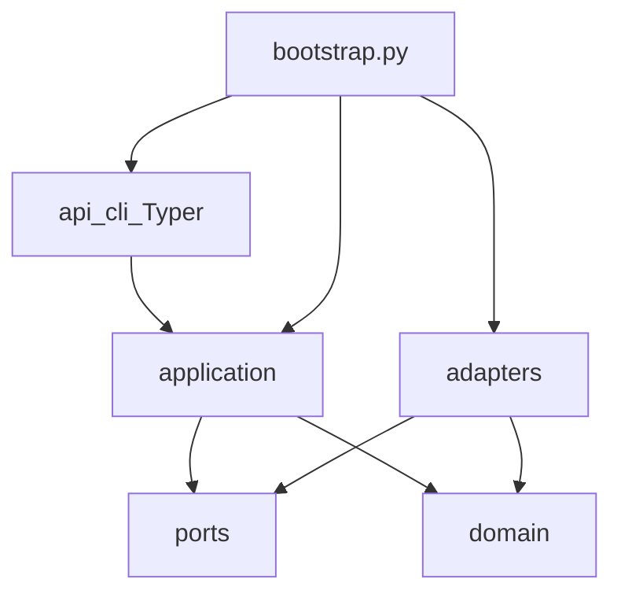

# Architecture (as built)

SecureMail uses clean architecture with a single composition root. Import
boundaries are enforced by import-linter in [`pyproject.toml`](../pyproject.toml),
not by review convention.

`bootstrap.py` is the **only** module that imports a port and its adapter.

## Layer rules

| Layer | May import | Must not |
|---|---|---|
| `domain/` | stdlib, Pydantic, other `domain/` | `adapters/`, `ports/`, `application/`, `api/`, I/O, Docker, subprocess |
| `application/` | `domain/`, `ports/` | concrete `adapters/`, `docker`, SQLAlchemy |
| `adapters/` | `ports/`, `domain/` | `application/`, `api/` |
| `api/` | `application/` (via bootstrap wiring) | business rules, Zeek/TShark, PKI crypto |
| `ports/` | stdlib, typing, domain types as signatures | `docker`, `subprocess` |

Three import-linter contracts:

1. Domain has no outward dependencies.
2. Application does not import concrete adapters.
3. Domain, application, adapters, and ports are independent of `api`.

Canonical records that exist today: `AnalysisRun` (inside `EvidenceDocument`),
`CapturePreflight`, `Flow`, `EmailSession`, `TlsHandshake`,
`CertificateEvidence` (with leaf `CertificateValidation`). The names `Case`,
`Capture`, `Finding`, `AnomalyResult`,
`ReportManifest`, and `AuditEvent` are design vocabulary from
[`plans/TECHNICAL_DESIGN.md`](../plans/TECHNICAL_DESIGN.md); they are not live
models except where a placeholder file already occupies the scaffold path.

## Composition root

[`src/securemail/bootstrap.py`](../src/securemail/bootstrap.py) constructs:

- `DockerZeekRunner`
- `DockerCapinfosRunner`
- `DockerTSharkRunner`
- `CertificateStore`
- `load_iana_tls_parameters()`
- `load_trust_store_snapshot()`

and closes them over `_analyze`, which calls `run_analysis`. `create_cli()`
passes that function into `build_app` so the Typer layer never imports adapters.

## Live modules

### `api/`

| Path | Role |
|---|---|
| `api/cli/main.py` | Typer app; registers `analyze`; writes JSON |
| `api/cli/commands/*.py` | Stubs except that `analyze` actually lives in `main.py` |
| `api/main.py`, `api/dependencies.py`, `api/routers/` | Step 11 placeholders |

Console script: `securemail = "securemail.api.cli.main:main"` in
`pyproject.toml`. `main()` imports `create_cli` from bootstrap (lazy, to keep
`api` from importing adapters at module load).

### `application/`

| Path | Role |
|---|---|
| `run_analysis.py` | Intake hash, PCAP magic check, capinfos, Zeek, optional TShark, handshake/certificate normalize, chain validation, assemble `EvidenceDocument` |
| `normalize_flows.py` | Zeek `conn.log` / `weird.log` / `capture_loss.log` / `sm_tcp_recon.log` → `Flow` |
| `normalize_sessions.py` | `sm_email.log` + optional TShark frames + `ssl.log` → `EmailSession` |
| `normalize_handshakes.py` | `ssl.log` / ssl-log-ext + optional TShark frames → `TlsHandshake` |
| `normalize_certificates.py` | Extracted DER + `ssl.log` chain fingerprints → `CertificateEvidence` with leaf `validation` |
| `advisory_pipeline.py` | Step 10 placeholder |

Domain models are constructed here. They do not parse raw Zeek/TShark output
themselves.

### `domain/`

| Path | Role |
|---|---|
| `evidence/run.py` | `EvidenceState`, `AnalysisRun`, `CapturePreflight`, `EvidenceDocument`, schema version `v0` |
| `evidence/flow.py` | `Flow` + pure `classify_reconstruction` |
| `evidence/session.py` | `EmailSession`, protocol/port/payload enums, upgrade and implicit-TLS models |
| `policies/starttls/smtp_upgrade.py` | SMTP STARTTLS machine |
| `policies/starttls/imap_upgrade.py` | IMAP STARTTLS machine |
| `policies/starttls/pop3_upgrade.py` | POP3 STLS machine |
| `policies/starttls/implicit_tls.py` | ALPN correlation; port is never proof |
| `evidence/handshake.py` | `TlsHandshake`, version/cipher/key-exchange evidence, visibility, CertificateVerify signature slot |
| `policies/tls/key_exchange.py` | Pure version-aware key-exchange classifier (no weakness/FS judgment) |
| `evidence/certificate.py` | `CertificateEvidence` facts plus leaf-only `CertificateValidation` |
| `policies/pki/key_strength.py` | Data-driven effective-strength table |
| `policies/pki/chain_validation.py` | Path validation at an explicit verification time |
| `policies/pki/identity.py` | RFC 9525 SAN matching; no CN fallback |
| `findings/`, `reports/`, remaining TLS/rule packs | Placeholders for Steps 7–9 |

### `ports/`

| Path | Role |
|---|---|
| `analyzers.py` | `ZeekRunner`, `TSharkRunner`, `CapturePreflightRunner` protocols and result models |
| `artifacts.py` | `ArtifactStore` protocol (`put`/`get` by SHA-256) |
| `persistence.py`, `ml.py` | Step 11 / Step 10 placeholders |

### `adapters/`

| Path | Role |
|---|---|
| `analyzers/sandbox.py` | Shared Docker flags, image refs, argv guard |
| `analyzers/bundle_lock.py` | Load/verify `tools/analyzer-bundle.lock`; hash `zeek/` |
| `analyzers/zeek_runner.py` | Pinned `docker run` of `securemail/zeek:step0`; copies extracted cert DER |
| `analyzers/tshark_runner.py` | Pinned bounded TShark field dump |
| `analyzers/capinfos_runner.py` | capinfos inside the TShark image (same sandbox) |
| `reference_data/iana_tls_parameters.py` | Bounded load of the checked-in IANA TLS Parameters snapshot |
| `artifacts/certificate_store.py` | Content-addressed DER store (SHA-256 filenames under a caller root) |
| `pki/trust_store.py` | Bounded load of the pinned offline PEM trust snapshot |
| `pki/trust-store-snapshot.pem` | Lab root + USERTrust RSA; SHA-256 is `trust_store_digest` |
| `pki/openssl_crosscheck.py` | Test-only fixed-argv `openssl verify`; not on the production path |
| reports, ML | Placeholders |

## Toolchain (what the package actually pins)

- CPython **3.13** (`requires-python = ">=3.13,<3.14"`), installed via `uv`
- Default deps: pydantic v2, typer, cryptography, pyyaml, jinja2
- Extras `reports`, `ml`, and `api` are declared for later steps; they are not
  required to run `analyze`
- Dev extra: pytest, hypothesis, import-linter, ruff, mypy, pre-commit,
  playwright, scapy
- Analyzers: Docker images, `--network=none` (see [analyzers.md](analyzers.md))

## Not in this build

No FastAPI app factory with routes, no Celery workers, no SQLAlchemy
repositories, no React tree under `frontend/` (only `.nvmrc` + README). The
scaffold directories exist so later steps fill named files instead of inventing
layout.
