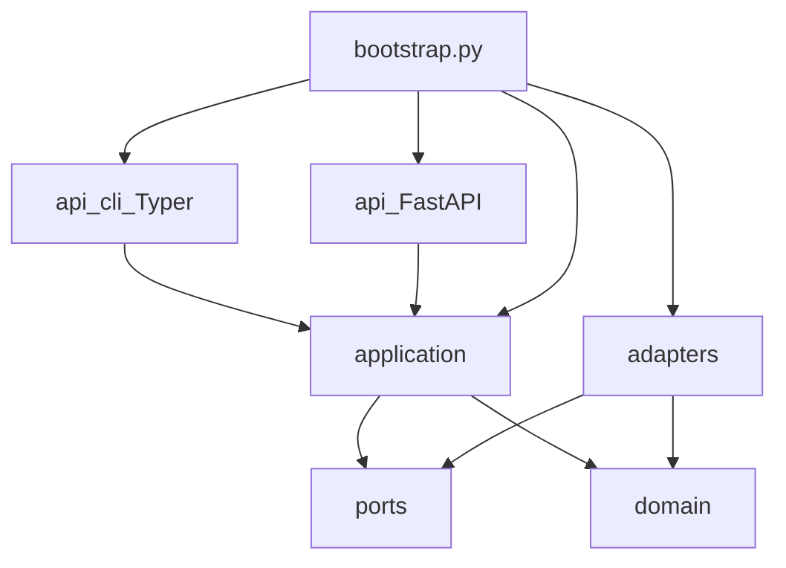

# Architecture (as built)

SecureMail uses clean architecture with a single composition root. Import
boundaries are enforced by import-linter in [`pyproject.toml`](../pyproject.toml),
not by review convention.

`bootstrap.py` is the **only** module that imports a port and its adapter.

## Layer rules

| Layer | May import | Must not |
|---|---|---|
| `domain/` | stdlib, Pydantic, other `domain/` | `adapters/`, `ports/`, `application/`, `api/`, I/O, Docker, subprocess |
| `application/` | `domain/`, `ports/` | concrete `adapters/`, `docker`, SQLAlchemy |
| `adapters/` | `ports/`, `domain/` | `application/`, `api/` |
| `api/` | `application/` (via bootstrap wiring) | business rules, Zeek/TShark, PKI crypto |
| `ports/` | stdlib, typing, domain types as signatures | `docker`, `subprocess` |

Three import-linter contracts:

1. Domain has no outward dependencies.
2. Application does not import concrete adapters.
3. Domain, application, adapters, and ports are independent of `api`.

Canonical records that exist today: `AnalysisRun` (inside `EvidenceDocument`),
`CapturePreflight`, `Flow`, `EmailSession`, `TlsHandshake`,
`CertificateEvidence` (with leaf `CertificateValidation`), `Finding`,
`PolicyCheck`, `PostureAssessment`, `AnomalyResult`, and `ReportManifest` /
`CanonicalReport`. The names `Case`, `Capture`, and `AuditEvent` are design
vocabulary from [`plans/TECHNICAL_DESIGN.md`](../plans/TECHNICAL_DESIGN.md);
they are not live models except where a placeholder file already occupies the
scaffold path.

## Composition root

[`src/securemail/bootstrap.py`](../src/securemail/bootstrap.py) constructs:

- `DockerZeekRunner`
- `DockerCapinfosRunner`
- `DockerTSharkRunner`
- `CertificateStore`
- `load_iana_tls_parameters()`
- `load_trust_store_snapshot()`

and closes them over `_analyze`, which calls `run_analysis`. `create_cli()`
passes `_analyze`, `score_findings`, and `_render_report` into the Typer app.
`create_api()` wires the report query operations to the filesystem catalog and
FastAPI app. Neither API adapter imports a concrete I/O adapter.

## Live modules

### `api/`

| Path | Role |
|---|---|
| `api/cli/main.py` | Typer app; registers `analyze`, `score`, `report`, and `evaluate-ml` |
| `api/cli/commands/score.py` | Thin `score` command: bounded JSON in, stdout JSON out |
| `api/cli/commands/report.py` | Thin `report` command: bounded JSON in, JSON/HTML/PDF out; `--advisory` |
| `api/cli/commands/analyze.py` | Unused Step 0 stub; live `analyze` lives in `main.py` |
| `api/cli/commands/evaluate_ml.py` | Thin `evaluate-ml` command over a seeded cohort directory |
| `api/main.py` | FastAPI app factory, security headers, optional built frontend |
| `api/dependencies.py` | Shared bounded request/report dependencies |
| `api/routers/reports.py` | Thin health, case catalog, report, and preview routes |

Console script: `securemail = "securemail.api.cli.main:main"` in
`pyproject.toml`. `main()` imports `create_cli` from bootstrap (lazy, to keep
`api` from importing adapters at module load).

### `application/`

| Path | Role |
|---|---|
| `run_analysis.py` | Intake, hash, preflight, Zeek, optional TShark, normalize, policy, score, assemble `EvidenceDocument`; `score_findings` RORO use case |
| `render_report.py` | Dump one `CanonicalReport` to JSON-compatible payload; derive JCS/HTML/PDF from that dump |
| `report_queries.py` | Bounded report parsing, summaries, catalog lookup, canonical response bytes |
| `normalize_flows.py` | Zeek `conn.log` / `weird.log` / `capture_loss.log` / `sm_tcp_recon.log` → `Flow` |
| `normalize_sessions.py` | `sm_email.log` + optional TShark frames + `ssl.log` → `EmailSession` |
| `normalize_handshakes.py` | `ssl.log` / ssl-log-ext + optional TShark frames → `TlsHandshake` |
| `normalize_certificates.py` | Extracted DER + `ssl.log` chain fingerprints → `CertificateEvidence` with leaf `validation` |
| `advisory_pipeline.py` | Feature extraction from canonical evidence, `AnomalyResult` assembly, cohort evaluation; never mutates `Finding` |

Domain models are constructed here. They do not parse raw Zeek/TShark output
themselves.

### `domain/`

| Path | Role |
|---|---|
| `evidence/run.py` | `EvidenceState`, `PolicyProfile`, `AnalysisRun`, `CapturePreflight`, `EvidenceDocument`; normalization schema `v1`, document schema `v2` |
| `evidence/flow.py` | `Flow` + pure `classify_reconstruction` |
| `evidence/session.py` | `EmailSession`, protocol/port/payload enums, upgrade and implicit-TLS models |
| `policies/starttls/smtp_upgrade.py` | SMTP STARTTLS machine |
| `policies/starttls/imap_upgrade.py` | IMAP STARTTLS machine |
| `policies/starttls/pop3_upgrade.py` | POP3 STLS machine |
| `policies/starttls/implicit_tls.py` | ALPN correlation; port is never proof |
| `evidence/handshake.py` | `TlsHandshake`, version/cipher/key-exchange evidence, visibility, CertificateVerify signature |
| `policies/tls/key_exchange.py` | Pure version-aware key-exchange classifier (no weakness/FS judgment) |
| `policies/tls/forward_secrecy.py` | Version-aware FS table; never infers reuse or ticket rotation |
| `policies/rule_engine.py` | Pure tri-state evaluator; emits findings plus applicable `PolicyCheck` coverage |
| `policies/rules/*.yaml` | `ietf_current`, `nist_federal`, `historical_at_capture` |
| `evidence/certificate.py` | `CertificateEvidence` facts plus leaf-only `CertificateValidation` |
| `policies/pki/key_strength.py` | Data-driven effective-strength table |
| `policies/pki/chain_validation.py` | Path validation at an explicit verification time |
| `policies/pki/identity.py` | RFC 9525 SAN matching; no CN fallback |
| `findings/finding.py` | Canonical session-level `Finding` |
| `findings/scoring.py` | Versioned integer priority and named components |
| `findings/dedup.py` | Session findings → endpoint clusters |
| `findings/posture.py` | Coverage matrix, prioritized findings, assessment state |
| `reports/schema.py` | `CanonicalReport` / `ReportManifest`; JSON Schema snapshot |
| `ml/models.py` | `EndpointWindow`, `AnomalyResult`, cohort labels, evaluation report |
| `ml/evaluation.py` | Detection delay, precision@K, stratified lift CI, declared thresholds |

### `ports/`

| Path | Role |
|---|---|
| `analyzers.py` | `ZeekRunner`, `TSharkRunner`, `CapturePreflightRunner` protocols and result models |
| `artifacts.py` | `ArtifactStore` protocol (`put`/`get` by SHA-256) |
| `ml.py` | `AnomalyScorer` protocol; sklearn stays in adapters |
| `persistence.py` | Read-only canonical report catalog protocol |

### `adapters/`

| Path | Role |
|---|---|
| `analyzers/sandbox.py` | Shared Docker flags, image refs, argv guard |
| `analyzers/bundle_lock.py` | Load/verify `tools/analyzer-bundle.lock`; hash `zeek/` |
| `analyzers/zeek_runner.py` | Pinned `docker run` of `securemail/zeek:step0`; copies extracted cert DER |
| `analyzers/tshark_runner.py` | Pinned bounded TShark field dump |
| `analyzers/capinfos_runner.py` | capinfos inside the TShark image (same sandbox) |
| `reference_data/iana_tls_parameters.py` | Bounded load of the checked-in IANA TLS Parameters snapshot |
| `reference_data/policy_packs.py` | Bounded YAML load of built-in rule packs; no user path |
| `artifacts/certificate_store.py` | Content-addressed DER store (SHA-256 filenames under a caller root) |
| `pki/trust_store.py` | Bounded load of the pinned offline PEM trust snapshot |
| `pki/trust-store-snapshot.pem` | Lab root + USERTrust RSA; SHA-256 is `trust_store_digest` |
| `pki/openssl_crosscheck.py` | Test-only fixed-argv `openssl verify`; not on the production path |
| `reports/canonical_json.py` | RFC 8785 JCS + SHA-256 |
| `reports/html_renderer.py` | Jinja2 autoescape, forensic text filter, view-model diagrams |
| `reports/pdf_renderer.py` | WeasyPrint over the HTML string; `data:`-only URL fetcher |
| `reports/templates/report.html.j2` | Single HTML template for HTML and PDF |
| `reports/fonts/` | Bundled Noto Sans / Noto Sans Mono (OFL) |
| `ml/baselines.py` | Median/MAD, categorical rarity, Page-Hinkley |
| `ml/isolation_forest.py` | Isolation Forest challenger; gated by the evaluation harness |
| `persistence/report_repository.py` | Bounded, symlink-safe filesystem report catalog |

## Toolchain (what the package actually pins)

- CPython **3.13** (`requires-python = ">=3.13,<3.14"`), installed via `uv`
- Default deps: pydantic v2, typer, cryptography, pyyaml, jinja2, rfc8785==0.1.4
- Extra `reports` (WeasyPrint==69.0) is required for PDF; JSON/HTML report rendering
  uses core deps. Extra `ml` (scikit-learn, numpy, scipy) is required for
  `securemail evaluate-ml` and `--advisory`. Extra `api` provides FastAPI and
  Uvicorn for Step 11.
- Dev extra: pytest, hypothesis, import-linter, ruff, mypy, pre-commit,
  playwright, scapy, jsonschema, pypdf
- Frontend: Node 22, React, TypeScript, Vite, TanStack Query/Table, ECharts,
  Tailwind, Shadcn/Radix primitives, Motion, Vitest, and Playwright
- Analyzers: Docker images, `--network=none` (see [analyzers.md](analyzers.md))

## Deliberately deferred

The dashboard catalog is filesystem-backed and read-only. PostgreSQL,
SQLAlchemy repositories, OIDC/RBAC, Celery/RabbitMQ workers, packet upload, and
analysis inside API request processes remain outside Step 11.
