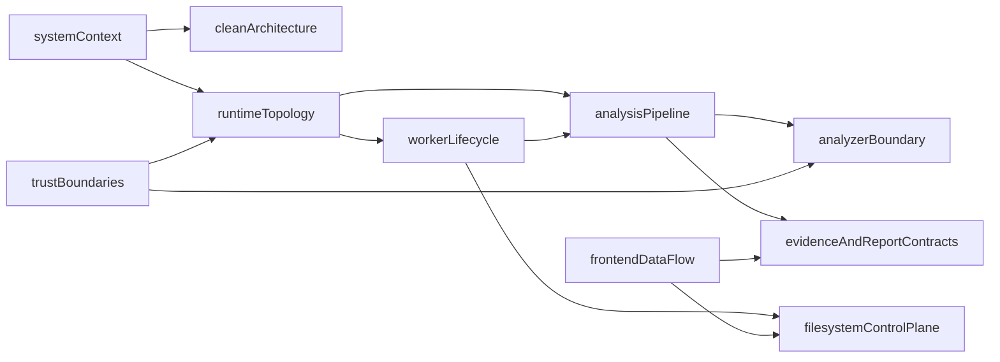

# Architecture (as built)

These pages describe **implemented** SecureMail: Python orchestration, sandboxed
Zeek/TShark, a versioned evidence envelope, filesystem jobs and catalog, a local
worker, and a FastAPI + React dashboard. They are derived from `src/`, `zeek/`,
`frontend/`, and tests — not from historical plans.

If a page here disagrees with a plan under [`plans/`](../../plans/README.md),
source wins. Gaps are labeled **Known limitation**, **Deferred**, or
**Unsupported**.

Canonical command, route, environment, limit, and pin tables live in
[reference](../reference/cli.md). This directory narrates structure and
runtime; it does not copy those tables.

## Pages

| Page | Owns |
|---|---|
| [System context](system-context.md) | Actors, in-scope products, and what is outside this build |
| [Clean architecture](clean-architecture.md) | Layers, import-linter contracts, composition root, live modules |
| [Runtime topology](runtime-topology.md) | Host processes, analyzer containers, data roots |
| [Analysis pipeline](analysis-pipeline.md) | `securemail analyze` from intake through `EvidenceDocument` v2 |
| [Analyzer boundary](analyzer-boundary.md) | Zeek/TShark sandbox, lockfile checks, display filter |
| [Evidence and report contracts](evidence-and-report-contracts.md) | `securemail.evidence/v2` and `securemail.report/v1` |
| [Filesystem control plane](filesystem-control-plane.md) | Jobs, quarantine, catalog, ML history |
| [Worker lifecycle](worker-lifecycle.md) | `python -m securemail.worker`, stages, claim, cancel |
| [Frontend data flow](frontend-data-flow.md) | React queries, four regions, selectors, known resolver gap |
| [Trust boundaries](trust-boundaries.md) | Isolation, untrusted input, host vs container network |

## What the product is

SecureMail is an **offline, deterministic-first** analyzer of SMTP, IMAP, and
POP3 traffic in PCAP/PCAPNG files. Python hashes the capture, runs sandboxed
analyzers, normalizes evidence, applies versioned YAML policy, scores posture,
and optionally wraps a canonical report for HTML/PDF and advisory ML. Packet
parsing, TCP reassembly, protocol identification, TLS handshake decoding, and
X.509 extraction happen in **Zeek**. TShark is a bounded corroboration pass.

The dashboard can **upload captures, cancel jobs, and download HTML/PDF**. It is
not a read-only catalog browser.

## Two pipelines

1. **CLI analyze** — `securemail analyze` writes a pretty-printed
   `securemail.evidence/v2` `EvidenceDocument`. It does **not** emit a report
   envelope.
2. **Worker** — after intake, `assemble_report` wraps that document in
   `securemail.report/v1`, runs advisory ML against local history, renders
   JSON/HTML/PDF, and publishes into the filesystem catalog.

`securemail report` still reads an already-assembled report object. There is no
CLI command that turns analyze JSON into a report envelope.

## Source of truth vs this directory

| Question | Page |
|---|---|
| Commands and options | [CLI reference](../reference/cli.md) |
| HTTP routes and status codes | [API reference](../reference/api.md) |
| Environment variables | [Environment variables](../reference/environment-variables.md) |
| Numeric bounds | [Limits](../reference/limits.md) |
| Pins and extras | [Toolchain](../reference/toolchain.md) |
| Engineering constraints | [`AGENTS.md`](../../AGENTS.md) |

## Related pages

- [Documentation hub](../README.md)
- [Documentation style](../development/documentation-style.md)
- [Current state](../status/current-capabilities.md)

## Implementation anchors

- `src/securemail/bootstrap.py`
- `src/securemail/application/run_analysis.py`
- `src/securemail/application/analysis_workflow.py`
- `frontend/src/App.tsx`

## Test evidence

- `tests/test_empty_fixture.py`
- `tests/test_analysis_api.py`
- `tests/e2e/dashboard.spec.ts`
