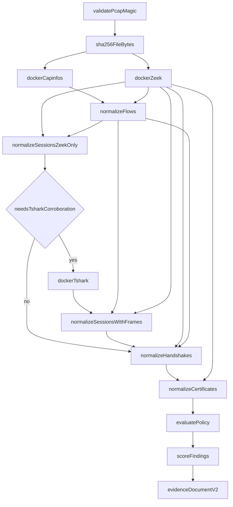

# Analysis pipeline

`securemail analyze <capture> --out <json>` is the CLI end-to-end path. It is
`run_analysis` in
[`application/run_analysis.py`](../../src/securemail/application/run_analysis.py).
The final node is a **`securemail.evidence/v2` `EvidenceDocument`**, not a
report envelope and not a v1 document.

The dashboard worker reuses the same `run_analysis` (or `stub_analyze` when
`SECUREMAIL_ANALYSIS_STUB=1`), then continues with assemble / ML / render /
publish. Those extra stages are [worker lifecycle](worker-lifecycle.md).



Capinfos and Zeek receive the original capture path. The file is hashed
**before** analyzers run. Containers bind it read-only; they do not rewrite it.

## 1. Intake

Reject if the path is not a file. Read the first four bytes:

- PCAPNG: `0a 0d 0d 0a`
- PCAP (any endian / ns variant): `d4 c3 b2 a1`, `a1 b2 c3 d4`, `4d 3c b2 a1`,
  `a1 b2 3c 4d`

Anything else raises `InvalidCaptureError` (CLI exit 1). Then SHA-256 the whole
file into `run_identity.capture_sha256`.

Dashboard upload uses the same magics **and** requires the filename extension
to match (`capture_intake.validate_magic`). See
[API reference](../reference/api.md).

## 2. Preflight (capinfos)

`DockerCapinfosRunner` runs capinfos inside `securemail/tshark:step0` with a
fixed argv (`capinfos -M -c -l -d -u -a -F`). Parsed fields become
`CapturePreflight`. Recipe digest vs lock, then image presence: same TShark
rules as [analyzer boundary](analyzer-boundary.md).

## 3. Zeek (always)

`DockerZeekRunner` runs `securemail/zeek:step0` with checksums ignored (`-C`),
JSON ASCII logs, and `/opt/securemail/zeek/site/__load__.zeek`. Before exec it
hashes on-disk `zeek/`, checks the lock’s Zeek image digest, and inspects
image labels. Mismatch is fatal. Logs are one JSON object per line. Certificate
DER under `certs/` is copied into memory before the temp directory is deleted.

`analyzer_bundle_digest` on the run is SHA-256 of the **lockfile bytes**, not
of the image.

## 4. Normalize flows

`normalize_flows(zeek_result.logs, preflight)` joins `conn.log`, `weird.log`,
`capture_loss.log`, and `sm_tcp_recon.log` into `Flow` records and runs
`classify_reconstruction`. See [tcp-reconstruction.md](../forensics/tcp-reconstruction.md).

## 5. Normalize sessions (first pass)

`normalize_sessions(logs, flows)` with no TShark frames builds `EmailSession`
records from `sm_email.log` and `ssl.log`. Protocol identity, STARTTLS/STLS,
and implicit-TLS assessments are attached on this pass.

`correlate_implicit_tls` returns `observed` plus the ALPN protocol whenever
**selected** ALPN is `smtp` / `imap` / `pop3` **and** TLS is on the connection,
including off 465/993/995. Ports 465/993/995 without selected ALPN are
`indeterminate`. Other ports without ALPN are `not_observable`. Port number
never sets `correlated_protocol`. See
[evidence and report contracts](evidence-and-report-contracts.md).

## 6. Optional TShark corroboration

`needs_tshark_corroboration(sessions, flows, logs)` is true when:

- any session has protocol or payload evidence in `{smtp, imap, pop3}`, or
- any flow’s responder port is 465, 993, or 995, or
- any row in `ssl.log` has a UID (standalone TLS on a non-mail port included)

Empty and non-mail, non-TLS captures (the Step 0 `empty` fixture) skip TShark.

When the gate fires, `DockerTSharkRunner` uses display filter
``smtp or imap or pop or tls.handshake`` and allowlisted `-e` fields.
`normalize_sessions` is called **again** with those frames. Handshake
normalization uses the same frames for message/HRR corroboration. See
[analyzer boundary](analyzer-boundary.md) and
[protocol-identification.md](../forensics/protocol-identification.md).

## 7. Normalize handshakes

`normalize_handshakes` builds top-level `TlsHandshake` records from Zeek
`ssl.log` / ssl-log-ext. TShark supplies frame numbers and HelloRetryRequest
corroboration; Zeek remains the parameter source. Cipher identifiers resolve
through the checked-in IANA snapshot loaded in `bootstrap.py`.

## 8. Normalize certificates

`normalize_certificates` stores extracted DER by SHA-256, joins `ssl.log`
`cert_chain_fps` (and `sm_cert.log` / `files.log` as fallback), and parses with
`cryptography`. Capture-time and analysis-time validity are independent.
TLS 1.3 UIDs without history letter `x` emit no certificates.

When a trust snapshot is wired (production CLI always does), each **server
leaf** gets `validation`: path checks plus RFC 9525 SAN identity. Intermediates
keep `validation: null`. Revocation is `unknown`. OpenSSL CLI is not on this
path.

## 9. Evaluate policy

`evaluate_policy_batch` applies the selected YAML pack without mutating
evidence. Session-level `Finding` records are **negative and indeterminate
only**. Applicable pass/fail/unknown/not-observable evaluations are retained as
`policy_checks`. Genuine non-applicability is omitted.

Default profile: `ietf_current`. `nist_federal` adds NIST-approved-suite/key
rules without relabeling strong non-approved crypto as weak.
`historical_at_capture` uses `capture_start_time` and fails closed if that
timestamp is missing.

Service role is inferred from payload-confirmed protocol plus responder port.
Ambiguous or nonstandard SMTP stays unclassified so relay/submission policy is
never guessed from a port alone.

## 10. Score, dedup, coverage

`score_findings` collapses session findings that share a code and endpoint,
computes `securemail.scoring/v1` named components, and publishes coverage
denominators. Analyze **always** runs this step. Inventory labels default to
`unknown`. See [scoring.md](../user-guide/scoring-and-coverage.md).

## 11. Emit `EvidenceDocument` v2

```text
schema_version = "v2"
run_identity.capture_sha256
run_identity.analyzer_bundle_digest    = SHA-256(lockfile bytes)
run_identity.normalization_schema_version = "v1"
run_identity.configuration_digest
run_identity.analysis_time
run_identity.policy_profile
run_identity.policy_pack_version
run_identity.trust_store_digest
capture_preflight, flows, sessions, handshakes, certificates,
findings, policy_checks, posture
```

The CLI dumps `document.model_dump(mode="json")` with `json.dumps(..., indent=2,
sort_keys=True, ensure_ascii=False)` plus a trailing newline. Certificate DER
sidecars go to `<out-parent>/certificates/<sha256>.der`.

**Analyze does not emit `securemail.report/v1`.** `securemail report` reads an
already-assembled report. The worker calls `assemble_report` after this
document exists.

## Configuration digest

`configuration_digest()` hashes this object (sorted keys, compact separators):

```python
{
    "normalization_schema_version": "v1",
    "zeek_entry": "zeek/site/__load__.zeek",
    "zeek_deterministic": True,
    "capinfos_entry": "capinfos",
    "flow_normalization": "v1",
    "session_normalization": "v2",
    "handshake_normalization": "v1",
    "certificate_normalization": "v1",
    "chain_validation": "v1",
    "expiry_warning_seconds": 2592000,
    "tshark_corroboration": "smtp_imap_pop_tls_handshake",
    "starttls_evaluation": "v1",
    "scoring_schema_version": "securemail.scoring/v1",
    "posture_schema_version": "securemail.posture/v1",
    "evidence_document_schema_version": "v2",
    "expected_hostname": None,
    "iana_tls_parameters_sha256": "<SHA-256 of iana-tls-parameters.json>",
}
```

Policy pack bytes are **not** in this digest; they appear as
`policy_pack_version`. Changing any of those strings, or the IANA snapshot
bytes, changes every fixture’s `run_identity.configuration_digest`.

## Idempotency

`test_empty_analyze_is_byte_identical` runs analyze twice and asserts byte-
identical output. Zeek UIDs are stabilized with
`redef global_hash_seed = "securemail-v0"` in `zeek/site/__load__.zeek`. The
fixture harness requires exact JSON equality, including digests and UIDs.

## Errors

| Exception | Typical cause | CLI |
|---|---|---|
| `InvalidCaptureError` | Not PCAP/PCAPNG | exit 1 |
| `AnalysisError` wrapping `AnalyzerError` | Docker missing, digest mismatch, 120s timeout, non-zero exit, output over 50 MiB | exit 1 |
| `FileNotFoundError` | Capture path missing | exit 1 |

Unknown `--policy-profile` exits 2. Command tables:
[CLI reference](../reference/cli.md).

## Related pages

- [Architecture index](README.md)
- [Analyzer boundary](analyzer-boundary.md)
- [Evidence and report contracts](evidence-and-report-contracts.md)
- [Worker lifecycle](worker-lifecycle.md)

## Implementation anchors

- `src/securemail/application/run_analysis.py`
- `src/securemail/application/normalize_sessions.py`
- `src/securemail/application/assemble_report.py`
- `src/securemail/api/cli/main.py`

## Test evidence

- `tests/test_empty_fixture.py`
- `tests/unit/test_run_analysis.py`
- `tests/unit/test_normalize_sessions.py`
- `tests/support/fixture_harness.py`
