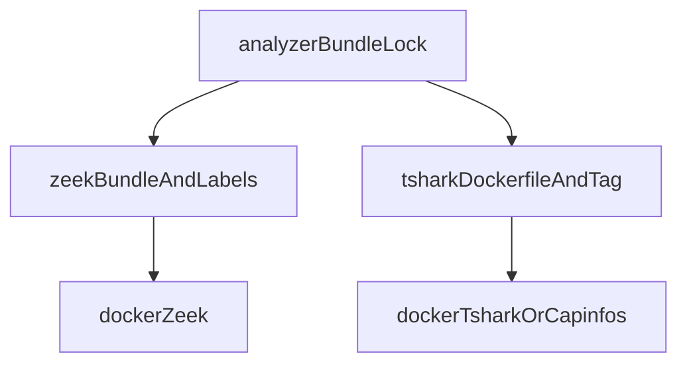

# Analyzer boundary

Packet ingest, TCP reassembly, protocol identification, TLS record decoding,
and X.509 extraction happen in **Zeek**. TShark is a bounded second pass for
mail command/status and TLS handshake message/frame corroboration. Python never
builds analyzer commands through a shell: runners assemble a `list[str]` and
call `subprocess.run`.

Decision record for IMAP/POP3 depth:
[0001 IMAP/POP3 corroboration](../decisions/0001-imap-pop3-corroboration.md).



## Sandbox (every analyzer container)

Flags from [`sandbox.py`](../../src/securemail/adapters/analyzers/sandbox.py):

```text
--network=none --read-only --user 65532:65532 --cap-drop=ALL
--security-opt no-new-privileges --pids-limit 256
--memory 2g --memory-swap 2g --cpus 2
--tmpfs /tmp:rw,nosuid,nodev,size=64m
```

Also `--rm`, capture bind-mounted **readonly** at `/data/capture.pcapng`,
output directory at `/data/out`. Timeout **120s**. Combined stdout (or Zeek log
bytes plus extracted certificate DER) capped at **50 MiB**. Extracted
certificates are additionally bounded to 64 KiB each, 4,096 raw files, and 256
distinct DER values. Numeric
table: [limits](../reference/limits.md).

`assert_fixed_argv` rejects empty parts and the substrings ` && `, ` | `, `;`,
`$(`, backtick.

Local tags: `securemail/zeek:step0`, `securemail/tshark:step0`. Image pins:
[toolchain](../reference/toolchain.md).

Host Python (CLI, API, worker) does **not** receive these flags.

## Lockfile

[`tools/analyzer-bundle.lock`](../../tools/analyzer-bundle.lock) is generated
by [`tools/refresh_analyzer_lock.py`](../../tools/refresh_analyzer_lock.py).
Do not hand-edit it.

| Key | Meaning |
|---|---|
| `zeek_image_digest` | Pinned `zeek/zeek:8.0.10` digest |
| `tshark_image_digest` | SHA-256 of `docker/tshark/Dockerfile` **bytes** (recipe, not a local image id) |
| `zeek_bundle_sha256` | Deterministic hash of every file under `zeek/` |

`AnalysisRun.analyzer_bundle_digest` is SHA-256 of the **lockfile file bytes**.

`make analyzer-lock` regenerates the file. `make zeek-image` / `make tshark-image`
build the local tags. The Zeek image is labeled at build time with
`securemail.zeek_bundle_sha256` and `securemail.zeek_base_digest`.

## Zeek runtime checks (strict)

Before `docker run`, `DockerZeekRunner`:

1. Hashes on-disk `zeek/` and compares to `zeek_bundle_sha256`.
2. Compares the lock’s `zeek_image_digest` to the pinned
   `zeek/zeek:8.0.10` digest in `sandbox.py`.
3. `docker image inspect` of `securemail/zeek:step0` and reads labels
   `securemail.zeek_bundle_sha256` and `securemail.zeek_base_digest`. Missing
   image, missing labels, or mismatch is `AnalyzerDigestMismatchError`.

Invocation (fixed):

```text
docker run … sandbox … securemail/zeek:step0
  zeek -C -D -r /data/capture.pcapng
  LogAscii::use_json=T
  /opt/securemail/zeek/site/__load__.zeek
```

`-C` ignores checksums so lab and Scapy captures still reassemble.

### Site load

[`zeek/site/__load__.zeek`](../../zeek/site/__load__.zeek):

- `redef global_hash_seed = "securemail-v0"` — stable UIDs
- `base/protocols/conn`
- `policy/protocols/ssl/ssl-log-ext` and `validate-certs` (loaded; Python does
  not treat Zeek validation as authoritative)
- `base/protocols/smtp`, `imap`, `pop3`
- DPD signatures `zeek/signatures/email-dpd.sig`
- `zeek/scripts/tcp-reconstruction.zeek`
- `zeek/scripts/securemail-email.zeek`
- `zeek/scripts/securemail-certs.zeek`

`sm_tcp_recon.log` is metadata only. Sequence numbers and lengths are logged;
**payload bytes are never written**. `tcp_max_old_segments = 8`.

`sm_email.log` is unified mail events. Text bounded to 128 characters. Secret
commands’ arguments/text replaced with `<redacted>`. Ambiguous greeting DPD
can emit `event_type=ambiguous_banner` with `protocol=unknown`.

Certificate extraction writes DER under `/data/out/certs/<fuid>.der`. The
runner copies those bytes into `ZeekRunResult.extracted_certificates` before
the output directory is deleted. Python stores them by SHA-256.

`x509.log` is a cross-check. Python does not treat it as TLS 1.3 certificate
evidence.

## TShark runtime checks (weaker)

`tshark_image_digest` in the lock is the Dockerfile SHA-256. At runtime
`DockerTSharkRunner` and `DockerCapinfosRunner`:

1. Hash `docker/tshark/Dockerfile` and compare to the lock.
2. `docker image inspect securemail/tshark:step0` — **presence only**.

They do **not** verify local image bytes, Debian package version, or labels.

**Known limitation:** `apt-get install tshark` in the Dockerfile is
unversioned. Rebuilding later can produce a different TShark while the
Dockerfile hash still matches. Documented in
[toolchain](../reference/toolchain.md).

### When TShark runs

`needs_tshark_corroboration` — see [analysis pipeline](analysis-pipeline.md).
Not started for the empty fixture or captures with neither mail nor TLS
handshake evidence.

### Display filter (literal)

```text
smtp or imap or pop or tls.handshake
```

This is **not** `tls.handshake.type == 1`. Handshake type is an allowlisted
`-e` field, not the display filter.

### Allowlisted `-e` fields only

- `frame.number`, `frame.time_epoch`
- `ip.src`, `ip.dst`, `ipv6.src`, `ipv6.dst`
- `tcp.srcport`, `tcp.dstport`
- `imap.request.command`, `imap.response.status`, `imap.tag`, `imap.isrequest`
- `pop.request.command`, `pop.response.indicator`
- `smtp.req.command`, `smtp.response.code`
- `tls.handshake.type`
- `tls.handshake.extensions_key_share_selected_group`
- `tls.handshake.sig_hash_alg`

Explicitly excluded: `imap.line`, usernames/passwords, POP parameters/data,
SMTP parameters/auth, `tls.handshake.certificate`, key-share key material.

Output is CSV (`-T fields`, header, quoted, all occurrences). Python parses
rows into dicts; empty cells become `null`. Comma-joined handshake types are
split so CertificateVerify in the same frame as Certificate is still visible.

**Known limitation:** TShark uses `subprocess.run(capture_output=True)` and
checks size afterward. Documented output limits bound accepted data, not peak
host allocation during collection.

TShark’s mail dissectors bind **well-known ports**. Nonstandard-port identity
stays on Zeek DPD (`imap_nonstandard_port`, `pop3_nonstandard_port` stay
`corroboration=zeek`).

## Capinfos

Same TShark image, same sandbox, same Dockerfile-hash + tag-presence checks.
Argv: `capinfos -M -c -l -d -u -a -F /data/capture.pcapng` via `--entrypoint
capinfos`. Stdout is parsed into `CapturePreflight`.

## IANA TLS Parameters

Checked-in snapshot
[`iana-tls-parameters.json`](../../src/securemail/adapters/reference_data/iana-tls-parameters.json).
Analysis workers never fetch IANA. The snapshot SHA-256 is part of
`configuration_digest`.

## Redaction and hostility

Treat every capture as hostile. Session-normalizer bounds include 10 000 Zeek
rows, 10 000 TShark frames, 256 events per session, 64-char UIDs, 253-char
hosts, 32-char commands/tags, 128-char text. Certificate parsing rejects DER
above 64 KiB and ASN.1 constructed depth above 16. No packet payloads,
credentials, or message bodies are written to logs or JSON.

## Not in this build

No Spicy analyzers. No unbounded `tshark -V` tree. No AIA/OCSP/CRL/CT/DNS
lookups from the worker. Zeek `validate-certs` is a cross-check only; Python
path validation is authoritative.

## Related pages

- [Architecture index](README.md)
- [Analysis pipeline](analysis-pipeline.md)
- [Trust boundaries](trust-boundaries.md)
- [Limits](../reference/limits.md)
- [Toolchain](../reference/toolchain.md)

## Implementation anchors

- `src/securemail/adapters/analyzers/sandbox.py`
- `src/securemail/adapters/analyzers/zeek_runner.py`
- `src/securemail/adapters/analyzers/tshark_runner.py`
- `src/securemail/adapters/analyzers/capinfos_runner.py`
- `src/securemail/adapters/analyzers/bundle_lock.py`
- `zeek/site/__load__.zeek`

## Test evidence

- `tests/unit/test_analyzer_argv.py`
- `tests/unit/test_bundle_lock.py`
- `tests/unit/test_capinfos_parse.py`
- `tests/test_empty_fixture.py`
