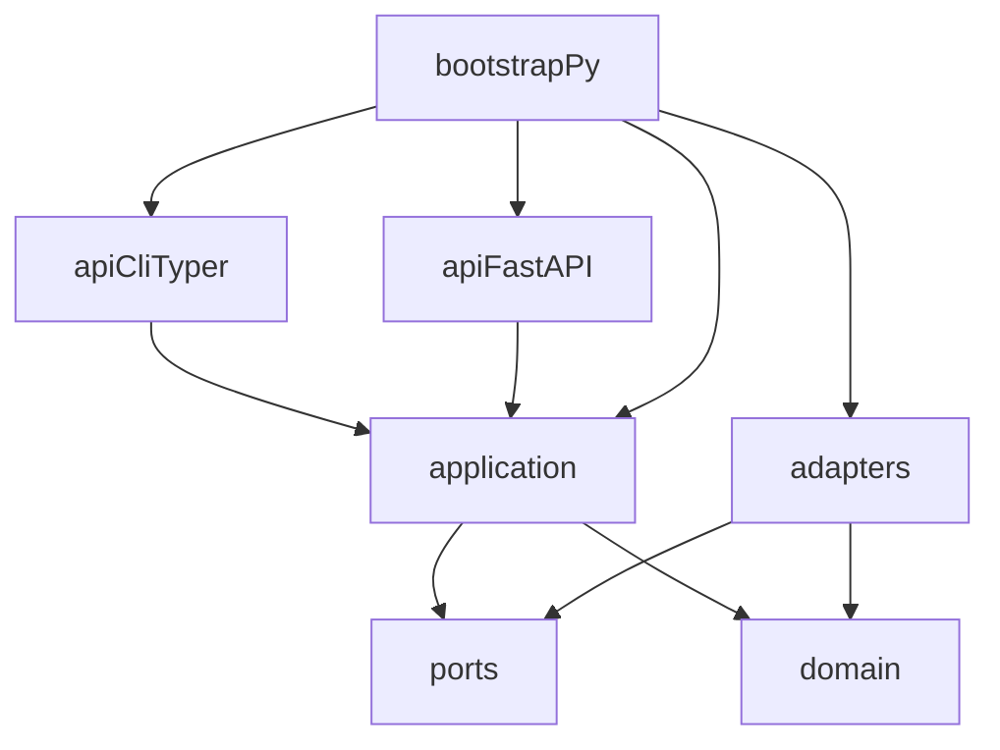

# Clean architecture

SecureMail is a layered Python package with a single composition root. Import
boundaries are enforced by **import-linter** in [`pyproject.toml`](../../pyproject.toml),
not by review convention.

`src/securemail/bootstrap.py` is the composition root: it constructs adapters
and closes them over application use cases. `create_cli()` and `create_api()`
are the two public factories.

**Known limitation vs [`AGENTS.md`](../../AGENTS.md):** the brief says `api/`
imports only `application/` (via bootstrap) and that bootstrap is the *only*
module that imports a port and its adapter. Live FastAPI modules still import
some `ports/` types:

- `api/dependencies.py` — `AnalysisJobStore`, `ReportRepository`
- `api/routers/analyses.py` — job/persistence exceptions
- `api/routers/reports.py` and `api/cli/commands/report.py` — `MAX_REPORT_BYTES`

import-linter does **not** forbid `api` → `ports`. The three contracts below
are what CI actually checks.

## Layer rules (as enforced)

| Layer | May import | Must not |
|---|---|---|
| `domain/` | stdlib, Pydantic, other `domain/` | `adapters/`, `ports/`, `application/`, `api/`, I/O, Docker, subprocess |
| `application/` | `domain/`, `ports/` | concrete `adapters/` |
| `adapters/` | `ports/`, `domain/` | `application/`, `api/` |
| `api/` | `application/` (intended); some `ports/` (live drift) | Zeek/TShark runners, PKI crypto, policy arithmetic |
| `ports/` | stdlib, typing, domain types as signatures | `docker`, `subprocess`, SQLAlchemy |

## Import-linter contracts

Three contracts in `pyproject.toml`:

1. **Domain has no outward dependencies** — `securemail.domain` must not import
   adapters, ports, application, or api.
2. **Application does not import concrete adapters** — `securemail.application`
   must not import `securemail.adapters`.
3. **Layers are independent of api** — domain, application, adapters, and ports
   must not import `securemail.api`.

`make lint` runs import-linter with ruff and mypy.

## Composition root

[`bootstrap.py`](../../src/securemail/bootstrap.py) constructs:

- `DockerZeekRunner`, `DockerCapinfosRunner`, `DockerTSharkRunner`
- `CertificateStore`
- `load_iana_tls_parameters()`, `load_trust_store_snapshot()`, `load_policy_pack`
- report canonicalize / HTML / PDF callables
- `FilesystemReportRepository`, `FilesystemJobStore`, `FilesystemCatalogPublisher`,
  `FilesystemMlHistoryStore` for API and worker
- `BaselineAnomalyScorer` and `IsolationForestScorer` for advisory paths

`_analyze` calls `run_analysis`. When `SECUREMAIL_ANALYSIS_STUB=1`, the worker
uses `stub_analyze` instead (Playwright / tests only; not an acceptance proof).

`create_cli()` injects `_analyze`, `score_findings`, `_render_report`,
`_parse_report`, `_evaluate_ml`, and `_apply_advisory` into the Typer app.
`create_api()` injects `ApiDependencies` into `build_app`. Invalid
`SECUREMAIL_MAX_CAPTURE_BYTES` is swallowed in `create_api()` and replaced with
the 64 MiB default; the CLI intake path raises. See
[environment variables](../reference/environment-variables.md).

## Canonical records that exist

Live frozen Pydantic models:

| Record | Module |
|---|---|
| `AnalysisRun`, `CapturePreflight`, `EvidenceDocument` | `domain/evidence/run.py` |
| `Flow` | `domain/evidence/flow.py` |
| `EmailSession` | `domain/evidence/session.py` |
| `TlsHandshake` | `domain/evidence/handshake.py` |
| `CertificateEvidence`, `CertificateValidation` | `domain/evidence/certificate.py` |
| `Finding` | `domain/findings/finding.py` |
| `PolicyCheck`, `PostureAssessment` | `domain/findings/posture.py` |
| `AnomalyResult`, `EndpointWindow` | `domain/ml/models.py` |
| `CanonicalReport`, `ReportManifest` | `domain/reports/schema.py` |
| `AnalysisJob` | `domain/jobs/models.py` |

`AnomalyResult` is never merged into `Finding`. Domain models are constructed
in `application/` normalizers; they do not parse raw Zeek/TShark bytes
themselves.

**`Case`, `Capture`, and `AuditEvent` are not live domain models.** Those names
are design vocabulary. Report manifests carry `case_id` / `capture_id` strings
and `SourceRecordKind` labels (`case`, `capture`, `analysis_run`). There is no
`class Case`, `class Capture`, or `class AuditEvent` under `src/`.

## Live modules

### `api/`

| Path | Role |
|---|---|
| `api/cli/main.py` | Typer app; registers `analyze`, `score`, `report`, `evaluate-ml` |
| `api/cli/commands/score.py` | Thin `score` command |
| `api/cli/commands/report.py` | Thin `report` command; `--advisory` |
| `api/cli/commands/analyze.py` | Unused Step 0 stub; live `analyze` is `register_analyze` in `main.py` |
| `api/cli/commands/evaluate_ml.py` | Thin `evaluate-ml` over a seeded cohort directory |
| `api/main.py` | FastAPI factory, security headers, optional worker lifespan |
| `api/dependencies.py` | Shared report and capture-analysis dependencies |
| `api/routers/reports.py` | Health, catalog, report JSON, preview |
| `api/routers/analyses.py` | Upload, status, cancel, HTML/PDF downloads |

Console script: `securemail = "securemail.api.cli.main:main"`. `main()` imports
`create_cli` lazily so `api` does not load adapters at module import.

### `application/`

| Path | Role |
|---|---|
| `run_analysis.py` | Intake, hash, preflight, Zeek, optional TShark, normalize, policy, score, assemble `EvidenceDocument` |
| `assemble_report.py` | Wrap an `EvidenceDocument` in `securemail.report/v1` without re-scoring |
| `capture_intake.py` | Bounded streaming intake and duplicate reuse |
| `analysis_workflow.py` | Worker stages after claim |
| `analysis_queries.py` | Job status, cancel, artifact reads, catalog HTML/PDF |
| `render_report.py` | Dump one `CanonicalReport`; derive JCS/HTML/PDF from that dump |
| `report_queries.py` | Bounded parse, summaries, catalog lookup |
| `normalize_flows.py` / `normalize_sessions.py` / `normalize_handshakes.py` / `normalize_certificates.py` | Analyzer logs → domain models |
| `advisory_pipeline.py` | Feature extraction, `AnomalyResult` assembly; never mutates `Finding` |
| `stub_analyze.py` | Docker-free stub for UI tests |

### `domain/`

Pure functions and frozen models. STARTTLS machines, TLS key-exchange and
forward-secrecy classifiers, PKI path/identity, YAML rule engine, scoring,
dedup, and posture live here. Rule packs are YAML under
`domain/policies/rules/`.

### `ports/`

`typing.Protocol` only: `ZeekRunner`, `TSharkRunner`, `CapturePreflightRunner`,
`ArtifactStore`, `AnomalyScorer`, `ReportRepository`, `CatalogPublisher`,
`AnalysisJobStore`, `MlHistoryStore`.

### `adapters/`

Docker runners, lockfile, IANA/policy loaders, certificate store, trust store,
JCS/HTML/PDF, ML baselines and Isolation Forest, filesystem job store, catalog,
ML history. OpenSSL CLI (`openssl_crosscheck.py`) is **test-only**.

## Related pages

- [Architecture index](README.md)
- [Runtime topology](runtime-topology.md)
- [Evidence and report contracts](evidence-and-report-contracts.md)
- [Toolchain](../reference/toolchain.md)

## Implementation anchors

- `src/securemail/bootstrap.py`
- `pyproject.toml` (`[tool.importlinter.contracts]`)
- `src/securemail/api/dependencies.py`
- `src/securemail/domain/evidence/run.py`

## Test evidence

- `tests/unit/test_evidence_state.py`
- `tests/unit/test_report_schema.py`
- `tests/unit/test_assemble_report.py`
