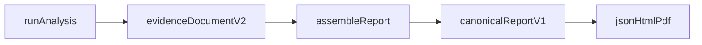

# Evidence and report contracts

The analyze CLI writes one **`EvidenceDocument`** with
`schema_version: "v2"` (`securemail.evidence/v2` in product language).
Normalization facts inside that envelope still use
`NORMALIZATION_SCHEMA_VERSION = "v1"`. Models live under
[`domain/evidence/`](../../src/securemail/domain/evidence/). They are frozen
Pydantic v2 models (`extra="forbid"`).

The report envelope is **`securemail.report/v1`** (`CanonicalReport`). It
embeds the v2 evidence document unmodified. Analyze does **not** produce this
wrapper; `assemble_report` (worker) and hand-authored goldens do.

Serialization for analyze/score: `model_dump(mode="json")` then `json.dumps`
with sorted keys. Report JSON is RFC 8785 compact bytes.



## Evidence envelope

```text
EvidenceDocument
  schema_version: "v2"
  run_identity: AnalysisRun
  capture_preflight: CapturePreflight
  flows: Flow[]
  sessions: EmailSession[]
  handshakes: TlsHandshake[]
  certificates: CertificateEvidence[]
  findings: Finding[]
  policy_checks: PolicyCheck[]
  posture: PostureAssessment
```

Standalone TLS (no mail session) is retained in `handshakes`. Certificates are
a separate top-level array linked by Zeek `uid` and `chain_index`. `findings`
never mutate the evidence arrays. `policy_checks` retain applicable
pass/fail/unknown/not-observable evaluations. `posture` holds endpoint-deduped
prioritized findings and coverage denominators.

Field-level catalog: [evidence schema](../reference/evidence-schema.md).
Command options: [CLI reference](../reference/cli.md).

### `AnalysisRun`

| Field | Today |
|---|---|
| `capture_sha256` | SHA-256 of the intake file |
| `analyzer_bundle_digest` | SHA-256 of `tools/analyzer-bundle.lock` bytes |
| `normalization_schema_version` | `"v1"` |
| `configuration_digest` | Hash of the frozen config dict plus IANA snapshot digest and optional expected hostname |
| `analysis_time` | `--analysis-time`, else now (seconds precision in JSON) |
| `policy_profile` | `ietf_current` (default), `nist_federal`, or `historical_at_capture` |
| `policy_pack_version` | SHA-256 of canonical validated pack JSON |
| `trust_store_digest` | SHA-256 of `adapters/pki/trust-store-snapshot.pem` |

Idempotency key from the design (not a stored field) is the tuple of those
digests. Policy is **not** folded into `configuration_digest`.

`Case`, `Capture`, and `AuditEvent` are **not** fields or models here.

## Evidence states

Defined once in `domain/evidence/run.py` as `EvidenceState`. Nothing redefines
the enum.

| State | Meaning in this build |
|---|---|
| `observed` | Directly seen |
| `verified` | Reserved on classifiers; used as finding `evaluation_state` for negatives |
| `inferred` | TLS 1.2 key exchange from IANA suite-name grammar (and TLS 1.3 PSK-only when key_share is absent) |
| `incomplete` | Missing bytes or boundaries |
| `conflicting` | Retransmission conflict, or Zeek vs TShark protocol disagreement |
| `not_observable` | Check does not apply, or implicit TLS off 465/993/995 without selected ALPN |
| `indeterminate` | Ambiguous banner, TLS on 465/993/995 without selected ALPN, unresolved identity |

`not_observable`, `incomplete`, and `indeterminate` are **not** “secure”.
Fixture tests assert the state field itself.

## Identification and implicit TLS

`EmailSession` identification fields are **independent**: `port_hint` is not
proof of `payload_evidence`.

`correlate_implicit_tls` (implemented behavior):

| Condition | `correlated_protocol` | `evidence_state` | `source` |
|---|---|---|---|
| TLS **and** selected ALPN in `{smtp, imap, pop3}` — **any responder port** | that protocol | `observed` | `alpn` |
| Responder port in {465,993,995}, TLS, no selected ALPN | `null` | `indeterminate` | `none` |
| Responder port in that set, no TLS | `null` | `indeterminate` | `none` |
| Other ports, no selected ALPN | `null` | `not_observable` | `null` |

Selected ALPN plus TLS is `observed` even off 465/993/995 (for example SMTP
ALPN on 587). Offered-but-unselected ALPN is ignored (`protocol_from_alpn`
uses Zeek `ssl.log` `next_protocol` only). Port number never sets
`correlated_protocol`.

STARTTLS/STLS machines: [starttls.md](../forensics/starttls-and-stls.md).

## Handshakes and certificates

- `supported_versions` wins over the legacy record-layer version.
- TLS 1.3 key exchange comes from `key_share` / groups / PSK modes — never
  from cipher-suite name.
- Certificate signature algorithm ≠ handshake `CertificateVerify` algorithm.
- `valid_at_capture_time` and `valid_at_analysis_time` are independent.
- Path validity and `identity_match` are independent. SAN matching is RFC 9525;
  **no CN fallback**. Revocation without imported OCSP/CRL is `unknown`.
- TLS 1.3 without history letter `x` emits no certificate records.

## Findings vs checks vs posture

`Finding` records are negative or indeterminate outcomes from YAML packs.
Pass/present results stay in `policy_checks`. Scoring formula and coverage
vocabulary: [scoring.md](../user-guide/scoring-and-coverage.md).

Forward secrecy: TLS 1.2 ECDHE/DHE present; static RSA/DH/ECDH absent;
TLS 1.3 (EC)DHE present; PSK-only or missing handshake indeterminate. Present
outcomes are not emitted as findings.

## Report envelope

```text
CanonicalReport
  schema_version: "securemail.report/v1"
  manifest: ReportManifest
  evidence: EvidenceDocument          # v2, unmodified
  limitations: CaptureLimitations
  stage_errors: StageError[]
  suppressed_findings: Finding[]
  exceptions: str[]
  advisory: { present, items[] }
  analyst_conclusions: { present, notes[] }
```

`assemble_report` copies digests from `run_identity`, derives limitation
counts from flows/handshakes/coverage, and leaves advisory empty. The worker
fills advisory later. `securemail report --advisory` fills it on the CLI path.

JSON is authoritative. HTML and PDF render the **same in-memory dump**.
Canonicalize with RFC 8785 before hashing. The report’s own digest is written
beside JSON as `report.json.sha256`, not stored inside the object.

Unavailable fields stay labeled. They are not invented. See
[reports.md](../user-guide/generate-reports.md).

Jinja2 autoescape stays on. `forensic_text` makes C0/C1 and bidi overrides
visible; Jinja then HTML-escapes. The PDF URL fetcher allows only `data:`
URLs.

## Related pages

- [Architecture index](README.md)
- [Analysis pipeline](analysis-pipeline.md)
- [Frontend data flow](frontend-data-flow.md)
- [CLI reference](../reference/cli.md)

## Implementation anchors

- `src/securemail/domain/evidence/run.py`
- `src/securemail/domain/reports/schema.py`
- `src/securemail/domain/policies/starttls/implicit_tls.py`
- `src/securemail/application/assemble_report.py`
- `src/securemail/application/render_report.py`

## Test evidence

- `tests/unit/test_evidence_state.py`
- `tests/unit/test_implicit_tls.py`
- `tests/unit/test_assemble_report.py`
- `tests/test_report_fixtures.py`
- `tests/unit/test_canonical_json.py`
