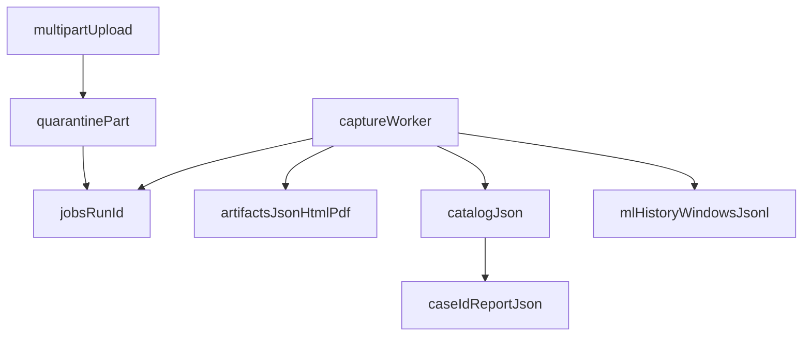

# Filesystem control plane

The published catalog and capture jobs are **filesystem-backed**. There is no
live SQL control plane. PostgreSQL, SQLAlchemy repositories, Alembic, and
asyncpg are **Deferred** as a product; they are not invoked from `src/`.

**Known limitation:** the `api` extra in `pyproject.toml` still lists
`sqlalchemy`, `asyncpg`, and `alembic`. Those packages are unused remnants, not
a database. `DATABASE_URL` is not read. See
[environment variables](../reference/environment-variables.md) and
[toolchain](../reference/toolchain.md).



## Roots

| Environment variable | Role |
|---|---|
| `SECUREMAIL_DATA_ROOT` | Jobs, quarantine, ML history |
| `SECUREMAIL_REPORT_ROOT` | `catalog.json` and `{case_id}.report.json` |

If only the report root is set, it is also the data root. Defaults and
invalid-byte handling: [environment variables](../reference/environment-variables.md).
Numeric caps: [limits](../reference/limits.md).

## Layout

```text
<data-root>/
  jobs/<run_id>/
    status.json
    capture.pcap | capture.pcapng
    cancel.flag                 # present while cancel is requested
    artifacts/
      report.json
      report.html
      report.pdf
  quarantine/
    u<hex>.part                 # in-flight uploads
  ml_history/
    windows.jsonl

<report-root>/
  catalog.json
  <case_id>.report.json
```

`AnalysisJob` never carries filesystem paths. The worker asks
`job_store.capture_path(run_id)` internally.

## Intake and jobs

[`capture_intake.ingest_capture`](../../src/securemail/application/capture_intake.py)
streams chunks through `FilesystemJobStore.stage_capture`:

- Writes under `quarantine/` with `O_CREAT|O_EXCL` and `O_NOFOLLOW`.
- **fsyncs** the quarantine file descriptor after the stream (this is the
  upload path, not the catalog).
- Hashes SHA-256 while writing; keeps the first four bytes for magic checks.
- Extension must match PCAP vs PCAPNG magic.
- Duplicate `(capture_sha256, policy_profile, expected_hostname)` reuses an
  in-flight or completed job and aborts the staged file.
- `commit_staged` `os.replace`s the part file into `jobs/<run_id>/capture.*`,
  creates `artifacts/`, and writes `status.json`.

New jobs are `status=queued`, `stage=intake`. Run ids are `r` + 16 hex chars.
Case ids are caller-supplied or derived from a sanitized filename stem plus
eight hex chars of the digest.

Quota: 64 job directories (including completed), 2 GiB of jobs+quarantine,
64 MiB default upload. **Known limitation:** `max_jobs` is not a concurrent-job
cap; quota accounting can double-count a staged upload during commit.

Status writes use a temp file plus `os.replace`. Artifact writes do the same.
Those paths do **not** fsync.

## Catalog publication

[`FilesystemCatalogPublisher.publish_report`](../../src/securemail/adapters/persistence/writable_catalog.py):

1. Validate `case_id` (`^[A-Za-z0-9][A-Za-z0-9._-]{0,159}$`).
2. Write `{case_id}.report.json` via temp file + **`os.replace`**.
3. Load `catalog.json`, replace or append the case entry, sort by `case_id`.
4. Write `catalog.json` via temp file + **`os.replace`**.

There is **no fsync** on catalog or report files. There is **no interprocess
lock** (no flock, no lockfile). Two publishers can interleave.

Schema: `securemail.report-catalog/v1`. Each entry is
`{"case_id": "…", "report": "<case_id>.report.json"}`. Max 256 entries, catalog
file 1 MiB, report JSON 8 MiB.

**Known limitation:** `CatalogPublisher.publish_report`’s protocol docstring
says it fsyncs. The adapter does not.

### Read path

[`FilesystemReportRepository`](../../src/securemail/adapters/persistence/report_repository.py)
is symlink-safe and path-jail’d:

- Report root must be a non-symlink directory.
- Catalog paths must stay beneath the root, end in `.json`, and not be
  `catalog.json` itself.
- Opens with `O_NOFOLLOW`; refuses non-regular files.
- Lookup is by explicit `case_id`. There is no implicit current/latest report.

HTML/PDF for catalog cases are **rendered on download** from the stored JSON
(`render_case_artifact`). Job HTML/PDF are pre-rendered artifacts under
`jobs/<run_id>/artifacts/`.

## ML history

[`FilesystemMlHistoryStore`](../../src/securemail/adapters/persistence/ml_history_store.py)
keeps at most 512 `EndpointWindow` records in `ml_history/windows.jsonl`.
Append rewrites the file through a temp path then `Path.replace`. Invalid JSON
fails closed. History is **not** fully included in the 2 GiB data-root quota.

## What is not here

- No interprocess CAS for job claim (see [worker lifecycle](worker-lifecycle.md)).
- No retention sweeper; operators delete `jobs/` and catalog files themselves.
- No `AuditEvent` log. Failed jobs store `error_message` (max 1000 characters)
  on `status.json`.

## Related pages

- [Architecture index](README.md)
- [Worker lifecycle](worker-lifecycle.md)
- [Runtime topology](runtime-topology.md)
- [Limits](../reference/limits.md)
- [Environment variables](../reference/environment-variables.md)
- [API reference](../reference/api.md)

## Implementation anchors

- `src/securemail/adapters/persistence/job_store.py`
- `src/securemail/adapters/persistence/writable_catalog.py`
- `src/securemail/adapters/persistence/report_repository.py`
- `src/securemail/adapters/persistence/ml_history_store.py`
- `src/securemail/application/capture_intake.py`
- `src/securemail/domain/jobs/models.py`

## Test evidence

- `tests/unit/test_job_store.py`
- `tests/unit/test_writable_catalog.py`
- `tests/unit/test_report_repository.py`
- `tests/unit/test_capture_intake.py`
