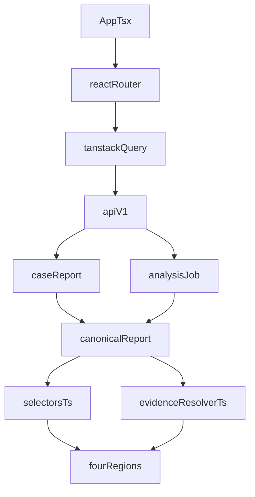

# Frontend data flow

The dashboard is a React 19 + Vite 8 SPA (`frontend/`). It consumes
`securemail.report/v1` JSON from FastAPI. Packet decoding does not run in the
browser. The UI is **not** read-only: it uploads PCAP/PCAPNG, cancels in-flight
jobs, and offers HTML/PDF downloads.

Node 22 is pinned in `frontend/.nvmrc`. Stack: React Router, TanStack Query,
TanStack Table, ECharts, Tailwind, Motion, Vitest, Playwright. Routes: [API
reference](../reference/api.md). UI routes:
[dashboard workflows](../user-guide/dashboard-workflows.md).

## Selection and isolation

[`App.tsx`](../../frontend/src/App.tsx) is a dark-only shell: logo → `/cases`,
**Upload capture** → `/upload`. Client routes:

| Path | Owner |
|---|---|
| `/cases` | catalog summaries only |
| `/cases/:case_id` | case report; optional `?run=` for job artifacts |
| `/upload` | capture intake and job polling |

Every report fetch names a case or run explicitly. There is no implicit
current/latest report. **Back to catalog** navigates to `/cases` and
`removeQueries` for `case-report`, `analysis`, and `analysis-report` so
another case cannot leak into the view. Playwright covers this in
`tests/e2e/dashboard.spec.ts`.

The catalog page is the no-case-selected view
(`data-testid="no-case-selected"`). It must not render another case’s
evidence.

## TanStack Query keys

| Key | Source | Notes |
|---|---|---|
| `["cases"]` | `GET /api/v1/cases` | catalog summaries only |
| `["analysis", run_id]` | `GET /api/v1/analyses/{run_id}` | enabled on `/upload` while queued/running; refetch every 1s |
| `["analysis-report", run_id]` | `GET /api/v1/analyses/{run_id}/report` | enabled on `/cases/:id?run=` |
| `["case-report", case_id]` | `GET /api/v1/cases/{case_id}/report` | enabled on `/cases/:id` when `run` is absent |

Visible report: `analysis_report_query.data ?? report_query.data ?? null`.
While a run is in progress, `/upload` shows the six-stage analysis ledger and
Cancel. On `completed`, the upload page navigates to the case detail.

Vite proxies `/api` to `VITE_API_TARGET` (default `http://127.0.0.1:8000`).
After `npm --prefix frontend run build`, FastAPI serves `frontend/dist` and
returns `index.html` for extensionless client routes.

## Upload and cancel

[`create_analysis`](../../frontend/src/core/api.ts) posts multipart `file` plus
`policy_profile` (default `ietf_current`). Filename must end in `.pcap` or
`.pcapng`. On success the upload page stores the job and polls. Cancel posts
`/analyses/{run_id}/cancel`. HTML/PDF links use either job artifact URLs or
catalog render URLs depending on whether `run` is set
([`case_view.tsx`](../../frontend/src/components/case_view.tsx)).

The in-progress ledger is a presentation of `AnalysisJob`, not a second worker
state machine. It has exactly these ordered rows: capture intake,
deterministic analysis, assemble report (`policy_scoring`), advisory
evaluation, report rendering, and publication. A queued intake job says
**Waiting for the local worker**; a running job names the real worker stage in
plain language. The page derives total elapsed time only from `created_at` and
the browser clock. It does not expose a percentage, ETA, queue position,
substage, or artifact forecast.

The current row has `aria-current="step"`, and phase title plus job status share
one polite status region. The elapsed timer is intentionally outside that live
region. A small CSS tracer is decorative, indeterminate, and present only
while a job has not accepted a cancellation request. `motion` transitions are
keyed by status/stage/cancellation state rather than `updated_at`, so a normal
one-second poll does not restart them. Reduced-motion removes the tracer and
translation; forced-colors retains marker outlines, the active rail, visible
status text, and button boundaries.

## Analyst-first workbench

[`CaseView`](../../frontend/src/components/case_view.tsx) places an
**Assessment trust** gate above every case subview. It shows the canonical
assessment state, **Highest endpoint priority (0–100)** (or **Not proven**),
coverage counts, passive-evidence limitations, stage errors, and report
provenance. Acknowledging a limit is local UI state; it never resolves or
rewrites that evidence.

The final ruled section of that card is the report-scoped **Analyst snapshot**.
It remains above View focus and the case tabs. `attention_rings.tsx` projects
four exact, presentation-only attention ratios: failed checks, unresolved
checks, mail sessions without a same-UID published TLS establishment, and TLS
handshakes whose server certificate is not observable. Its centre is the
canonical highest endpoint priority, never a health or percent-secure score.
Zero denominators say **No applicable data**; unknown and not-observable values
never become passes.

`evidence_heatmap.tsx` projects flows, sessions, handshakes, and certificates
into one shared seven-row contribution matrix with adjacent labelled groups
and one scroller. It does not render an independent heatmap or scroll area for
each inventory. Each cell is one canonical record in report order.
Flow/session/handshake keys are `record_type + uid`; certificate keys
are `uid:role:chain_index:der_sha256`. `select_evidence_bands` joins checks by
exact `record_type` + `record_key` and findings only by exact
`evidence_references`, then retains all linked details in the record inspector.
It does not infer endpoint associations, run policy, or mutate the report.
Each group initially renders at most 104 records and expands locally in
104-record increments. Selection, limits, and roving focus reset when report
identity changes.

The workbench keeps these four authority regions separate:

1. **Observed Facts** — flow, session, handshake, and certificate records;
   explicit STARTTLS/STLS timelines; frame-linked protocol and TLS messages.
2. **Deterministic Conclusions** — canonical endpoint findings in an
   endpoint-first risk tree, plus a searchable ledger and six-part score
   explanation.
3. **Advisory / ML** — `report.advisory.items`; always marked as unable to
   change deterministic findings.
4. **Analyst Conclusions** — `report.analyst_conclusions.notes`, read-only in
   this build.

Hostile strings go through `render_forensic_text` (C0/C1 and bidi made
visible). HTML is not interpreted. Playwright asserts the four regions,
hostile strings, limitation gate, and HTML/PDF links.

The catalog lists catalog **summaries** (risk, finding count, unknown
counts) without loading full evidence until Open case.

## Selectors do not recompute findings

[`selectors.ts`](../../frontend/src/core/selectors.ts) maps
`evidence.posture.prioritized_findings` into presentation rows, zero-filled
protocol × category coverage cells, endpoint groups, stable rule-domain and
remediation groups, session/TLS projections, and presented certificate chains.
Protocol is joined from `policy_checks` by record key or endpoint. Filters,
sorts, role focus, and grouping are presentation-only.

Selectors **do not** re-run the rule engine, re-score, deduplicate, or rewrite
findings. The score shown is the canonical highest endpoint priority, not a
health percentage. Coverage is always presented as passed, failed, unknown,
and not-observable counts; the latter two are never treated as passed.

## Evidence resolver

[`evidence_resolver.ts`](../../frontend/src/core/evidence_resolver.ts) looks up
a record by `record_type` + `record_key`, including canonical composite
certificate keys, then walks `field_path` on that record.

It accepts both old relative paths (`version.selected`) and engine-qualified
paths (`handshake.version.selected`, `session.explicit_upgrade.state`,
`certificate.validation.identity_match`, and `flow.*`). It strips exactly the
matching record prefix. Known `derived.*` display inputs resolve only from the
same report: service role, observed commands, transport TLS establishment, and
forward-secrecy outcome. This is display resolution, never browser-side policy
evaluation.

An unknown path or missing record remains an explicit **field unavailable** or
**record unavailable** status. Null frame references say **No direct frame
linked**; related record context is not labelled as the exact frame.

## Related pages

- [Architecture index](README.md)
- [Evidence and report contracts](evidence-and-report-contracts.md)
- [Worker lifecycle](worker-lifecycle.md)
- [API reference](../reference/api.md)
- [Dashboard navigation simplification](../../plans/proposals/dashboard-navigation-simplification.md)

## Implementation anchors

- `frontend/src/App.tsx`
- `frontend/src/pages/catalog_page.tsx`
- `frontend/src/pages/case_page.tsx`
- `frontend/src/pages/upload_page.tsx`
- `frontend/src/core/api.ts`
- `frontend/src/core/selectors.ts`
- `frontend/src/core/evidence_resolver.ts`
- `frontend/src/components/case_view.tsx`
- `frontend/src/components/finding_details.tsx`
- `frontend/vite.config.ts`
- `src/securemail/api/main.py`

## Test evidence

- `frontend/src/core/selectors.test.ts`
- `frontend/src/core/evidence_resolver.test.ts`
- `frontend/src/core/forensic_text.test.ts`
- `frontend/src/App.test.tsx`
- `tests/e2e/dashboard.spec.ts`
- `tests/test_report_api.py`
