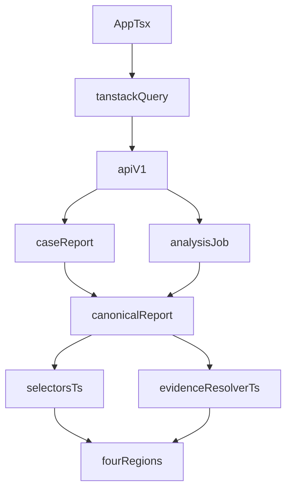

# Frontend data flow

The dashboard is a React 19 + Vite 8 SPA (`frontend/`). It consumes
`securemail.report/v1` JSON from FastAPI. Packet decoding does not run in the
browser. The UI is **not** read-only: it uploads PCAP/PCAPNG, cancels in-flight
jobs, and offers HTML/PDF downloads.

Node 22 is pinned in `frontend/.nvmrc`. Stack: TanStack Query, TanStack Table,
ECharts, Tailwind, Motion, Vitest, Playwright. Routes: [API
reference](../reference/api.md).

## Selection and isolation

[`App.tsx`](../../frontend/src/App.tsx) keeps:

- `selected_case_id` — catalog case, or the case id after a completed upload
- `active_run` — in-flight or just-finished analysis job
- `view_mode` — `portfolio` | `case`

Every report fetch names a case or run explicitly. There is no implicit
current/latest report. **Clear case** nulls selection, drops the active run,
and `removeQueries` for `case-report`, `analysis`, and `analysis-report` so
another case cannot leak into the view. Playwright covers this in
`tests/e2e/dashboard.spec.ts`.

No-case-selected is an empty state (`data-testid="no-case-selected"`), not
another case’s evidence.

## TanStack Query keys

| Key | Source | Notes |
|---|---|---|
| `["health"]` | `GET /api/v1/health` | staleTime 30s |
| `["cases"]` | `GET /api/v1/cases` | catalog summaries only |
| `["analysis", run_id]` | `GET /api/v1/analyses/{run_id}` | enabled while queued/running; refetch every 1s |
| `["analysis-report", run_id]` | `GET /api/v1/analyses/{run_id}/report` | enabled when status is `completed` |
| `["case-report", case_id]` | `GET /api/v1/cases/{case_id}/report` | enabled when a case is selected **and** no completed run is showing |

Visible report: `analysis_report_query.data ?? report_query.data ?? null`.
While a run is in progress, the case view is replaced by a stage stepper and
Cancel.

Vite proxies `/api` to `VITE_API_TARGET` (default `http://127.0.0.1:8000`).
After `npm --prefix frontend run build`, FastAPI serves `frontend/dist`.

## Upload and cancel

[`create_analysis`](../../frontend/src/core/api.ts) posts multipart `file` plus
`policy_profile` (default `ietf_current`). Filename must end in `.pcap` or
`.pcapng`. On success the UI stores the job and polls. Cancel posts
`/analyses/{run_id}/cancel`. HTML/PDF links use either job artifact URLs or
catalog render URLs depending on whether `run_id` is set
([`case_view.tsx`](../../frontend/src/components/case_view.tsx)).

## Four labeled regions

[`CaseView`](../../frontend/src/components/case_view.tsx) always renders:

1. **Observed Facts** — flow/session/handshake/certificate counts, certificate
   posture, forensic-escaped session event text
2. **Deterministic Conclusions** — findings table from posture
3. **Advisory / ML** — `report.advisory.items`; never mixed into findings
4. **Analyst Notes** — `report.analyst_conclusions.notes` (read-only in the UI)

Hostile strings go through `render_forensic_text` (C0/C1 and bidi made
visible). HTML is not interpreted. Playwright asserts the four `aria` regions,
hostile banners, and HTML/PDF links.

Portfolio view lists catalog **summaries** (risk, finding count, unknown
counts) without loading full evidence until Open case.

## Selectors do not recompute findings

[`selectors.ts`](../../frontend/src/core/selectors.ts) maps
`evidence.posture.prioritized_findings` into table rows. Protocol is joined
from `policy_checks` by record key or endpoint. Filters and sorts are
presentation-only.

Selectors **do not** re-run the rule engine, re-score, or rewrite findings.
Charts (`select_severity_counts`, `select_coverage`, inventories) read the
canonical object. Coverage percent is `passed / applicable`; unknown and
not-observable are never treated as passed.

## Evidence resolver — known limitation

[`evidence_resolver.ts`](../../frontend/src/core/evidence_resolver.ts) looks up
a record by `record_type` + `record_key`, then walks `field_path` as dotted
attributes **on that record**.

Live YAML policy paths are **target-prefixed**: `handshake.version.selected`,
`session.explicit_upgrade.state`, `certificate.validation.identity_match`,
`derived.service_role`. The resolver does not strip the `handshake.` /
`session.` / `certificate.` / `flow.` prefix, so those paths resolve as
`dangling_field` on analyze-produced findings.

Hand-assembled dashboard and golden reports use **unprefixed** paths
(`version.selected`, `explicit_upgrade.state`). Playwright’s
“TLS 1.0 negotiated” drill-down uses the catalog fixture, so it passes.

`derived.*` paths are not fields on any evidence record either.

The UI still shows the raw `field_path` and a “field unavailable” badge rather
than inventing a value.

## Related pages

- [Architecture index](README.md)
- [Evidence and report contracts](evidence-and-report-contracts.md)
- [Worker lifecycle](worker-lifecycle.md)
- [API reference](../reference/api.md)

## Implementation anchors

- `frontend/src/App.tsx`
- `frontend/src/core/api.ts`
- `frontend/src/core/selectors.ts`
- `frontend/src/core/evidence_resolver.ts`
- `frontend/src/components/case_view.tsx`
- `frontend/src/components/finding_details.tsx`
- `frontend/vite.config.ts`

## Test evidence

- `frontend/src/core/selectors.test.ts`
- `frontend/src/core/evidence_resolver.test.ts`
- `frontend/src/core/forensic_text.test.ts`
- `frontend/src/App.test.tsx`
- `tests/e2e/dashboard.spec.ts`
