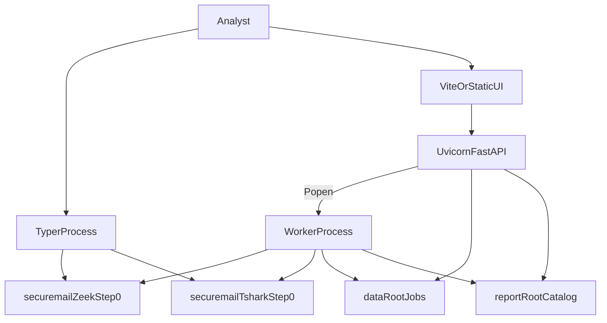

# Runtime topology

SecureMail runs as **host processes plus optional Docker analyzer containers**.
There is no Kubernetes, no message broker, and no analysis inside FastAPI
request handlers.



## Host processes

| Process | How it starts | Network |
|---|---|---|
| Typer CLI | `uv run securemail …` | Host network. Analyzers it launches are `--network=none`. |
| Uvicorn / FastAPI | `uv run uvicorn securemail.api.main:app` | Host network. Bind loopback. |
| Capture worker | `python -m securemail.worker`, usually spawned from FastAPI lifespan | Host network. Same `--network=none` only on containers it starts. |
| Vite dev server | `npm --prefix frontend run dev` | Loopback; proxies `/api` to `VITE_API_TARGET` (default `http://127.0.0.1:8000`). |

**Host Python is not `--network=none`.** WeasyPrint, sklearn, FastAPI, and the
worker inherit the host network namespace. Isolation is applied to Zeek,
TShark, and capinfos **containers** only. See
[trust boundaries](trust-boundaries.md).

## FastAPI lifespan and the worker

[`api/main.py`](../../src/securemail/api/main.py) exposes `app` via
`__getattr__` so Uvicorn does not import bootstrap at module load.
`create_api(start_worker=…)` stores the flag on `app.state`.

When `start_worker` is true, lifespan runs:

```text
sys.executable -m securemail.worker
```

with `SECUREMAIL_DATA_ROOT` / `SECUREMAIL_REPORT_ROOT` copied into the child
environment. On Darwin it prepends `/opt/homebrew/lib` to
`DYLD_FALLBACK_LIBRARY_PATH` so WeasyPrint can load Pango. Shutdown sends
`terminate()` and waits 15s, then `kill()`.

Default: if either root env var is set, `SECUREMAIL_START_WORKER` defaults to
`1`. Catalog-only browsing must set `SECUREMAIL_START_WORKER=0` explicitly.
See [environment variables](../reference/environment-variables.md).

The API process **never** calls `run_analysis` on the request thread. Upload
routes stage bytes and enqueue a job. The worker claims it.

## Analyzer containers

Local tags: `securemail/zeek:step0`, `securemail/tshark:step0`. Every analyzer
`docker run` includes the flags in
[`sandbox.py`](../../src/securemail/adapters/analyzers/sandbox.py):

```text
--network=none --read-only --user 65532:65532 --cap-drop=ALL
--security-opt no-new-privileges --pids-limit 256
--memory 2g --memory-swap 2g --cpus 2
--tmpfs /tmp:rw,nosuid,nodev,size=64m
```

Plus `--rm`, capture bind-mounted **readonly** at `/data/capture.pcapng`,
output at `/data/out`. Timeout 120s. Combined output 50 MiB. Exact numeric
caps: [limits](../reference/limits.md). Pins: [toolchain](../reference/toolchain.md).

Capinfos, Zeek, and optional TShark run **sequentially** inside one analyze
invocation. Worst-case analyzer wall time approaches 360 seconds before report
rendering. WeasyPrint and ML run in the host worker and do not inherit Docker
memory limits.

## Data roots

Typical dashboard:

```bash
SECUREMAIL_DATA_ROOT=out/data SECUREMAIL_REPORT_ROOT=out/data \
  SECUREMAIL_START_WORKER=1 \
  uv run uvicorn securemail.api.main:app
```

| Root | Contents |
|---|---|
| `SECUREMAIL_DATA_ROOT` | `jobs/<run_id>/{status.json,capture.*,artifacts/}`, `quarantine/`, `ml_history/windows.jsonl` |
| `SECUREMAIL_REPORT_ROOT` | `catalog.json`, `{case_id}.report.json` |

If only `SECUREMAIL_REPORT_ROOT` is set, it is also the data root. If neither
is set, capture routes return 503 and the catalog is empty. Layout details:
[filesystem control plane](filesystem-control-plane.md).

## Frontend serving

After `npm --prefix frontend run build`, FastAPI mounts `frontend/dist` at `/`
when that directory exists and returns `index.html` for extensionless client
routes (`/cases`, `/upload`). During development Vite owns the UI and proxies
`/api`. Packet decoding never happens in the browser.

## Concurrency

The worker loop processes **one job at a time** and sleeps 0.5s between polls.
Multiple Uvicorn or worker processes sharing one data root are **unsafe**:
`claim_next` is not inter-process compare-and-swap. See
[worker lifecycle](worker-lifecycle.md) and [limits](../reference/limits.md).

## Related pages

- [Architecture index](README.md)
- [System context](system-context.md)
- [Worker lifecycle](worker-lifecycle.md)
- [Analyzer boundary](analyzer-boundary.md)
- [Environment variables](../reference/environment-variables.md)

## Implementation anchors

- `src/securemail/api/main.py`
- `src/securemail/bootstrap.py`
- `src/securemail/worker.py`
- `src/securemail/adapters/analyzers/sandbox.py`
- `frontend/vite.config.ts`

## Test evidence

- `tests/test_report_api.py` (`test_uvicorn_app_entrypoint_imports_in_a_fresh_interpreter`)
- `tests/unit/test_analyzer_argv.py`
- `tests/unit/test_analysis_workflow.py`
