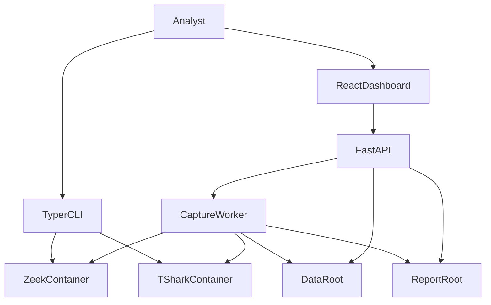

# System context

SecureMail is a **workstation-local** forensics tool. An analyst supplies a
PCAP or PCAPNG, or a canonical report JSON file, on a machine that already
has Docker images and a Python 3.13 environment. Nothing in this build is a
multi-tenant service, a packet capture appliance, or a mail-server manager.

## Actors

| Actor | What they do in this build |
|---|---|
| Analyst | Runs CLI commands, or uses the dashboard to upload a capture, watch a job, cancel, and download HTML/PDF. |
| FastAPI process | Serves `/api/v1/*`, optional `frontend/dist`, and security headers. Does **not** decode packets in the request handler. |
| Capture worker | Separate process (`python -m securemail.worker`) that claims queued jobs and runs analysis, assembly, ML, render, and publish. |
| Zeek container | Primary packet engine. Always `--network=none`. |
| TShark container | Capinfos preflight plus optional bounded field dump. Same sandbox flags. |
| Filesystem | The control plane: jobs, quarantine, ML history, and the report catalog. |

There is **no** authenticated identity provider, no role model, and no remote
queue. Bind the API to loopback on a trusted host. See
[API reference](../reference/api.md) and
[environment variables](../reference/environment-variables.md).

## In-scope products

- CLI: `analyze`, `score`, `report`, `evaluate-ml`. Options and exit codes are
  in the [CLI reference](../reference/cli.md).
- Dashboard: catalog browse, browser-local report preview, PCAP/PCAPNG upload,
  job status, cooperative cancel, HTML/PDF download.
- Deterministic evidence: flows, sessions, TLS handshakes, certificates,
  findings, policy checks, posture — envelope `securemail.evidence/v2`.
- Canonical report: `securemail.report/v1` wrapping that evidence without
  mutating findings.
- Advisory ML after the deterministic baseline, using bounded local
  endpoint-window history.

## What the system consumes and produces

**Inputs**

- PCAP / PCAPNG files (magic must match the extension on the upload path).
- Already-assembled `securemail.report/v1` JSON for `securemail report` and
  `POST /api/v1/reports/preview`.
- Synthetic `securemail.score_request/v1` JSON for `securemail score`.
- A seeded cohort directory for `securemail evaluate-ml`.
- In-repo YAML policy packs, IANA TLS snapshot, and PEM trust store.

**Outputs**

- Pretty-printed `EvidenceDocument` JSON from `analyze` (sorted keys, 2-space
  indent). Certificate DER sidecars under `<out-parent>/certificates/`.
- `PostureAssessment` JSON on stdout from `score`.
- RFC 8785 JSON, HTML, and PDF from `report` and from the worker.
- Job `status.json` plus artifacts under the data root; catalog entries under
  the report root.

Analyze does **not** emit a report envelope. The worker calls
`assemble_report` after `run_analysis` returns. See
[analysis pipeline](analysis-pipeline.md) and
[worker lifecycle](worker-lifecycle.md).

## External systems that are not called

Analyzer containers run `--network=none`. Python chain validation does not
fetch AIA, OCSP, CRL, CT, or DNS. IANA parameters and trust anchors are
checked-in files. The Isolation Forest adapter does not download models.

**Known limitation:** host Python (CLI, API, worker, WeasyPrint, sklearn) is
**not** launched with `--network=none`. Only analyzer containers are. See
[trust boundaries](trust-boundaries.md).

## Deliberately outside this build

These names appear in historical design notes. They are **not** live:

- PostgreSQL, SQLAlchemy repositories, Alembic migrations, asyncpg
- RabbitMQ, Celery, Redis, OpenSearch
- OIDC / Keycloak / RBAC
- Spicy analyzers, unbounded `tshark -V`
- Case / Capture / AuditEvent as domain models (report manifests carry string
  identifiers only)
- A CLI that assembles analyze JSON into `securemail.report/v1`

The `api` extra still *lists* SQLAlchemy, asyncpg, and Alembic. Those packages
are unused remnants. See [filesystem control plane](filesystem-control-plane.md)
and [toolchain](../reference/toolchain.md).

## Related pages

- [Architecture index](README.md)
- [Runtime topology](runtime-topology.md)
- [Trust boundaries](trust-boundaries.md)
- [CLI reference](../reference/cli.md)
- [API reference](../reference/api.md)

## Implementation anchors

- `src/securemail/api/cli/main.py`
- `src/securemail/api/main.py`
- `src/securemail/worker.py`
- `src/securemail/bootstrap.py`

## Test evidence

- `tests/test_empty_fixture.py`
- `tests/test_report_api.py`
- `tests/test_analysis_api.py`
- `tests/e2e/dashboard.spec.ts`
