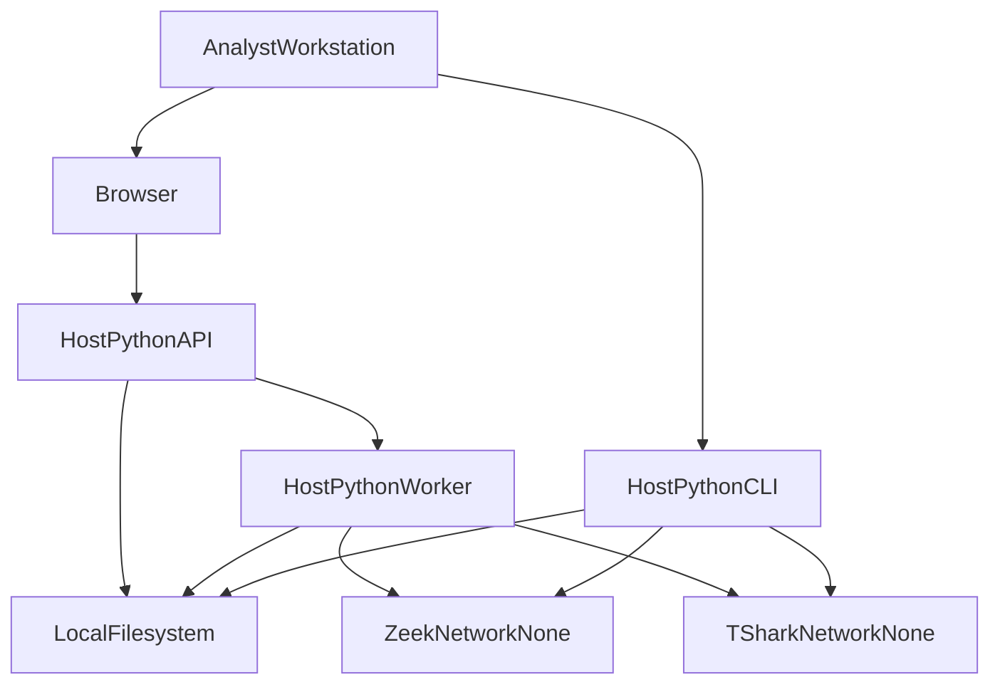

# Trust boundaries

SecureMail assumes a **single trusted workstation**. The API has no
authentication, authorization, or TLS termination. Bind to loopback. Captures,
banners, certificates, and report JSON are treated as hostile data, not as
trusted operators.

## Zones

| Zone | Network | Trust posture |
|---|---|---|
| Analyst / browser | Host | Trusted operator; untrusted **content** (captures, JSON, banners). |
| Host Python (CLI, Uvicorn, worker, WeasyPrint, sklearn) | **Host network** — not `--network=none` | Trusted code, untrusted inputs. Can in principle open sockets. |
| Analyzer containers | `--network=none`, `--read-only`, user `65532`, `cap-drop=ALL`, `no-new-privileges` | Hostile PCAP; no AIA/OCSP/CRL/CT/DNS. |
| Data root / report root | Local disk | Symlink-untrusted; adapters refuse symlink roots and `O_NOFOLLOW` opens. |

**Host Python is not `--network=none`.** Only Zeek, TShark, and capinfos
containers are. Production chain validation uses Python `cryptography` against
the pinned PEM snapshot and does not fetch. Tests additionally assert PKI
modules do not import network clients
(`tests/test_certificate_chain_fixtures.py`).

## Untrusted inputs

Treat as hostile and bounded:

- PCAP/PCAPNG bytes (magic + size caps)
- Zeek JSON logs and TShark CSV
- SMTP/IMAP/POP3 banners and capability text
- Certificate DER (64 KiB, ASN.1 depth 16)
- Canonical report JSON for preview and `securemail report` (8 MiB)
- Catalog paths (jail, no `..`, no symlinks)
- Original upload filenames (basename only)

No packet payloads, credentials, or private keys are written to evidence JSON.
Secret command arguments are `<redacted>` at Zeek and again in the session
normalizer.

## Rendering

HTML (Jinja2 autoescape on, no `|safe`) and the React UI run forensic-text
escaping for C0/C1 and bidi overrides, then treat the result as text. The PDF
fetcher allows **`data:` URLs only**; HTTP, file, and DNS fetches are fatal.
Fonts are bundled under `adapters/reports/fonts/`, never system fonts.

CSP and related headers on every API response: see
[API reference](../reference/api.md). `Cache-Control: no-store`.

## Analyzer isolation vs host

Sandbox flags: [analyzer boundary](analyzer-boundary.md) and
[limits](../reference/limits.md). Capture bind is readonly.
`assert_fixed_argv` blocks shell metacharacters.

Zeek refuses to run if `zeek/` hash, pinned base digest, or image labels
disagree with the lock. TShark/capinfos check Dockerfile SHA-256 and that
`securemail/tshark:step0` **exists**. They do not pin the built image digest.

## Control-plane honesty

- Catalog publish is `os.replace` **without fsync** and **without** an
  interprocess lock.
- `claim_next` is **not** interprocess CAS; two workers can process the same
  job.
- Cancel is cooperative **between stages**; it does not SIGKILL Docker.
- Health is liveness only (`{"status":"ok"}`); it does not check Docker, disk,
  worker, or catalog.
- Advisory ML cannot suppress, downgrade, or rewrite a `Finding`. The worker
  asserts object identity of `evidence.findings` after advisory.

## Identity and secrets

There is no OIDC. `OIDC_ISSUER` is not read. OpenSSL CLI is test-only
(Homebrew OpenSSL, never LibreSSL `/usr/bin/openssl`). Trust-store digest is
the SHA-256 of the checked-in PEM snapshot.

## Related pages

- [Architecture index](README.md)
- [Analyzer boundary](analyzer-boundary.md)
- [Runtime topology](runtime-topology.md)
- [Filesystem control plane](filesystem-control-plane.md)
- [API reference](../reference/api.md)
- [Limits](../reference/limits.md)

## Implementation anchors

- `src/securemail/adapters/analyzers/sandbox.py`
- `src/securemail/api/main.py` (security headers)
- `src/securemail/adapters/reports/pdf_renderer.py`
- `src/securemail/adapters/reports/html_renderer.py`
- `src/securemail/domain/policies/pki/chain_validation.py`
- `frontend/src/core/forensic_text.ts`

## Test evidence

- `tests/unit/test_analyzer_argv.py`
- `tests/unit/test_pdf_renderer.py` (`test_url_fetcher_denies_http`)
- `tests/unit/test_html_renderer.py`
- `tests/test_certificate_chain_fixtures.py` (`test_step6_python_makes_no_inet_connections`)
- `tests/test_report_api.py` (security headers)
- `tests/e2e/dashboard.spec.ts` (hostile strings)
