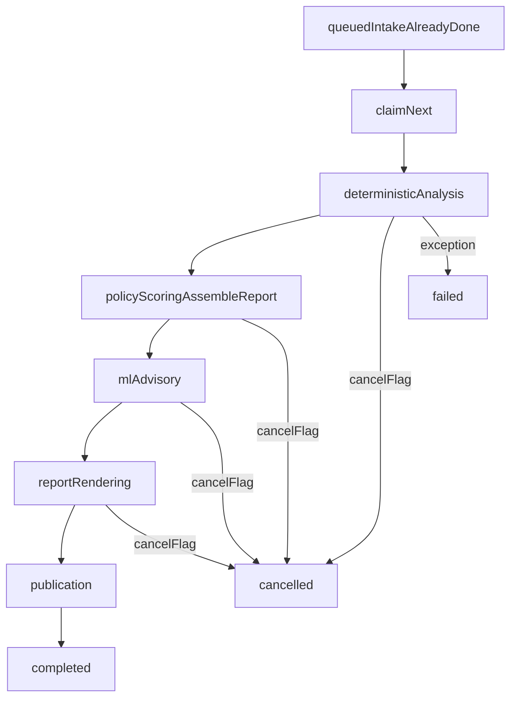

# Worker lifecycle

Capture analysis after HTTP intake runs in a dedicated process:

```bash
python -m securemail.worker
```

[`worker.py`](../../src/securemail/worker.py) calls
`bootstrap.run_capture_worker_loop`. FastAPI lifespan can spawn that module
(see [runtime topology](runtime-topology.md)). Tests call
`process_pending_analysis` / `process_next_job` in-process instead of the
subprocess.

The loop is:

```text
while True:
    process_next_job(...)
    time.sleep(0.5)
```

Poll interval is **0.5 seconds**. Concurrency is **one job at a time**.



## Intake is already done

By the time the worker sees a job, [`ingest_capture`](../../src/securemail/application/capture_intake.py)
has hashed the capture, validated magic, committed it under `jobs/<run_id>/`,
and written `status.json` with `status=queued` and `stage=intake`. The worker
does not re-do intake.

## `claim_next` is not interprocess CAS

[`FilesystemJobStore.claim_next`](../../src/securemail/adapters/persistence/job_store.py):

1. Lists jobs with `status=queued` and `cancel_requested=false`.
2. Sorts by `(created_at, run_id)`.
3. For each, calls `update_job(..., status=running)`.
4. `update_job` raises `JobConflictError` only if the job is **already
   terminal**. It does not compare-and-swap against `queued`.
5. Queued jobs that already have `cancel_requested` are marked `cancelled`.

Two worker processes can both observe `queued` and both set `running`. The
`AnalysisJobStore` protocol docstring says “atomically claim”; the adapter
does not provide inter-process compare-and-swap.

**Known limitation:** multiple Uvicorn/worker processes on one data root are
unsafe. See [limits](../reference/limits.md).

## Stages after claim

[`execute_capture_job`](../../src/securemail/application/analysis_workflow.py)
checks `is_cancel_requested` **between** stages, then:

| Stage enum | What actually runs |
|---|---|
| `intake` | Already finished in the API process. |
| `deterministic_analysis` | `analyze(AnalyzeRequest)` → `run_analysis` (policy + score included) or `stub_analyze`. |
| `policy_scoring` | `assemble_report` — wraps `EvidenceDocument` in `securemail.report/v1`. **Does not re-score.** |
| `ml_advisory` | `attach_advisories_with_history`; asserts `advised.evidence.findings is evidence.findings`. |
| `report_rendering` | `render_report` for json+html+pdf; writes artifacts. |
| `publication` | `catalog.publish_report(case_id, json_bytes)`; marks `completed` with artifact flags. |

Analyze does not emit the report envelope. **`assemble_report` does**, in the
`policy_scoring` stage (name is historical; the work is wrapping, not scoring).

Advisory history: fewer than 14 endpoint-windows →
`ADVISORY_INSUFFICIENT_HISTORY` (baseline silent). Fewer than 40 → Isolation
Forest silent, baseline may run. See [advisory-ml.md](../user-guide/advisory-ml.md).

HTML/PDF are required on this path. Oversized artifacts fail the job. Bounds:
[limits](../reference/limits.md).

Uncaught exceptions become `status=failed` with `error_message` truncated to
1000 characters.

## Cancel

`POST /api/v1/analyses/{run_id}/cancel` → `request_cancel`:

- **Queued:** immediately `cancelled`.
- **Running:** sets `cancel_requested` and writes `cancel.flag`. The worker
  notices at the next between-stage check.
- **Terminal:** 409 `JobConflictError`.

Cancel does **not** kill a running Zeek/TShark/`subprocess.run`. A 120s
analyzer can finish after the analyst clicks cancel; the job then becomes
`cancelled` before the next stage (and does not publish).

## Stub mode

`SECUREMAIL_ANALYSIS_STUB=1` swaps `run_analysis` for `stub_analyze`: magic
check and a minimal empty `EvidenceDocument`, no Docker. Used by Playwright
and some API tests. It is not an acceptance proof of packet analysis.

## Related pages

- [Architecture index](README.md)
- [Runtime topology](runtime-topology.md)
- [Analysis pipeline](analysis-pipeline.md)
- [Filesystem control plane](filesystem-control-plane.md)
- [API reference](../reference/api.md)
- [Limits](../reference/limits.md)

## Implementation anchors

- `src/securemail/worker.py`
- `src/securemail/bootstrap.py` (`run_capture_worker_loop`)
- `src/securemail/application/analysis_workflow.py`
- `src/securemail/adapters/persistence/job_store.py`
- `src/securemail/domain/jobs/models.py`

## Test evidence

- `tests/unit/test_job_store.py`
- `tests/unit/test_analysis_workflow.py`
- `tests/test_analysis_api.py`
- `tests/test_capture_acceptance.py`
