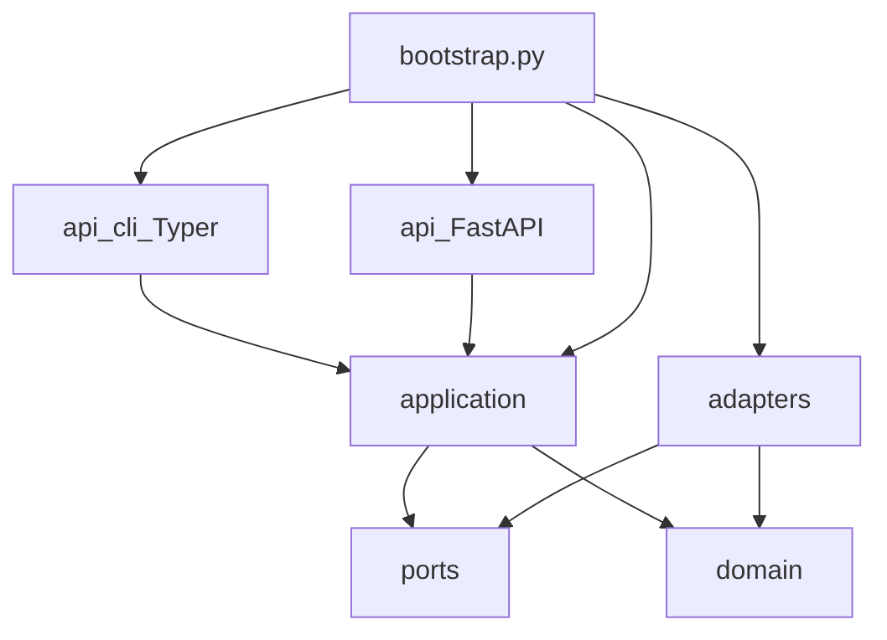

# Coding and import boundaries

Clean architecture with a single composition root. Enforced by `import-linter`
in `pyproject.toml` (`make lint` runs `lint-imports`), not by review
convention.

`bootstrap.py` is the **only** module that imports a port and its adapter.

## Layer rules

| Layer | May import | Must not |
|---|---|---|
| `domain/` | stdlib, Pydantic, other `domain/` | `adapters/`, `ports/`, `application/`, `api/`, I/O, Docker, subprocess |
| `application/` | `domain/`, `ports/` | concrete `adapters/`, `docker`, SQLAlchemy |
| `adapters/` | `ports/`, `domain/` | `application/`, `api/` |
| `api/` | `application/` (via bootstrap wiring) | business rules, Zeek/TShark, PKI crypto |
| `ports/` | stdlib, typing, domain types as signatures | `docker`, `subprocess` |

Three import-linter contracts:

1. Domain has no outward dependencies.
2. Application does not import concrete adapters.
3. Domain, application, adapters, and ports are independent of `api`.

Domain evidence models are constructed by normalizers in `application/`.
Models do not parse raw Zeek/TShark output themselves.

Python: `def` for pure functions, `async def` for I/O. Type hints on all
signatures. Pydantic v2. Guard clauses; happy path last. Directories
`lowercase_with_underscores`.

## Known limitation: API imports `ports`

Routers and CLI helpers import constants and Protocol types from
`securemail.ports` (`MAX_REPORT_BYTES`, `AnalysisJobStore`,
`ReportRepository`). Import-linter does **not** forbid `api` → `ports`.
`AGENTS.md` still says `api/` must not contain business rules; the ports
imports are type/limit leakage, not a second composition root.

The `api` extra still lists unused SQLAlchemy, asyncpg, and Alembic. Those
packages are remnants, not a live ORM.

## Canonical records

`AnalysisRun`, `CapturePreflight`, `Flow`, `EmailSession`, `TlsHandshake`,
`CertificateEvidence`, `Finding`, `PolicyCheck`, `PostureAssessment`,
`AnomalyResult`, `ReportManifest` / `CanonicalReport`.

`AnomalyResult` is never merged into `Finding`. Design names `Case`,
`Capture`, and `AuditEvent` are not live models.

## Related pages

- [Repository map](repository-map.md)
- [Known limitations](../status/known-limitations.md)
- [Architecture — clean architecture](../architecture/clean-architecture.md)

## Implementation anchors

- `pyproject.toml` `[tool.importlinter]`
- `src/securemail/bootstrap.py`
- `src/securemail/api/dependencies.py`

## Test evidence

- `make lint` → `uv run lint-imports`
