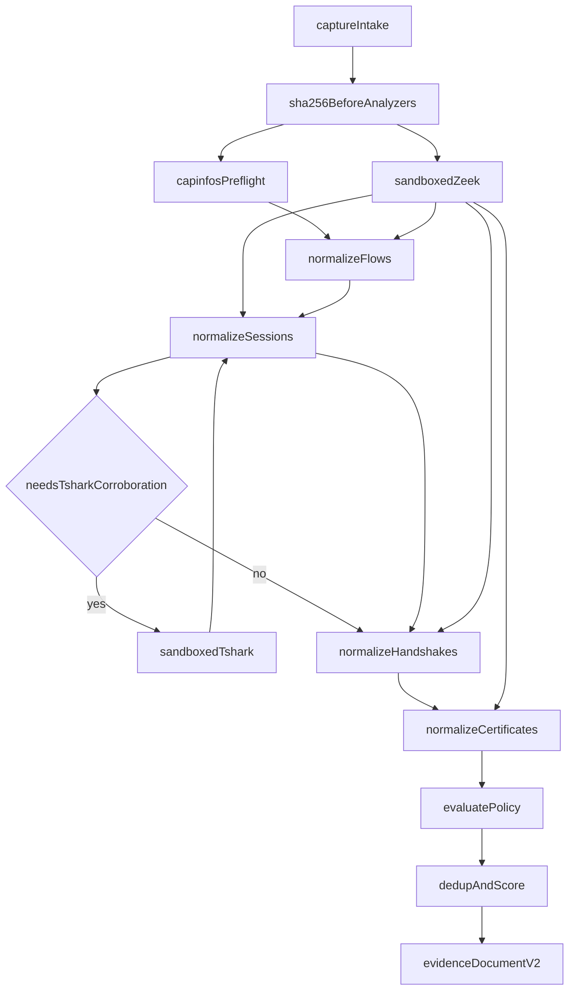

# Forensic pipeline

SecureMail assesses SMTP, IMAP, and POP3 cryptographic posture from a
PCAP / PCAPNG file. Python **orchestrates**. It does **not** re-implement
packet parsing, TCP reassembly, or TLS record decoding. Zeek is the primary
processing engine. TShark is a bounded second pass. Policy, scoring, and
coverage run only after canonical evidence exists.

The CLI proof of the whole chain is `securemail analyze`. The dashboard and
HTTP worker call the same use cases. Advisory ML is **not** part of this
pipeline; it runs later and never rewrites a `Finding`.

There are **71** committed PCAP fixture directories under
`tests/fixtures/`. Public-corpus traces are regression only; they are never
the sole proof of a rule.



## EvidenceDocument schema v2

`securemail analyze` writes one frozen `EvidenceDocument`.
`schema_version` is the literal `"v2"`. Packet / flow / session / handshake /
certificate **facts** still use `normalization_schema_version` `"v1"`. v2 adds
`policy_checks` and `posture` to the same envelope.

```text
EvidenceDocument
  schema_version: "v2"
  run_identity: AnalysisRun
  capture_preflight: CapturePreflight
  flows: Flow[]
  sessions: EmailSession[]
  handshakes: TlsHandshake[]
  certificates: CertificateEvidence[]
  findings: Finding[]
  policy_checks: PolicyCheck[]
  posture: PostureAssessment
```

Findings never mutate the evidence arrays. Passes are `policy_checks`, not
findings. Standalone TLS (no mail session) is retained in `handshakes`.

Serialization is `model_dump(mode="json")` then `json.dumps` with sorted keys.
On-disk field order is alphabetical, not declaration order.

## Evidence states

Every applicable field uses the vocabulary defined once as `EvidenceState`
in `domain/evidence/run.py`. The canonical meanings live in
[evidence states](../reference/evidence-states.md).

| State | Forensic meaning in this pipeline |
|---|---|
| `observed` | Directly seen (complete TCP stream, confirmed protocol, selected ALPN, decoded version) |
| `verified` | Unused by classifiers. Negative findings set `evaluation_state=verified` |
| `inferred` | TLS 1.2 key exchange from the IANA suite-name grammar; TLS 1.3 PSK-only when key_share is absent |
| `incomplete` | Missing bytes or handshake messages; truncated ClientHello with no selected version |
| `conflicting` | Overlapping retransmission conflict, or Zeek vs TShark protocol disagreement |
| `not_observable` | The check or field **cannot be observed** from this capture |
| `indeterminate` | Evidence exists but does not resolve (ambiguous banner, mail-port TLS without ALPN) |

`not_observable` is **not** a synonym for “this check does not apply.”
Genuine non-applicability (inactive rule, role mismatch, where-clause fail)
is omitted from `policy_checks` entirely. `not_observable` is used when the
pipeline looked for a fact and the capture cannot show it. Examples:

- TLS 1.3 certificates after `ServerHello` unless Zeek `ssl_history` contains
  letter `x`
- Handshake `CertificateVerify` unless history contains letter `y`
- Implicit TLS on a port other than 465/993/995 when no selected ALPN in
  `{smtp, imap, pop3}` is present
- Explicit STARTTLS/STLS when no upgrade alphabet was seen

`not_observable`, `incomplete`, and `indeterminate` are never “secure” and
must not be folded into a pass. Fixture tests assert the state field itself.

## Stage pages

| Stage | Owns | Proof fixture |
|---|---|---|
| [Capture intake](capture-intake.md) | Magic bytes, SHA-256 before analyzers, API quarantine | `empty` |
| [TCP reconstruction](tcp-reconstruction.md) | Quality classifier; Zeek reassembles | `tcp_snaplen_truncation` |
| [Protocol identification](protocol-identification.md) | Payload-driven identity; port is a hint | `pop3_nonstandard_port` |
| [STARTTLS and STLS](starttls-and-stls.md) | Explicit upgrade state machines | `imap_starttls_capability_stripped` |
| [Implicit TLS](implicit-tls.md) | ALPN correlation; never port-as-proof | `tls_mail_port_no_alpn` |
| [TLS handshakes](tls-handshakes.md) | Version, cipher, key exchange | `tls13_hello_retry_request` |
| [Certificate extraction](certificate-extraction.md) | Per-certificate facts, not policy | `cert_expired_rsa1024` |
| [Chain and identity](chain-and-identity-validation.md) | Offline path + RFC 9525 SAN | `cert_chain_san_mismatch` |
| [Policy evaluation](policy-evaluation.md) | Versioned YAML packs; tri-state predicates | `tls13_psk_only_resumption` |
| [Forward secrecy](forward-secrecy.md) | Version-aware FS table | `tls12_static_dh`, `tls13_psk_only_resumption` |
| [Finding deduplication](finding-deduplication.md) | Dedup key, scoring v1, coverage | `synthetic_findings/mixed_severity.json` |

Each stage page records inputs, outputs, evidence states, precedence,
uncertainty, security bounds, implementation anchors, fixture examples, and
limitations.

## Non-negotiable forensic rules

- Port is never proof. `port_hint` and `payload_evidence` are independent.
- TLS version: `supported_versions` wins over the legacy record-layer version.
- TLS 1.3 key exchange comes from `key_share` / groups / PSK modes — **never**
  from the cipher-suite name.
- Certificate signature algorithm ≠ handshake `CertificateVerify` algorithm.
- `valid_at_capture_time` and `valid_at_analysis_time` are independent.
- Path validity and `identity_match` are independent. SAN matching is RFC 9525;
  **no CN fallback**.
- Revocation is always `unknown` without imported OCSP/CRL. This build never
  imports those.
- Forward secrecy: never claim ephemeral-key reuse or ticket rotation from one
  PCAP.
- Policy unknown is not a pass. Findings are negative or indeterminate only.
- Coverage is `passed + failed + unknown + not_observable`. Unknown is never
  folded into passed.

## TShark display filter

Current code uses the literal filter `smtp or imap or pop or tls.handshake`.
[ADR 0001](../decisions/0001-imap-pop3-corroboration.md) historically recorded
`tls.handshake.type == 1` (ClientHello only). That ADR text is historical.
The live runner is broader so Certificate, CertificateVerify, HelloRetryRequest,
and selected-group fields can be corroborated. ClientHello **frame attachment**
for STARTTLS still looks for handshake type `1`.

Sandbox flags, image pins, and argv construction belong in
[analyzer boundary](../architecture/analyzer-boundary.md), not here.

## Related pages

- [Analysis pipeline](../architecture/analysis-pipeline.md)
- [Evidence and report contracts](../architecture/evidence-and-report-contracts.md)
- [Evidence states](../reference/evidence-states.md)
- [Policy packs](../reference/policy-packs.md)
- [Limits](../reference/limits.md)
- [Fixture contract](../development/fixture-contract.md)

## Implementation anchors

- `src/securemail/application/run_analysis.py`
- `src/securemail/domain/evidence/run.py`
- `src/securemail/adapters/analyzers/tshark_runner.py`

## Test evidence

- `tests/test_tcp_fixtures.py` through `tests/test_policy_fixtures.py`
- `tests/test_scoring_fixtures.py`
- `tests/fixtures/` — 71 PCAP directories plus `synthetic_findings/`
