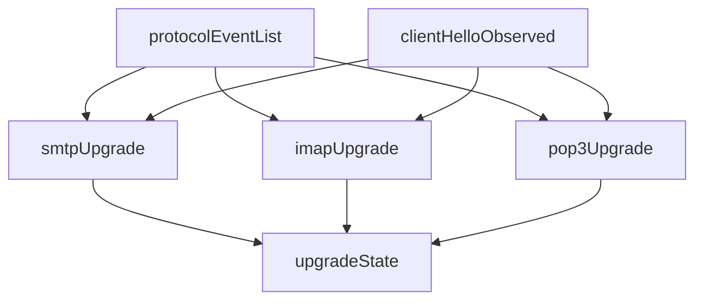

# STARTTLS and STLS

Explicit upgrade is evaluated **after** protocol identity. Three pure
functions consume `ProtocolEvent` lists plus a ClientHello flag. They never
invent TLS.

| Protocol | Function | File |
|---|---|---|
| SMTP | `smtp_upgrade` | `domain/policies/starttls/smtp_upgrade.py` |
| IMAP | `imap_upgrade` | `domain/policies/starttls/imap_upgrade.py` |
| POP3 | `pop3_upgrade` | `domain/policies/starttls/pop3_upgrade.py` |

`normalize_sessions` calls the matching machine when `session.protocol` is
set; otherwise `explicit_upgrade.state` is `null` and `evidence_state` is
`not_observable`. Implicit mail-over-TLS is a separate assessment:
[implicit TLS](implicit-tls.md).



## Inputs

| Input | Meaning |
|---|---|
| `EmailSession.events` | Zeek `sm_email.log` plus optional TShark command/status |
| `client_hello_observed` | Zeek `ssl_history` contains `C`, and/or a TShark frame with handshake type `1` joined to the flow |
| `client_hello_frames` | Frame numbers cited when the terminal state is `tls_established` |

IMAP tagged `CAPABILITY` / `STARTTLS` / OK-NO-BAD come from TShark
(`imap.request.command`, `imap.response.status`, `imap.tag`). Zeek supplies
capability tokens and `imap_starttls` only.

Current TShark display filter: `smtp or imap or pop or tls.handshake`.
[ADR 0001](../decisions/0001-imap-pop3-corroboration.md) historically said
`tls.handshake.type == 1`. That ADR sentence is historical. Live code keeps
the broader filter so later handshake messages can be corroborated; the
STARTTLS ClientHello **gate** still requires type `1` (or Zeek letter `C`).

## Outputs

`ExplicitUpgrade` on every normalized session:

| Field | Values |
|---|---|
| `state` | `advertised`, `requested`, `accepted`, `tls_established`, `plaintext_fallback`, `violation`, or `null` |
| `evidence_state` | `observed` if `state` is set, else `not_observable` |
| `evidence_frames` | Sorted frame numbers cited by the machine |
| `downgrade_consistent` | Capability stripping pattern; not proof of an attacker |

## Evidence states

| Upgrade `state` | Upgrade `evidence_state` |
|---|---|
| any non-null terminal | `observed` |
| `null` (no upgrade alphabet) | `not_observable` |

`not_observable` here means the upgrade check **cannot be observed**: there
was no advertisement, request, or accept in the event list (typical for
implicit TLS, or unidentified sessions). It is not “STARTTLS does not apply
so the session is fine.”

`tls_established` additionally requires an observed ClientHello. Server
accept without ClientHello stays `accepted`.

Hypothesis tests generate bounded random event sequences and assert the
machines never report `tls_established` without `client_hello_observed` and
never leave an undefined state.

## Precedence rules

Terminal states, first match:

| State | When |
|---|---|
| `violation` | Plaintext command (or unexpected) after accept, before ClientHello — including mid-transition MAIL/IMAP commands other than the harmless set |
| `plaintext_fallback` | Credential command (`AUTH` / `LOGIN`+`AUTHENTICATE` / `USER`+`PASS`+`APOP`+`AUTH`) while upgrade was **not** accepted |
| `tls_established` | Accepted **and** ClientHello observed |
| `accepted` | Positive reply (or Zeek `starttls` event) without ClientHello |
| `requested` | STARTTLS/STLS sent, not (yet) accepted |
| `advertised` | Capability listed STARTTLS/STLS; client never requested |
| `null` | No upgrade evidence → `evidence_state=not_observable` |

A second guard downgrades a would-be `tls_established` when the ClientHello
flag is false.

### Per-protocol alphabet

#### SMTP

- Advertisement: EHLO/HELO/LHLO reply or capability text containing
  `STARTTLS`, or a 250 reply whose command is STARTTLS
- Request: `REQUEST` command `STARTTLS`
- Accept: reply 2xx while awaiting STARTTLS reply, or `kind=starttls`
- Reject: reply ≥ 400 while awaiting
- Credentials: `AUTH`
- Harmless after accept (not a violation): EHLO, HELO, LHLO, STARTTLS, QUIT,
  NOOP, RSET, HELP

#### IMAP

- Advertisement: capability tokens contain `STARTTLS`, or a reply text that
  does
- Request: `STARTTLS`; pending tag tracked when TShark provides one
- Accept: tagged OK (or untagged if tags missing), or `kind=starttls`
- Reject: tagged NO/BAD
- Credentials: `LOGIN`, `AUTHENTICATE`
- Harmless: CAPABILITY, STARTTLS, LOGOUT, NOOP, ID

#### POP3

STLS advertisement is often on a **subsequent** CAPA line, not the `+OK`
status. Zeek emits those lines as `capability` events from `pop3_data`.

- Advertisement: capability tokens contain `STLS`, or a reply containing
  `STLS`
- Request: command `STLS`
- Accept: `+OK` (or `OK`) while awaiting, or `kind=starttls`
- Reject: `-ERR`
- Credentials: `USER`, `PASS`, `APOP`, `AUTH`
- Harmless: CAPA, STLS, QUIT, NOOP

### `downgrade_consistent`

True iff:

- a capability exchange was seen (EHLO/CAPABILITY/CAPA family), **and**
- STARTTLS/STLS was **not** advertised, **and**
- the client still requested and the server accepted

That is consistent with capability stripping. It is **not** “STARTTLS
missing” and **not** proof of an on-path attacker. Advertised-but-never-
requested sessions (`smtp_nonstandard_port` and IMAP/POP3 equivalents) stay
`state=advertised` and `downgrade_consistent=false`.

## Uncertainty behavior

- Rejected STARTTLS/STLS is typically `requested`, never `tls_established`.
- Accept without ClientHello is `accepted`, not a fabricated handshake.
- Unidentified sessions (`protocol=null`) get `explicit_upgrade` with
  `state=null` / `not_observable`.
- IMAP on nonstandard ports may lack TShark tags; accept can still fire from
  Zeek `kind=starttls` or untagged OK.
- Policy must not treat `not_observable` upgrade as “STARTTLS not required,
  therefore secure.”

## Security bounds

| Bound | Value |
|---|---|
| Events consumed | Already bounded at 256 per session |
| Frame numbers | Positive integers only; sorted unique |
| Credentials in events | Arguments/text already `<redacted>` |
| TShark fields | Allowlisted command/status/tag and `tls.handshake.type` — no lines, passwords, or cert bytes |

Machines are pure functions: no I/O, no packet parsing, no TLS record
decode.

## Fixture examples

| Pattern | Terminal state |
|---|---|
| Lab STARTTLS/STLS success | `tls_established` with non-empty `evidence_frames` |
| Rejected STARTTLS/STLS | not `tls_established` (typically `requested`) |
| Capability stripped | `accepted`, `downgrade_consistent=true` |
| Mid-transition plaintext | `violation` |
| Credentials after failed/absent upgrade | `plaintext_fallback` |
| Advertised, never requested (`*_nonstandard_port`) | `advertised` |
| Implicit TLS + ALPN | identity observed; explicit upgrade often `not_observable` |

Proof:

```bash
uv run securemail analyze tests/fixtures/imap_starttls_capability_stripped/capture.pcapng
```

Matching stripped fixtures: `smtp_starttls_capability_stripped`,
`pop3_stls_capability_stripped`. Public-corpus STARTTLS/STLS slices are
regression only.

## Limitations

- **Implemented:** three explicit state machines; ClientHello gate;
  `downgrade_consistent` as its own field.
- **Known limitation:** post-upgrade capability refresh is not a separate
  published field; it only appears as further `ProtocolEvent`s when analyzers
  still decode after the handshake (usually they do not, once TLS starts).
- **Unsupported:** a policy finding named “STARTTLS missing” as attacker
  proof. Packs may still assert upgrade outcomes; `downgrade_consistent` is
  not attribution.
- **Deferred:** opportunistic-TLS scoring; Spicy IMAP.

## Related pages

- [Protocol identification](protocol-identification.md)
- [Implicit TLS](implicit-tls.md)
- [TLS handshakes](tls-handshakes.md)
- [Evidence states](../reference/evidence-states.md)
- [ADR 0001](../decisions/0001-imap-pop3-corroboration.md)

## Implementation anchors

- `src/securemail/domain/policies/starttls/smtp_upgrade.py`
- `src/securemail/domain/policies/starttls/imap_upgrade.py`
- `src/securemail/domain/policies/starttls/pop3_upgrade.py`
- `src/securemail/application/normalize_sessions.py`

## Test evidence

- `tests/test_starttls_fixtures.py`
- `tests/unit/test_smtp_upgrade.py`
- `tests/unit/test_imap_upgrade.py`
- `tests/unit/test_pop3_upgrade.py`
- `tests/unit/test_starttls_hypothesis.py`
