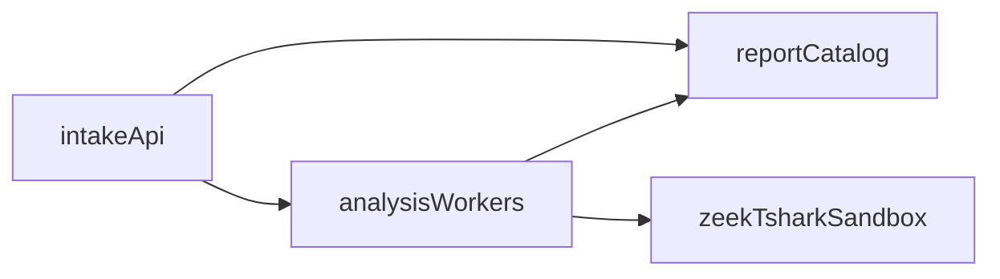

# Reference architecture (not implemented)

> **Not an approved phase.** This page is future reference architecture only.
> Do not treat PostgreSQL, Celery, OIDC, Kubernetes, or similar control-plane
> components as current SecureMail behavior. Current runtime is a single-host
> CLI plus optional FastAPI, filesystem catalog, and `python -m securemail.worker`.

If a later phase exists, keep the **analysis pipeline** as it is today:

```text
capture → hash → capinfos → Zeek → optional TShark → normalize
       → policy → score → optional advisory ML → canonical JSON → HTML/PDF
```

A later control plane would sit **beside** that pipeline, not inside Zeek
scripts or `domain/` models. Suggested logical split (unimplemented):



Today `intakeApi`, `catalog`, and `worker` are FastAPI + JSON files + one
process. Replacing those boxes is a new contract.

Do not introduce a second evidence schema. `securemail.evidence/v2` and
`securemail.report/v1` remain the interchange.

## Related pages

- [Runtime topology (current)](../architecture/runtime-topology.md)
- [Scale-out control plane](scale-out-control-plane.md)
- [Migration triggers](migration-triggers.md)

## Implementation anchors

- None. This page has no live modules.
