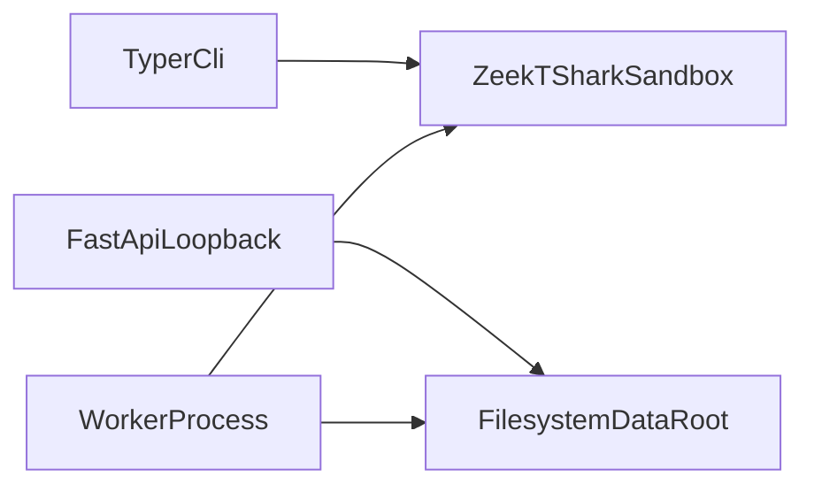

# Deployment topologies

SecureMail is a **single-host** tool. Analyzer containers are Linux. The
orchestrator is host Python (CPython 3.13 via uv). Supported platforms:
[supported platforms](../getting-started/supported-platforms.md).

**Deferred:** Kubernetes, multi-node workers, docker-compose control planes,
PostgreSQL, queues, and OIDC. Historical design notes that name those are not
a license to run them.

**Unsupported:** Windows; Intel macOS Homebrew at `/usr/local`.

There is no signed offline appliance image. See
[air-gapped operation](air-gapped-operation.md).

## Topology A — CLI only

No FastAPI process. No worker. No catalog.

```bash
uv run securemail analyze tests/fixtures/empty/capture.pcapng --out out/empty.json
uv run securemail score tests/fixtures/synthetic_findings/mixed_severity.json
uv run securemail report tests/fixtures/reports/golden_report.json \
  --format json,html,pdf --out out/
```

Requires Docker for `analyze`, Pango/`reports` extra for PDF, `ml` extra for
`evaluate-ml` / `--advisory`. This path never calls `assemble_report`.

## Topology B — catalog browse (no analysis)

Read-only canonical reports. **Must** set `SECUREMAIL_START_WORKER=0`. If a
root is set and `SECUREMAIL_START_WORKER` is omitted, the worker **starts**.

```bash
SECUREMAIL_REPORT_ROOT=tests/fixtures/dashboard \
SECUREMAIL_START_WORKER=0 \
  uv run uvicorn securemail.api.main:app --host 127.0.0.1 --port 8000
```

In another terminal (optional Vite UI):

```bash
npm --prefix frontend run dev
```

Capture routes return 503 `capture analysis is not configured` when neither
`SECUREMAIL_DATA_ROOT` nor `SECUREMAIL_REPORT_ROOT` is set. With only
`SECUREMAIL_REPORT_ROOT`, that path also becomes the data root.

**Known limitation:** `SECUREMAIL_START_WORKER=0` stops the worker process
only. Upload routes still accept PCAPs into that root if it is set. Do not
upload into `tests/fixtures/dashboard`.

## Topology C — analysis workstation

Writable data root plus worker. Packet decode still runs in Docker, never
inside a FastAPI request.

```bash
SECUREMAIL_DATA_ROOT=out/data \
SECUREMAIL_REPORT_ROOT=out/data \
SECUREMAIL_START_WORKER=1 \
  uv run uvicorn securemail.api.main:app --host 127.0.0.1 --port 8000
```

Uvicorn lifespan starts `python -m securemail.worker` in a subprocess and
terminates it on shutdown (15 s, then kill).

Alternatively run the worker yourself (still **exactly one** worker process):

```bash
SECUREMAIL_DATA_ROOT=out/data \
SECUREMAIL_REPORT_ROOT=out/data \
  uv run python -m securemail.worker
```

Do **not** combine lifespan `SECUREMAIL_START_WORKER=1` with a second
`python -m securemail.worker`. `claim_next()` is not inter-process
compare-and-swap. Multiple Uvicorn `--workers` is likewise **unsafe**.

## Topology D — same process serves the built UI

After `make frontend-build`, FastAPI mounts `frontend/dist` when that
directory exists. One loopback Uvicorn then serves UI + `/api/v1/*`.

## What every topology shares



- Analyzers: `--network=none`, non-root `65532`, `--cap-drop=ALL`,
  `--read-only`, 2 GiB memory, 2 CPUs, 120 s timeout each.
- No TLS termination and no authentication on the API.
- Health is liveness only.

## Related pages

- [API and worker startup](api-and-worker-startup.md)
- [Configuration](configuration.md)
- [Security hardening](security-hardening.md)
- [Environment variables](../reference/environment-variables.md)

## Implementation anchors

- `src/securemail/api/main.py`
- `src/securemail/bootstrap.py`
- `src/securemail/worker.py`

## Test evidence

- `tests/test_report_api.py`
- `tests/test_analysis_api.py`
- `frontend/playwright.config.ts`
