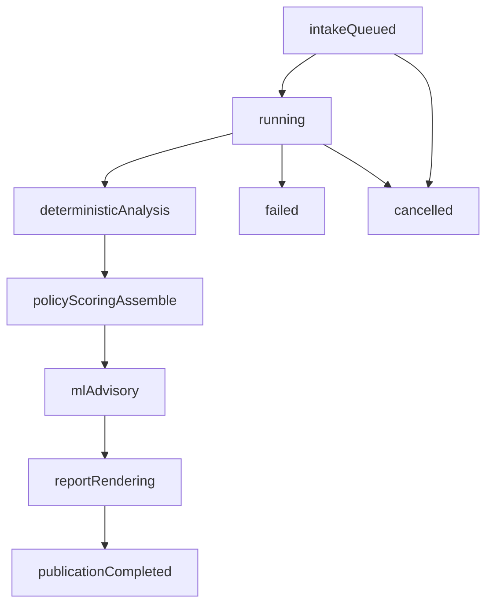

# Job lifecycle

Statuses: `queued` → `running` → `completed` | `failed` | `cancelled`.

Stages, in order:

1. `intake` — set at enqueue.
2. `deterministic_analysis` — worker calls `run_analysis` (Zeek/TShark,
   normalize, policy, score).
3. `policy_scoring` — `assemble_report` wraps the evidence document. Analyze
   already scored; this stage does not re-score.
4. `ml_advisory` — history + baseline / Isolation Forest; append windows.
5. `report_rendering` — JSON, HTML, PDF from one in-memory object.
6. `publication` — catalog publish; artifacts flagged true.

HTTP views: [API reference](../reference/api.md). `error_message` is present
on failure, max 1000 characters. Filesystem paths never appear on the job
model or status JSON.

## Enqueue

`POST /api/v1/analyses` streams to quarantine, validates magic vs extension,
hashes SHA-256, then `commit_staged` into `jobs/{run_id}/`. Response 202
`AnalysisStatusView`.

Empty files, extension/magic mismatch, and invalid `case_id` → 400. Oversize
→ 413. Quota → 503 `capture storage quota exceeded`. Unconfigured data root
→ 503 `capture analysis is not configured`.

## Duplicates

`find_duplicate` matches `(capture_sha256, policy_profile,
expected_hostname)` among jobs that are not terminal **or** are
`completed`. The newest such job is returned and the staged upload is
aborted. Failed and cancelled jobs are not reused; a new upload creates a
new `run_id` (and still consumes a job-directory slot until cleanup).

## Claim

The worker calls `claim_next()`: oldest queued job without
`cancel_requested`, status set to `running`. Queued jobs that already have
cancel requested are marked `cancelled` during that sweep. Only **queued**
jobs are claimed. A job left `running` after a crash is **not** auto-requeued.
See [troubleshooting](troubleshooting.md).

Concurrency: one job at a time in one worker loop. Poll interval 0.5 s.

## Cancel

`POST /api/v1/analyses/{run_id}/cancel`:

- Unknown run → 404.
- Already terminal → 409.
- `queued` → status `cancelled` immediately, `cancel.flag` written.
- `running` → `cancel_requested=true` and `cancel.flag`; status stays
  `running` until the worker notices.

The worker checks `is_cancel_requested` **between stages**. Cooperative
cancel does **not** kill a running Docker analyzer (capinfos/Zeek/TShark
`subprocess.run` with 120 s timeout). After a long analyzer call, the next
check can still mark the job `cancelled` before later stages. Cancel after
publication is 409.

## Failure

Uncaught exceptions in `execute_capture_job` mark the job `failed` with
`str(exc)` truncated to 1000 characters. Analyzer digest mismatch, Docker
errors, timeouts, HTML/PDF oversize, and catalog publish errors take this
path.

If status is not `running` when `execute_capture_job` starts, the function
returns the job unchanged (no resume).

## Artifacts

HTML and PDF are required on the worker path. Downloads before
`artifacts.json/html/pdf` are ready → 409. Catalog case HTML/PDF are rendered
from published JSON on demand.

## Related pages

- [Storage layout](storage-layout.md)
- [Troubleshooting](troubleshooting.md)
- [Dashboard workflows](../user-guide/dashboard-workflows.md)
- [API reference](../reference/api.md)

## Implementation anchors

- `src/securemail/application/analysis_workflow.py`
- `src/securemail/application/capture_intake.py`
- `src/securemail/adapters/persistence/job_store.py`
- `src/securemail/domain/jobs/models.py`

## Test evidence

- `tests/unit/test_job_store.py`
- `tests/unit/test_analysis_workflow.py`
- `tests/unit/test_capture_intake.py`
- `tests/test_analysis_api.py`
