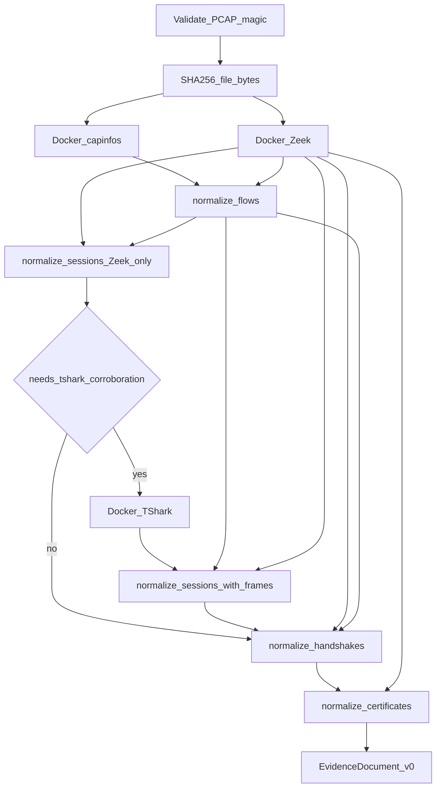

# Analyze pipeline

`securemail analyze <capture> --out <json>` is the only end-to-end path. It is
implemented as `run_analysis` in
[`src/securemail/application/run_analysis.py`](../src/securemail/application/run_analysis.py).



Capinfos and Zeek both receive the original capture path. The capture is hashed
**before** analyzers run. Analyzers bind it read-only into the container; they
do not rewrite the file.

## 1. Intake

Reject if the path is not a file. Read the first four bytes:

- PCAPNG: `0a 0d 0d 0a`
- PCAP (any endian / ns variant): `d4 c3 b2 a1`, `a1 b2 c3 d4`, `4d 3c b2 a1`,
  `a1 b2 3c 4d`

Anything else raises `InvalidCaptureError` (CLI exit 1). Then SHA-256 the whole
file into `run_identity.capture_sha256`.

## 2. Preflight (capinfos)

`DockerCapinfosRunner` runs capinfos inside `securemail/tshark:step0` with a
fixed argv (`capinfos -M -c -l -d -u -F`). Parsed fields become
`CapturePreflight` (packet count, time precision, snaplen / inferred limits,
truncated-packet flag, original byte count, duration). See
[evidence-model.md](evidence-model.md).

## 3. Zeek (always)

`DockerZeekRunner` runs `securemail/zeek:step0` with checksums ignored (`-C`),
JSON ASCII logs (`LogAscii::use_json=T`), and
`/opt/securemail/zeek/site/__load__.zeek`. Before exec it:

- hashes the on-disk `zeek/` tree and compares it to
  `tools/analyzer-bundle.lock` `zeek_bundle_sha256`
- checks the lock’s Zeek image digest against the pinned `zeek/zeek:8.0.10`
  digest
- inspects image labels `securemail.zeek_bundle_sha256` and
  `securemail.zeek_base_digest`

Mismatch is fatal (`AnalyzerDigestMismatchError`). Logs are read as one JSON
object per line from `*.log` in the output mount. Certificate DER files under
`certs/` are copied into memory before the temp directory is deleted. Combined
log plus DER bytes are bounded to 50 MiB; each DER file is also capped at
64 KiB.

`analyzer_bundle_digest` on the run is the SHA-256 of the **lockfile bytes**,
not of the image.

## 4. Normalize flows

`normalize_flows(zeek_result.logs, preflight)` joins `conn.log`, `weird.log`,
`capture_loss.log`, and `sm_tcp_recon.log` into `Flow` records and runs
`classify_reconstruction`. Details:
[tcp-reconstruction.md](tcp-reconstruction.md).

## 5. Normalize sessions (first pass)

`normalize_sessions(logs, flows)` with no TShark frames builds `EmailSession`
records from `sm_email.log` and `ssl.log`. Protocol identity, events, and
STARTTLS/implicit-TLS assessments are already attached on this pass.

## 6. Optional TShark corroboration

`needs_tshark_corroboration(sessions, flows, logs)` is true when:

- any session has protocol or payload evidence in `{smtp, imap, pop3}`, or
- any flow’s responder port is 465, 993, or 995, or
- any row in `ssl.log` has a UID (standalone TLS on a non-mail port included)

Empty and non-mail, non-TLS captures (the Step 0 `empty` fixture) skip TShark.

When the gate fires, `DockerTSharkRunner` runs a fixed display filter and
allowlisted `-e` fields. `normalize_sessions` is called **again** with those
frames: events are merged by UID and a 2.0s timestamp window, ClientHello frame
numbers are attached, and identity/upgrade are recomputed. Handshake
normalization uses the same frames for message/HRR corroboration. See
[analyzers.md](analyzers.md) and [protocol-identification.md](protocol-identification.md).

## 7. Normalize handshakes

`normalize_handshakes(logs, flows, tls_parameters, tshark_frames)` builds
top-level `TlsHandshake` records from Zeek `ssl.log` (including `ssl-log-ext`
fields). TShark supplies frame numbers and HelloRetryRequest corroboration;
Zeek remains the parameter source. Cipher identifiers are resolved through the
checked-in IANA snapshot loaded in `bootstrap.py`. See
[evidence-model.md](evidence-model.md).

## 8. Normalize certificates

`normalize_certificates` stores extracted DER by SHA-256, joins `ssl.log`
`cert_chain_fps` (and `sm_cert.log` / `files.log` as fallback) to those bytes,
and parses with `cryptography`. Capture-time validity uses the TLS observation
timestamp. Analysis-time validity uses `--analysis-time` (default now). The
expiry warning window defaults to 30 days. TLS 1.3 UIDs without history letter
`x` emit no certificates.

## 9. Emit `EvidenceDocument`

```text
schema_version = "v0"
run_identity.capture_sha256            = intake hash
run_identity.analyzer_bundle_digest    = SHA-256(lockfile)
run_identity.normalization_schema_version = "v0"
run_identity.configuration_digest      = SHA-256 of the frozen config dict
                                         plus iana_tls_parameters_sha256
run_identity.policy_pack_version       = null
run_identity.trust_store_digest        = null
capture_preflight, flows, sessions, handshakes, certificates
```

The CLI dumps `document.model_dump(mode="json")` with `json.dumps(..., indent=2,
sort_keys=True, ensure_ascii=False)` plus a trailing newline.

## Configuration digest

`configuration_digest()` hashes this object (sorted keys, compact separators):

```python
{
    "normalization_schema_version": "v0",
    "zeek_entry": "zeek/site/__load__.zeek",
    "zeek_deterministic": True,
    "capinfos_entry": "capinfos",
    "flow_normalization": "v1",
    "session_normalization": "v2",
    "handshake_normalization": "v1",
    "certificate_normalization": "v1",
    "expiry_warning_seconds": 2592000,
    "tshark_corroboration": "smtp_imap_pop_tls_handshake",
    "starttls_evaluation": "v1",
    "iana_tls_parameters_sha256": "<SHA-256 of iana-tls-parameters.json>",
}
```

Changing any of those strings, or the checked-in IANA snapshot bytes, changes
every fixture’s `expected.json` `run_identity.configuration_digest`. Current
fixtures pin
`cc097d0d9274c93df72590c9bbc9c1560e5019496b89f61f5ce38096a3052ca7`.

## Idempotency

The Step 0 test `test_empty_analyze_is_byte_identical` runs analyze twice and
asserts the output files are byte-identical. Zeek connection UIDs are
stabilized with `redef global_hash_seed = "securemail-v0"` in
[`zeek/site/__load__.zeek`](../zeek/site/__load__.zeek). The fixture harness
requires **exact** JSON equality, including `run_identity` digests and Zeek
UIDs — it does not ignore any field.

## Errors

| Exception | Typical cause | CLI |
|---|---|---|
| `InvalidCaptureError` | Not PCAP/PCAPNG | exit 1 |
| `AnalysisError` wrapping `AnalyzerError` | Docker missing, digest mismatch, analyzer timeout (120s), non-zero exit, output over 50 MiB | exit 1 |
| `FileNotFoundError` | Capture path missing | exit 1 |

## Not in this build

No policy evaluation, scoring, report freeze, or ML step after JSON emission.
The pipeline stops at evidence.
