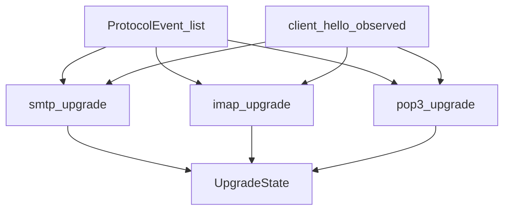

# STARTTLS, STLS, and implicit TLS

Step 3 evaluates explicit upgrade and implicit mail-over-TLS **after** protocol
identity. The three machines are pure functions over `ProtocolEvent` lists plus
a ClientHello flag. They never invent TLS.

| Protocol | Function | File |
|---|---|---|
| SMTP | `smtp_upgrade` | [`smtp_upgrade.py`](../src/securemail/domain/policies/starttls/smtp_upgrade.py) |
| IMAP | `imap_upgrade` | [`imap_upgrade.py`](../src/securemail/domain/policies/starttls/imap_upgrade.py) |
| POP3 | `pop3_upgrade` | [`pop3_upgrade.py`](../src/securemail/domain/policies/starttls/pop3_upgrade.py) |
| Implicit | `correlate_implicit_tls` | [`implicit_tls.py`](../src/securemail/domain/policies/starttls/implicit_tls.py) |

`normalize_sessions` calls the matching machine when `session.protocol` is set;
otherwise `explicit_upgrade.state` is `null` and `evidence_state` is
`not_observable`. Implicit TLS is always assessed from the flow’s responder
port and SSL/ALPN facts.

## ClientHello gate

`tls_established` requires an observed TLS ClientHello:

- Zeek `ssl.log` `ssl_history` contains `C`, and/or
- TShark `tls.handshake.type == 1` joined to the flow

If the server accepted STARTTLS/STLS but no ClientHello was seen, the terminal
state is `accepted`, not `tls_established`. A second guard in each machine
downgrades a would-be `tls_established` when the flag is false.

Hypothesis tests (`tests/unit/test_starttls_hypothesis.py`) generate bounded
random event sequences and assert the machines never report `tls_established`
without `client_hello_observed` and never leave an undefined state.

## Terminal states

Evaluated in this order (first match):

| State | When |
|---|---|
| `violation` | Plaintext command (or unexpected) after accept, before ClientHello — including mid-transition MAIL/IMAP commands other than the harmless set |
| `plaintext_fallback` | Credential command (`AUTH` / `LOGIN`+`AUTHENTICATE` / `USER`+`PASS`+`APOP`+`AUTH`) while upgrade was **not** accepted |
| `tls_established` | Accepted **and** ClientHello observed |
| `accepted` | Positive reply (or Zeek `starttls` event) without ClientHello |
| `requested` | STARTTLS/STLS sent, not (yet) accepted |
| `advertised` | Capability listed STARTTLS/STLS; client never requested |
| `null` | No upgrade evidence → `evidence_state=not_observable` |

`evidence_state` on the upgrade object is `observed` whenever `state` is not
`null`.

## Per-protocol alphabet

### SMTP

- Advertisement: EHLO/HELO/LHLO reply or capability text containing `STARTTLS`,
  or a 250 reply whose command is STARTTLS
- Request: `REQUEST` command `STARTTLS`
- Accept: reply 2xx while awaiting STARTTLS reply, or `kind=starttls`
- Reject: reply ≥ 400 while awaiting
- Credentials: `AUTH`
- Harmless after accept (not a violation): EHLO, HELO, LHLO, STARTTLS, QUIT,
  NOOP, RSET, HELP

### IMAP

Zeek supplies capability tokens and `imap_starttls`. Tagged `CAPABILITY` /
`STARTTLS` / completion come from TShark (`imap.request.command`,
`imap.response.status`, `imap.tag`).

- Advertisement: capability tokens contain `STARTTLS`, or a reply text that does
- Request: `STARTTLS`; pending tag tracked when TShark provides one
- Accept: tagged OK (or untagged if tags missing), or `kind=starttls`
- Reject: tagged NO/BAD
- Credentials: `LOGIN`, `AUTHENTICATE`
- Harmless: CAPABILITY, STARTTLS, LOGOUT, NOOP, ID

### POP3

STLS advertisement is often on a **subsequent** CAPA line, not the `+OK`
status. Zeek emits those lines as `capability` events from `pop3_data`.

- Advertisement: capability tokens contain `STLS`, or a reply containing `STLS`
- Request: command `STLS`
- Accept: `+OK` (or `OK`) while awaiting, or `kind=starttls`
- Reject: `-ERR`
- Credentials: `USER`, `PASS`, `APOP`, `AUTH`
- Harmless: CAPA, STLS, QUIT, NOOP

## `downgrade_consistent`

True iff:

- a capability exchange was seen (EHLO/CAPABILITY/CAPA family), **and**
- STARTTLS/STLS was **not** advertised, **and**
- the client still requested and the server accepted

That is consistent with capability stripping. It is **not** “STARTTLS missing”
and **not** proof of an on-path attacker. Advertised-but-never-requested
sessions (`smtp_nonstandard_port` and IMAP/POP3 equivalents) stay
`state=advertised` and `downgrade_consistent=false`.

The Step 3 proof fixture `imap_starttls_capability_stripped` is `accepted` +
`downgrade_consistent=true` (no ClientHello after accept in that Scapy case).
SMTP and POP3 have matching stripped fixtures.

## Implicit TLS

Ports 465, 993, 995 are `port_hint` only.

`correlate_implicit_tls`:

| Condition | `correlated_protocol` | `evidence_state` | `source` |
|---|---|---|---|
| TLS on the connection **and** selected ALPN in `{smtp, imap, pop3}` | that protocol | `observed` | `alpn` |
| Responder port in {465,993,995} and TLS, no selected ALPN | `null` | `indeterminate` | `none` |
| Responder port in that set, no TLS | `null` | `indeterminate` | `none` |
| Other ports | `null` | `not_observable` | `null` |

Offered-but-unselected ALPN is ignored (`protocol_from_alpn` uses Zeek
`ssl.log` `next_protocol` only). Lab fixtures `smtp_implicit_tls`,
`imap_implicit_tls`, `pop3_implicit_tls` negotiate ALPN and assert
`payload_evidence` matches `correlated_protocol`. `tls_mail_port_no_alpn` is
TLS on 993 without ALPN: protocol stays `null`, implicit TLS
`indeterminate`.

TShark still runs on implicit-TLS ports so ClientHello frame numbers can be
cited when ALPN correlation succeeds.

## Fixture outcomes (Step 3)

| Pattern | Terminal state |
|---|---|
| Lab STARTTLS/STLS success | `tls_established` with non-empty `evidence_frames` |
| Rejected STARTTLS/STLS | not `tls_established` (typically `requested`) |
| Capability stripped | `accepted`, `downgrade_consistent=true` |
| Mid-transition plaintext | `violation` |
| Credentials after failed/absent upgrade | `plaintext_fallback` |
| Advertised, never requested (Step 2 nonstandard-port captures) | `advertised` |
| Implicit TLS + ALPN | identity observed; explicit upgrade often `not_observable` |
| TLS on mail port, no ALPN | identity and implicit TLS `indeterminate` |

Public-corpus STARTTLS/STLS slices are regression only.

Proof command:
`securemail analyze tests/fixtures/imap_starttls_capability_stripped/capture.pcapng`.

## Not in this build

No policy finding such as “STARTTLS missing” or “not FIPS”. No opportunistic
TLS scoring. Post-upgrade capability refresh is not a separate published field;
it only appears as further `ProtocolEvent`s when analyzers still decode after
the handshake (usually they do not, once TLS starts).
