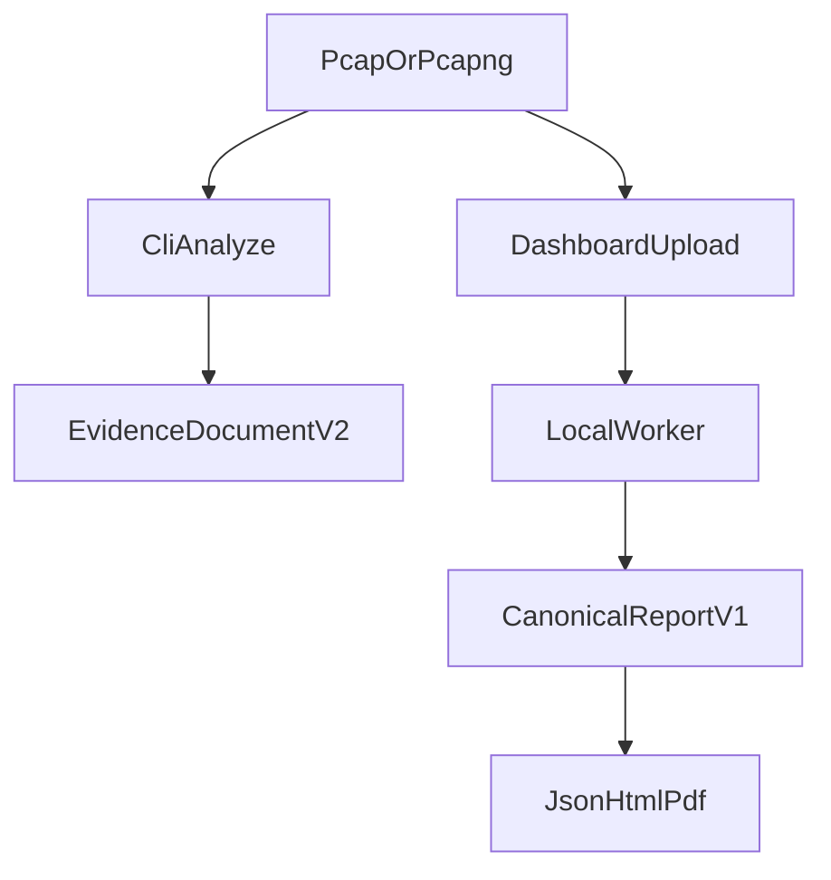

# User guide

This guide is for analysts who already have SecureMail installed. For first
install and a first command, start at
[getting started](../getting-started/README.md).

SecureMail assesses the cryptographic posture of **SMTP, IMAP, and POP3**
traffic in **PCAP / PCAPNG** files. Packet decoding happens in sandboxed Zeek
and TShark. Python normalizes evidence, applies policy, scores, and renders.

**Implemented** commands: `analyze`, `score`, `report`, `evaluate-ml`. Full
option tables live in the [CLI reference](../reference/cli.md). Do not copy
flags from this page.

## Two paths

There is no CLI command that wraps analyze output in a report envelope.

| Path | What you get | Who assembles `securemail.report/v1` |
|---|---|---|
| CLI `analyze` | `securemail.evidence/v2` `EvidenceDocument` (pretty JSON) | Nobody. You keep evidence JSON. |
| CLI `report` | RFC 8785 JSON, HTML, PDF | You must already have a `CanonicalReport`. Use the golden fixture or a dashboard-published report. |
| Dashboard upload | Catalog JSON plus job HTML/PDF | The worker calls `assemble_report` after analyze. |

## Reading order

1. [Analyze captures](analyze-captures.md) — intake, hash, evidence JSON.
2. [Policy profiles](policy-profiles.md) — `ietf_current`, `nist_federal`,
   `historical_at_capture`.
3. [Interpret evidence](interpret-evidence.md) — states and fact records.
4. [Interpret findings](interpret-findings.md) — session-level policy judgments.
5. [Scoring and coverage](scoring-and-coverage.md) — integer priority and
   denominators.
6. [Generate reports](generate-reports.md) — JSON is authoritative.
7. [Advisory ML](advisory-ml.md) — shadow-mode only; never mutates a `Finding`.
8. [Dashboard workflows](dashboard-workflows.md) — four regions, case isolation.
9. [Evidence limitations](evidence-limitations.md) — missing evidence is not a
   pass.

## What this tool is not

SecureMail is not a Wireshark replacement, an active scanner, or a mail-server
configurator. It does not recover plaintext without authorized key material. It
does not fetch AIA, OCSP, CRL, CT, DNS, or models during analysis.

## Related pages

- [First CLI analysis](../getting-started/first-cli-analysis.md)
- [First dashboard run](../getting-started/first-dashboard-run.md)
- [CLI reference](../reference/cli.md)
- [API reference](../reference/api.md)
- [Documentation hub](../README.md)

## Implementation anchors

- `src/securemail/api/cli/main.py`
- `src/securemail/application/assemble_report.py`
- `src/securemail/application/analysis_workflow.py`

## Test evidence

- `tests/test_empty_fixture.py`
- `tests/test_report_fixtures.py`
- `tests/e2e/dashboard.spec.ts`
