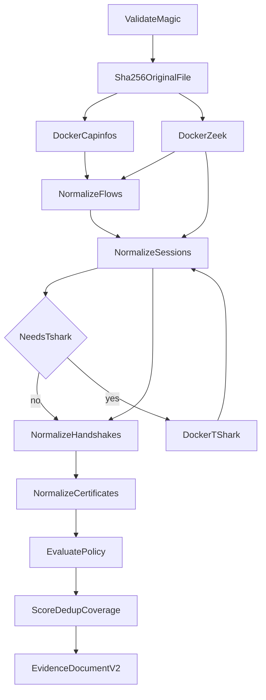

# Analyze captures

`securemail analyze` is the only CLI path that turns a capture into evidence.
It writes a `securemail.evidence/v2` `EvidenceDocument`. It does **not** emit
a `securemail.report/v1` envelope. There is no `assemble` CLI command. Report
assembly happens in the dashboard worker after an upload. See
[generate reports](generate-reports.md).

Option tables: [CLI reference](../reference/cli.md).

## Prerequisites

Analyzer images `securemail/zeek:step0` and `securemail/tshark:step0` must
exist, and the Docker daemon must be reachable. `make doctor` checks this.
Captures must be a readable `.pcap` or `.pcapng` file. Magic bytes are
validated before hashing.

```bash
uv run securemail analyze tests/fixtures/empty/capture.pcapng --out out/empty.json
```

`--out` is required. Parent directories are created.

A policy-bearing TLS 1.3 PSK-only example:

```bash
uv run securemail analyze \
  tests/fixtures/tls13_psk_only_resumption/capture.pcapng \
  --policy-profile ietf_current \
  --analysis-time 2026-09-04T12:00:00Z \
  --out out/policy.json
```

## What analyze does



1. Reject non-files and non-PCAP/PCAPNG magic.
2. SHA-256 the original bytes into `run_identity.capture_sha256` **before**
   analyzers run. Analyzers bind a read-only copy; they do not rewrite the
   intake file.
3. Run capinfos, then Zeek, inside `--network=none` containers (120 s each).
4. Optionally run TShark when mail, implicit-TLS ports, or any `ssl.log` UID
   is present. Empty non-mail, non-TLS captures skip TShark.
5. Normalize flows, sessions, handshakes, and certificates.
6. Apply the selected YAML pack. Emit session-level `Finding` records
   (negative and indeterminate only) plus `policy_checks` and `posture`.

Packet parsing is Zeek-first. Python does not re-implement TCP reassembly or
TLS record decoding.

## Output

Pretty JSON: `indent=2`, `sort_keys=True`, `ensure_ascii=False`, trailing
newline. Field order on disk is alphabetical, not declaration order.

Extracted certificate DER lands at
`<out-parent>/certificates/<sha256>.der`.

Envelope shape (not a golden file):

```text
EvidenceDocument
  schema_version: "v2"
  run_identity: AnalysisRun
  capture_preflight: CapturePreflight
  flows[]
  sessions[]
  handshakes[]
  certificates[]
  findings[]
  policy_checks[]
  posture: PostureAssessment
```

`NORMALIZATION_SCHEMA_VERSION` on `run_identity` is the literal `"v1"` (fact
records). `schema_version` on the document is `"v2"` (adds policy checks and
posture).

`run_identity` includes capture hash, analyzer-bundle digest (SHA-256 of
`tools/analyzer-bundle.lock` bytes), configuration digest, analysis time,
policy profile, policy-pack SHA-256, and trust-store digest. Policy pack
bytes are **not** folded into `configuration_digest`.

## Options that change evaluation

Documented in [CLI reference](../reference/cli.md). Analyst-facing effects:

| Option | Effect |
|---|---|
| `--policy-profile` | Which YAML pack runs. Default `ietf_current`. Unknown values exit 2. |
| `--analysis-time` | RFC 3339 UTC clock for `valid_at_analysis_time` and IETF/NIST evaluation. Default: now. |
| `--expiry-warning-days` | Window for `expires_within_warning_window`. Default 30, minimum 1. |
| `--expected-hostname` | RFC 9525 reference identity (`reference_identity_source=configured`). Default: observed SNI. |

`historical_at_capture` without `capture_preflight.capture_start_time` is an
`AnalysisError` (exit 1): `capture start time unavailable; historical policy
cannot be evaluated`.

## Related CLI commands

`securemail score` scores a `securemail.score_request/v1` JSON file (max
8 MiB) and writes a `PostureAssessment` to stdout. It does not read a PCAP.
Inventory labels default to `unknown` unless supplied in that request.
Analyze always scores internally; inventory labels on the analyze path are
`unknown`.

```bash
uv run securemail score tests/fixtures/synthetic_findings/mixed_severity.json
```

## Exit behavior

Success is exit 0. `AnalysisError`, `InvalidCaptureError`, `FileNotFoundError`,
and `OSError` print a message on stderr and exit 1. A missing capture path is
rejected by Typer (exit 2). Analyzer digest mismatch, Docker failure, 120 s
timeout, or combined analyzer output over 50 MiB become `AnalysisError`.

Rerunning the same capture with the same configuration is byte-identical
(Zeek `global_hash_seed` is `securemail-v0`). Fixture tests compare every
field, including digests and Zeek UIDs.

## Related pages

- [Policy profiles](policy-profiles.md)
- [Interpret evidence](interpret-evidence.md)
- [CLI reference](../reference/cli.md)
- [First CLI analysis](../getting-started/first-cli-analysis.md)
- [As-built pipeline](../architecture/analysis-pipeline.md)

## Implementation anchors

- `src/securemail/api/cli/main.py`
- `src/securemail/application/run_analysis.py`
- `src/securemail/bootstrap.py`

## Test evidence

- `tests/test_empty_fixture.py`
- `tests/support/fixture_harness.py`
- `tests/unit/test_run_analysis.py`
