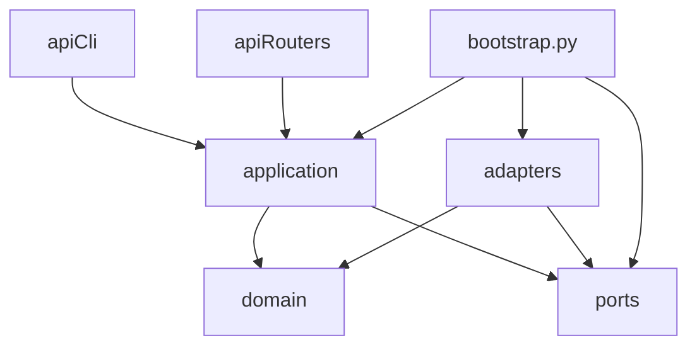

# SecureMail Project Scaffold

**Status:** Pre-development baseline — last document before Step 0 of the build plan starts
**Companion documents:** [OBJECTIVE.MD](./OBJECTIVE.MD) (requirements), [TECHNICAL_DESIGN.md](./TECHNICAL_DESIGN.md)
(architecture and rationale), [build_plan.md](./build_plan.md) (step sequence and test contracts)
**Verified against:** local machine state and live registry/package-index lookups on 3 September 2026
(macOS 26.5.1, Apple Silicon/arm64, Homebrew 6.0.9, Docker 29.5.2, `uv` 0.11.2, Node 25.4.0)

## 1. Purpose

[TECHNICAL_DESIGN.md](./TECHNICAL_DESIGN.md) decided *what* to build and *why*.
[build_plan.md](./build_plan.md) decided *in what order* to build it and *what test proves each
piece is done*. Neither document says where a given file lives, what belongs in it, what must
never be imported into it, or what has to be installed before the first line of code is written.
This document closes that gap. It is intentionally the last document before Step 0, because every
path it defines is a promise: once Step 0 creates these files, later steps only fill them in — they
do not get to invent new top-level layout.

This document does not repeat *why* Zeek, FastAPI, or PostgreSQL were chosen (TECHNICAL_DESIGN
Section 6) or *when* each file gets real content (build_plan's per-step Implementation sections). It
answers three questions only:

1. What has to be installed on a workstation before `git clone` is useful, and how do you get it?
2. What is the complete file tree, and what is each file's one job?
3. What mechanical rule (not a convention, an enforced rule) keeps the layers in
   TECHNICAL_DESIGN 5.3 from collapsing into each other as the codebase grows?

## 2. Prerequisites

Every command below was run against this machine to confirm it works before being written down. Do
not substitute versions without re-verifying the specific claim next to it (digest, wheel
availability, or native library requirement) — those are the parts most likely to silently rot.

### 2.1 Summary table

| Tool | Needed for (first step) | Status on this machine | Install | Verify |
|---|---|---|---|---|
| Homebrew | everything below | present (6.0.9) | see [brew.sh](https://brew.sh) | `brew --version` |
| `uv` | Python toolchain + dependency management, Step 0 | present (0.11.2) | `brew install uv` | `uv --version` |
| Python 3.13 | `securemail` package, Step 0 | not installed (only 3.14.2 venv exists) | `uv python install 3.13` | `uv python list \| grep 3.13` |
| git | version control, Step 0 | present | ships with Xcode CLT / `brew install git` | `git --version` |
| git-lfs | binary PCAP/DER fixtures, Step 0 | **not installed** | `brew install git-lfs && git lfs install` | `git lfs version` |
| Docker Desktop | Zeek/TShark analyzer containers, Step 0 | present (29.5.2) | [docker.com](https://www.docker.com/products/docker-desktop/) | `docker info` |
| Pango (+cairo/glib/fontconfig/harfbuzz, auto-pulled) | PDF rendering (WeasyPrint), Step 9 | **not installed** | `brew install pango` | `pkg-config --modversion pango` |
| Node.js 22 LTS | dashboard frontend, Step 11 | 25.4.0 present, repo pins 22 LTS separately | `brew install nvm` then `nvm install 22` | `node --version` (inside `frontend/`, via `.nvmrc`) |
| OpenSSL 3.x (Homebrew) | Step 6 differential cross-check | present at `/opt/homebrew/bin/openssl` (3.6.0) — **not** `/usr/bin/openssl` | `brew install openssl@3` | `/opt/homebrew/bin/openssl version` |

Nothing above needs a specific GPU, and none of it needs elevated/root privileges except Docker
Desktop's own installer.

### 2.2 Python toolchain

The project pins **CPython 3.13** (TECHNICAL_DESIGN Section 6: "pinned minor version"), not the
3.14.2 interpreter the stray `venv/` in this repo was built from. 3.13 was chosen over 3.14 purely
for wheel maturity: every dependency the design calls for resolves to a pre-built wheel for
`cp313-macosx_arm64` today (verified below); several are one or two release cycles newer on 3.14's
support matrix and more likely to force a source build during Step 0.

```bash
uv python install 3.13
uv --version                 # expect 0.11.x or newer
uv python list | grep 3.13   # expect a concrete 3.13.x row, not just "download available"
```

`uv` (not `pip`/`venv` directly) manages the interpreter and the project virtual environment for
three reasons that matter for a forensics tool: it resolves and locks the full dependency graph
(`uv.lock`, committed — see Section 6), it can install fully from a local wheel cache for the
air-gapped deployment target in TECHNICAL_DESIGN Section 6.2, and it never falls back to a
system/Homebrew Python behind your back the way bare `pip install` can.

**Wheel availability was verified, not assumed.** A throwaway `uv`-managed 3.13.12 environment on
this arm64 machine resolved the following core dependencies without any source build:

```text
cryptography==50.0.1   weasyprint==69.0    scikit-learn==1.9.0   asyncpg==0.31.0
fastapi==0.141.1       pydantic==2.13.5    numpy==2.5.2          scipy==1.18.1
pillow==12.3.0         cffi==2.1.1
```

If you re-verify this later, do it the same way rather than trusting the table above (versions
move every week):

```bash
uv venv --python 3.13 /tmp/wheelcheck
uv pip install --python /tmp/wheelcheck/bin/python3.13 --dry-run \
  cryptography weasyprint scikit-learn asyncpg pydantic fastapi
rm -rf /tmp/wheelcheck
```

If any package prints a source-build step (a `Building sdist` or long compile phase instead of an
immediate `Would download`), stop and re-check that package's minimum Python support table before
proceeding — do not silently accept a slow first install as normal.

Delete the pre-existing `venv/` directory once `uv sync` (Section 9) has created `.venv/`; the two
must never coexist, since accidentally activating the wrong one hides missing dependencies.

### 2.3 git-lfs (fixture storage)

build_plan Section 3 makes every fixture a `capture.pcapng` plus JSON metadata. PCAP/PCAPNG/DER
binaries do not belong in normal git blobs — they bloat every clone forever, and diffing them is
meaningless. This is required infrastructure starting at Step 0's first fixture, not an optional
nicety:

```bash
brew install git-lfs
git lfs install                 # registers the git-lfs filter globally, once per machine
```

The repository's `.gitattributes` (Section 6.4) declares which extensions route through LFS.
Cloning without `git-lfs` installed still works, but every fixture file appears as a small pointer
stub instead of real bytes — `securemail analyze` on such a checkout fails with a file-format error,
not a clear "install git-lfs" message, so this must be done before Step 0's first fixture is
authored.

### 2.4 Docker Desktop and the analyzer sandbox

Zeek and TShark are run exclusively as Docker containers, pinned by digest, with `--network=none`
(build_plan Ground rule 1, TECHNICAL_DESIGN Section 8.2). This project made that decision explicitly
rather than trying native Homebrew builds of Zeek, because:

- Zeek has no official Homebrew formula and building it from source pulls in a large C++/Broker/
  libpcap toolchain that then has to be kept in sync with the policy-script version by hand.
- A container gives one identical, digest-pinned artifact on every developer machine and in CI —
  which is exactly the reproducibility property `AnalysisRun.analyzer_bundle_digest`
  (TECHNICAL_DESIGN Section 5.4) depends on.
- `--network=none` is trivial to enforce for a container and easy to get wrong for a bare process.

```bash
# Docker Desktop must already be running before any of this
docker info                                   # confirms the daemon is reachable
docker manifest inspect zeek/zeek:8.0.10      # confirms registry reachability + arch coverage
```

**Pin by digest, not by tag.** A tag (`zeek/zeek:8.0.10`, `zeek/zeek:lts`) can be re-pushed to point
at a different image later; a digest cannot. Verified today:

| Image | Tag | Digest (multi-arch index) | Architectures |
|---|---|---|---|
| `zeek/zeek` | `8.0.10` (= `lts`) | `sha256:73e80e9cd23ff71fd28d158e9a9af5c7b2b0ef5d4036af61521827531347c0e3` | `linux/amd64`, `linux/arm64` |
| `debian` | `trixie-slim` | `sha256:d7e12182ce18b85b93007c1dedf31f2d29e01ccf3182cc4017c709b6259bc132` | `linux/amd64`, `linux/arm64`, `linux/arm/v5`, `linux/arm/v7`, and others |

`zeek/zeek:8.0.10` was chosen over the newer `8.2.x` line and the `9.0.0-rc*` pre-releases because
build_plan Section 5's field inventory (`ssl-log-ext.zeek` fields, the dormant POP3 analyzer,
`imap_capabilities`) was verified against the **Zeek 8.x** script reference, and `8.0` is the
current LTS line — the smallest surface that satisfies that claim. Upgrading to `8.2.x` later is a
one-line digest change plus a rerun of every fixture, not a design change.

There is no official Wireshark/TShark image, so `docker/tshark/Dockerfile` (Section 4) builds its
own from the digest-pinned `debian:trixie-slim` base plus `apt-get install --no-install-recommends
tshark`, which transitively pulls `capinfos`, `editcap`, and `mergecap` in via the
`wireshark-common` package — all three are named explicitly in build_plan Step 0/Step 1. TShark is
GPL-2.0-or-later and is deliberately kept in its own image, invoked as a separate subprocess, never
statically linked into anything (TECHNICAL_DESIGN Section 6.2).

`tools/analyzer-bundle.lock` (Section 4.7) is the single file that records the Zeek image digest,
the SHA-256 of `docker/tshark/Dockerfile` (not a local TShark image ID; see Section 8), and the
SHA-256 of the `zeek/` policy-script bundle. Regenerating it after a deliberate upgrade is one
command (Section 4.7); an unreviewed change to it should look exactly like an unreviewed change to
`uv.lock` — a diff a reviewer reads, not a file anyone hand-edits.

**Resource-limit flags Step 0 must actually pass at container run time** (TECHNICAL_DESIGN
Section 8.2 — this is the checklist the `zeek_runner.py`/`tshark_runner.py` adapters translate into
`docker run` arguments):

```bash
docker run --rm \
  --network=none \
  --read-only \
  --user 65532:65532 \
  --cap-drop=ALL \
  --security-opt=no-new-privileges \
  --pids-limit=256 \
  --memory=2g --memory-swap=2g \
  --cpus=2 \
  -v "$PCAP_PATH:/data/capture.pcapng:ro" \
  -v "$OUT_DIR:/data/out:rw" \
  zeek/zeek@sha256:73e80e9cd23ff71fd28d158e9a9af5c7b2b0ef5d4036af61521827531347c0e3 \
  zeek -C -r /data/capture.pcapng LogAscii::use_json=T /scripts/securemail-email.zeek
```

The adapters never build this command through a shell string; the fixed argv array above is the
contract (build_plan Step 0 Implementation, TECHNICAL_DESIGN Section 8.2 "never build analyzer
commands through a shell").

### 2.5 macOS-specific notes

These three are easy to get wrong on this specific platform and each one causes a test to fail for
a reason that looks unrelated to the real cause:

1. **`/usr/bin/openssl` is LibreSSL, not OpenSSL.** Apple ships LibreSSL 3.3.6 at that path.
   Step 6's differential test explicitly cross-checks the Python `cryptography` chain-validation
   result against a real **OpenSSL** `openssl verify` invocation (build_plan Step 6 Test contract).
   If `adapters/pki/openssl_crosscheck.py` resolves `openssl` via `PATH` or a bare `"openssl"`
   argv[0], it silently cross-checks against LibreSSL instead — a different X.509 validation
   implementation with different quirks — and the test's pass/fail becomes meaningless. The
   adapter must take an explicit, configurable binary path and default it to the Homebrew path on
   macOS:

   ```bash
   brew install openssl@3
   /opt/homebrew/bin/openssl version     # expect "OpenSSL 3.x", never "LibreSSL"
   ```

   In CI (Linux containers), `/usr/bin/openssl` is real OpenSSL, so this divergence is
   macOS-development-only — document it in the adapter's docstring so nobody "fixes" it into a bare
   `openssl` call later.

2. **Docker Desktop runs containers inside a Linux VM, not natively.** `--network=none` and the
   cgroup/seccomp/capability flags in Section 2.4 are enforced by that inner Linux kernel, and work
   identically to Linux CI. What does *not* transparently work is host-level packet capture: macOS
   has no equivalent of a Linux bridge interface Docker's Linux VM can see directly.
3. **Lab-capture generation (build_plan Section 3.1) needs a capture sidecar, not host
   `tcpdump`.** The lab fixtures (Postfix/Dovecot/Cyrus + `openssl s_server`/`s_client` in
   containers, captured with `tcpdump`) must run entirely inside Docker's network namespace: bring
   up the mail-server containers on a user-defined bridge network, then run a `nicolaka/netshoot`-
   style sidecar container attached to that *same* network with `--cap-add=NET_RAW
   --cap-add=NET_ADMIN` to run `tcpdump` against the bridge. Capturing from the macOS host's `en0`
   would only see Docker Desktop's VM uplink, never the individual container-to-container traffic
   the fixtures need. This sidecar pattern is documented once in
   `tests/fixtures/generators/README.md` (Step 0) rather than repeated per fixture generator script.

### 2.6 WeasyPrint / Pango (Step 9, PDF rendering)

WeasyPrint 69.0 itself is a normal Python wheel (confirmed in Section 2.2), but it dynamically
loads native Pango/cairo/GLib/HarfBuzz shared libraries at *runtime* via `cffi` — those are **not**
pip-installable and are not bundled in the wheel.

```bash
brew install pango     # transitively installs cairo, glib, fontconfig, freetype, harfbuzz, gdk-pixbuf
pkg-config --modversion pango     # expect >= 1.58 (WeasyPrint 69.0's minimum)
```

Do **not** follow WeasyPrint's own top-level "easiest way" install advice (`brew install
weasyprint`) — that installs Homebrew's *own* Python interpreter and expects you to use it directly.
This project pins Python via `uv` instead (Section 2.2), so the uv-managed interpreter needs to find
Homebrew's native libraries explicitly:

```bash
export DYLD_FALLBACK_LIBRARY_PATH="/opt/homebrew/lib:${DYLD_FALLBACK_LIBRARY_PATH:-}"
```

Add that line to the project's `.envrc`/`Makefile` environment (Section 6.2), not to a personal
shell profile — every contributor and every CI macOS runner needs it, and it must not depend on
someone's dotfiles. `libffi` needs no separate Homebrew package; WeasyPrint's own dependency
manifest lists it as "uses from macOS" (i.e., the OS-provided copy is sufficient). Linux CI and the
production containers install `libpango-1.0-0`, `libcairo2`, `libgdk-pixbuf-2.0-0`, and
`libharfbuzz0b` via `apt-get` instead — there is no Homebrew there.

Pinned fonts (build_plan Step 9: "pinned fonts bundled in the repo, not system fonts") live under
`src/securemail/adapters/reports/fonts/` and are loaded via an explicit `@font-face` `src: url()` in
the HTML template — Pango/WeasyPrint must never fall back to resolving a font by family name from
whatever happens to be installed on the rendering machine.

### 2.7 Node.js (Step 11 only)

The dashboard (build_plan Step 11) is the last step in the plan; nothing before it needs Node. This
machine already has Node 25.4.0 globally, but the frontend pins its own version independently via
`frontend/.nvmrc` (Section 6) so that CI and every contributor build against the same runtime
regardless of what else is installed globally:

```bash
brew install nvm
mkdir -p ~/.nvm  # if brew's post-install step did not already create it
nvm install 22    # installs latest Node 22.x LTS
cd frontend && nvm use   # reads frontend/.nvmrc
```

Do not install frontend dependencies or scaffold `frontend/` before Step 11 starts; the directory
exists from Step 0 onward (Section 3) only as a placeholder with a `.gitkeep` and a short `README.md`
explaining why it is still empty.

### 2.8 Air-gapped / offline bootstrap

TECHNICAL_DESIGN Section 6.2 requires a signed offline update bundle. The pieces already named
above compose into it directly — this project does not need a separate offline toolchain:

1. **Python wheels:** `uv export --format requirements-txt > requirements.lock.txt` then
   `pip download -r requirements.lock.txt -d wheelhouse/` on a networked machine; `uv pip install
   --no-index --find-links wheelhouse/ -r requirements.lock.txt` on the air-gapped target.
2. **Container images:** `docker pull` both digests in Section 2.4, then `docker save
   zeek/zeek@sha256:... securemail/tshark@sha256:... -o analyzer-bundle.tar`; load with `docker load
   -i analyzer-bundle.tar` on the target.
3. **npm packages:** `npm ci` against `frontend/package-lock.json` on a networked machine with
   `npm config set cache ./npm-cache`, then copy `npm-cache/` and run `npm ci --offline
   --cache ./npm-cache` on the target.
4. **Trust store / IANA data / rule packs:** these are already checked into the repo as versioned
   data files (Section 4.4), so cloning the repo is sufficient — no separate download step exists
   for them by design.

Every artifact above is content-addressed (SHA-256) and its hash recorded in
`tools/analyzer-bundle.lock` or the relevant lock file, so an air-gapped install is verifiable
without network access, per TECHNICAL_DESIGN Section 6.2's "pin images by digest, generate SBOMs,
verify signatures" requirement.

### 2.9 `make doctor`

Every check above is codified as a single command so no one has to re-read this section by hand.
Its implementation is part of Step 0 (`Makefile`, Section 6.2); its contract is fixed here:

```bash
make doctor
```

Expected output shape (each line is an independent, individually-failing check — the command exits
non-zero and prints a remediation hint for the *first* failing line, but still runs every check so a
new contributor sees every gap in one pass, not one-at-a-time):

```text
[ok]   uv >= 0.11
[ok]   python 3.13.x available via uv
[fail] git-lfs not installed          -> brew install git-lfs && git lfs install
[ok]   docker daemon reachable
[ok]   zeek/zeek@sha256:73e80e9c... reachable and matches tools/analyzer-bundle.lock
[fail] pango not found via pkg-config -> brew install pango
[ok]   /opt/homebrew/bin/openssl reports OpenSSL (not LibreSSL)
[skip] node/nvm (only required for Step 11)
```

## 3. Complete repository tree

Every path below is created in Step 0 as either a real starter file or a deliberately empty
placeholder (marked `[Step N]` for the step that first puts real content in it). A path with no
step tag is Step 0 itself. This tree is the full target shape from TECHNICAL_DESIGN Section 5.3,
resolved against build_plan's concrete file list — see Section 8 for every place the two source
documents disagreed and which one this document follows.

```text
SecureMail/
  plans/
    OBJECTIVE.MD
    TECHNICAL_DESIGN.md
    TECHNICAL_DESIGN.html
    build_plan.md
    build_plan.html
    PROJECT_SCAFFOLD.md                  # this document

  docs/
    README.md                            # as-built hub (what the code does today)
    current-state.md                     # Steps 0–3 done; 4–11 placeholders
    architecture.md
    pipeline.md
    evidence-model.md
    analyzers.md
    tcp-reconstruction.md
    protocol-identification.md
    starttls.md
    cli-and-development.md
    fixtures.md
    decisions/
      step2-imap-pop3-depth.md           # [Step 2] IMAP/POP3 depth ADR (amended Step 3)

  zeek/                                  # policy-script bundle, hashed as a unit
    site/
      __load__.zeek                      # [Step 0] loads base scripts + ssl-log-ext + validate-certs
    scripts/
      securemail-email.zeek              # [Step 2] unified sm_email.log emitter
    signatures/
      email-dpd.sig                      # [Step 2] SMTP/IMAP/POP3 DPD payload signatures

  docker/
    zeek/
      Dockerfile                         # pinned FROM zeek/zeek@sha256:..., copies zeek/ read-only
    tshark/
      Dockerfile                         # pinned FROM debian:trixie-slim@sha256:..., installs tshark

  tools/
    analyzer-bundle.lock                 # [Step 0] zeek image digest, TShark Dockerfile SHA-256, zeek/ bundle hash
    refresh_analyzer_lock.py             # regenerates the lock file; never hand-edit the lock

  src/
    securemail/
      __init__.py
      bootstrap.py                       # composition root: wires ports -> adapters -> CLI/API

      api/
        __init__.py
        cli/
          __init__.py
          main.py                        # Typer app entry point (`securemail` console script)
          commands/
            __init__.py
            analyze.py                   # [Step 0] `securemail analyze <pcap>`
            score.py                     # [Step 8] `securemail score <findings.json>`
            report.py                    # [Step 9] `securemail report <report.json>`
            evaluate_ml.py               # [Step 10] `securemail evaluate-ml <cohort_dir>`
        routers/
          .gitkeep                       # [Step 11] FastAPI routers, thin wrappers over application/
        main.py                          # [Step 11] FastAPI app factory (empty placeholder until then)
        dependencies.py                  # [Step 11] shared FastAPI dependencies (auth, db session)

      application/
        __init__.py
        run_analysis.py                  # [Step 0] the one use case the CLI's `analyze` command calls
        advisory_pipeline.py             # [Step 10] orchestrates ML feature extraction + scoring

      domain/
        __init__.py
        evidence/
          __init__.py
          run.py                         # [Step 0] AnalysisRun, EvidenceState enum
          flow.py                        # [Step 1] Flow model + reconstruction_quality
          session.py                     # [Step 2] EmailSession model (protocol, port_hint, payload_evidence)
          handshake.py                   # [Step 4] TlsHandshake model, visibility flag
          certificate.py                 # [Step 5] CertificateEvidence model
        policies/
          __init__.py
          starttls/
            __init__.py
            smtp_upgrade.py              # [Step 3] SMTP state machine
            imap_upgrade.py              # [Step 3] IMAP state machine
            pop3_upgrade.py              # [Step 3] POP3 state machine
            implicit_tls.py              # [Step 3] port 465/993/995 correlation, not port-only
          tls/
            __init__.py
            key_exchange.py              # [Step 4] version-aware key-exchange classification
            forward_secrecy.py           # [Step 7] pure forward-secrecy table, indeterminate defaults
          pki/
            __init__.py
            chain_validation.py          # [Step 6] cryptography-based path validation
            identity.py                  # [Step 6] RFC 9525 SAN matching, no CN fallback
            key_strength.py              # [Step 5] effective-security-strength mapping table (data-driven)
          rules/
            ietf_current.yaml            # [Step 7] versioned rule pack
            nist_federal.yaml            # [Step 7] versioned rule pack
            historical_at_capture.yaml   # [Step 7] versioned rule pack
          rule_engine.py                 # [Step 7] pure evaluator: rule pack + evidence -> Finding[]
        findings/
          __init__.py
          scoring.py                     # [Step 8] pure posture-score function + named components
          dedup.py                       # [Step 8] session-level -> endpoint-level Finding collapse
          posture.py                     # [Step 8] aggregation + coverage denominators
        reports/
          __init__.py
          schema.py                      # [Step 9] versioned JSON Schema / Pydantic report model

      ports/
        __init__.py
        analyzers.py                     # [Step 0] ZeekRunner / TSharkRunner Protocol interfaces
        artifacts.py                     # [Step 0] Protocol for content-addressed evidence storage
        persistence.py                   # [Step 11] Protocol for case/run repositories (Phase 1 scope)
        ml.py                            # [Step 10] Protocol for feature/model adapters

      adapters/
        __init__.py
        analyzers/
          __init__.py
          zeek_runner.py                 # [Step 0] pinned docker run argv, computes image digest
          tshark_runner.py               # [Step 0] pinned docker run argv, bounded field selection
        reference_data/
          __init__.py
          iana_tls_parameters.py         # [Step 4] versioned IANA TLS-parameters snapshot loader
          iana-tls-parameters.json       # [Step 4] the actual checked-in registry snapshot (data)
        artifacts/
          __init__.py
          certificate_store.py           # [Step 5] DER bytes stored by SHA-256
        pki/
          __init__.py
          trust_store.py                 # [Step 6] pinned offline trust-store snapshot + digest
          trust-store-snapshot.pem       # [Step 6] the actual checked-in trust bundle (data)
          openssl_crosscheck.py          # [Step 6] bounded `openssl verify` subprocess, test-only
        reports/
          __init__.py
          canonical_json.py             # [Step 9] RFC 8785 canonicalization + SHA-256
          html_renderer.py              # [Step 9] Jinja2, autoescape verified on
          pdf_renderer.py               # [Step 9] WeasyPrint over the same HTML
          templates/
            report.html.j2              # [Step 9] the one HTML template both HTML and PDF render from
          fonts/
            .gitkeep                    # [Step 9] pinned font files bundled here, not system fonts
        ml/
          __init__.py
          baselines.py                  # [Step 10] median/MAD + categorical-rarity scorers
          isolation_forest.py           # [Step 10] added only after the baseline-gate test passes
        persistence/
          .gitkeep                      # [Step 11] SQLAlchemy repositories (Phase 1 scope)
        queue/
          .gitkeep                      # [Step 11+] Celery/RabbitMQ integration (Phase 1 scope)

      workers/
        .gitkeep                        # [Step 11+] idempotent Celery task entry points

  tests/
    unit/
      .gitkeep                          # grows with every step's pure-function tests
    integration/
      .gitkeep                          # [Step 11+] Postgres/queue/adapter integration tests
    e2e/
      .gitkeep                          # [Step 11] dashboard.spec.ts (Playwright)
    support/
      __init__.py
      fixture_harness.py                # [Step 0] runs a fixture dir end-to-end, diffs expected.json
      synthetic_cohorts.py              # [Step 10] seeded-anomaly cohort generator
    fixtures/
      empty/
        capture.pcapng                  # [Step 0] the one trivial fixture Step 0 ships with
        expected.json
        provenance.json
      generators/
        README.md                      # documents the tcpdump-sidecar pattern (Section 2.5)
      reports/
        .gitkeep                        # [Step 9] golden_report.json lands here

  frontend/                             # [Step 11] placeholder until then
    README.md                           # explains the directory is intentionally empty until Step 11
    .nvmrc                              # pins Node 22 LTS ahead of time so CI config can reference it

  .github/
    workflows/
      ci.yml                            # lint, import-linter, pytest, `make doctor` in CI

  .cursor/
  pyproject.toml
  uv.lock
  .python-version
  Makefile
  .gitattributes
  .gitignore
  .pre-commit-config.yaml
  .dockerignore
  .env.example
  README.md
```

Note what is **not** created yet: no `docker-compose.yml` for Postgres/RabbitMQ (build_plan Ground
rule 3 — no database or queue before the CLI path proves the logic works), no Alembic migrations,
no Keycloak/OIDC config. Those appear when Phase 1's non-CLI surfaces actually start (TECHNICAL_DESIGN
Section 11, roughly build_plan Step 11 onward).

## 4. Per-file responsibility

Tables below cover every path from build_plan that is not self-explanatory from Section 3's tree
comment. "Must not" is the mechanical boundary a reviewer checks for on every PR touching that file,
not a style suggestion.

### 4.1 `ports/` — Protocol interfaces

| File | Responsibility | Owning step | Must not |
|---|---|---|---|
| `ports/analyzers.py` | Defines `ZeekRunner`/`TSharkRunner` as `typing.Protocol` classes: input is a capture path + config, output is a typed result + digest | Step 0 | Import `docker`, `subprocess`, or any concrete adapter |
| `ports/artifacts.py` | Protocol for content-addressed storage: `put(bytes) -> sha256`, `get(sha256) -> bytes` | Step 0 | Know about the filesystem, S3, or any backend |
| `ports/persistence.py` | Protocol for case/run repositories used by the API layer | Step 11 | Import SQLAlchemy |
| `ports/ml.py` | Protocol for feature extraction and model scoring | Step 10 | Import scikit-learn directly (adapters do) |

### 4.2 `adapters/analyzers/` — subprocess adapters

| File | Responsibility | Owning step | Must not |
|---|---|---|---|
| `zeek_runner.py` | Builds the fixed `docker run` argv from Section 2.4, executes it, captures the image digest actually used, parses JSON logs into raw dicts | Step 0 | Build the command via string concatenation/shell; silently continue if the digest does not match `analyzer-bundle.lock` |
| `tshark_runner.py` | Same shape, for the bounded `tshark -Y ... -T json` second pass named in build_plan Step 2's decision gate | Step 0 (harness), Step 2 (first real use) | Run an unbounded full-tree dissection; accept an arbitrary field list from caller input without an allowlist |

### 4.3 `domain/evidence/` — canonical models

| File | Responsibility | Owning step |
|---|---|---|
| `run.py` | `AnalysisRun` identity record and the `EvidenceState` enum (`observed`/`verified`/`inferred`/`incomplete`/`conflicting`/`not_observable`/`indeterminate`) — every other evidence model imports this enum, never redefines it | Step 0 |
| `flow.py` | `Flow` model, `reconstruction_quality` computed from `conn.log`/`weird.log`/`capture_loss.log` facts | Step 1 |
| `session.py` | `EmailSession` model with independent `port_hint` and `payload_evidence` fields | Step 2 |
| `handshake.py` | `TlsHandshake` model with frame references and a `visibility` flag (`full`/`partial`/`not_observable`) | Step 4 |
| `certificate.py` | `CertificateEvidence` model: subject/issuer, validity window, key algorithm/strength, signature algorithm — kept separate from the handshake's own `CertificateVerify` signature field | Step 5 |

All five are Pydantic v2 models. **Must not:** import anything from `adapters/` or `ports/` —
evidence models are pure data plus validation, constructed by normalizers that live in
`application/`, never by the models parsing raw analyzer output themselves.

### 4.4 `domain/policies/` — pure rule evaluators

| File | Responsibility | Owning step |
|---|---|---|
| `starttls/smtp_upgrade.py`, `imap_upgrade.py`, `pop3_upgrade.py` | One explicit transition-table state machine per protocol over the alphabet in build_plan Step 3 (`advertised`, `requested`, `accepted`, `tls_established`, `plaintext_fallback`, `violation`) | Step 3 |
| `starttls/implicit_tls.py` | Correlates ports 465/993/995 with the decoded protocol from Step 2, never port number alone | Step 3 |
| `tls/key_exchange.py` | Pure function `(version, cipher_suite, key_share_groups, dh_param_size, psk_modes) -> classification`; TLS 1.3 never inferred from cipher-suite name | Step 4 |
| `tls/forward_secrecy.py` | Version-aware forward-secrecy table; defaults to `indeterminate` whenever a required fact is missing | Step 7 |
| `pki/chain_validation.py` | `cryptography`-based path validation at an explicit verification time; produces the independent fields from TECHNICAL_DESIGN Section 4.3 | Step 6 |
| `pki/identity.py` | RFC 9525 SAN-based identity matching against a declared reference identity source; no CN fallback | Step 6 |
| `pki/key_strength.py` | Data-driven effective-security-strength table (RSA-2048 ≈ 112-bit, P-256 ≈ 128-bit) — a lookup table, not an `if/elif` chain | Step 5 |
| `rules/*.yaml` | One file per policy profile (`ietf_current`, `nist_federal`, `historical_at_capture`); each rule: stable ID, source standard, applicability, effective date, severity, rationale, inline test cases | Step 7 |
| `rule_engine.py` | Loads a rule pack, applies it to evidence, emits `Finding` records; computes the rule pack's own digest for `AnalysisRun.policy_pack_version` | Step 7 |

**Must not (all files in this section):** import `adapters/`, perform I/O, or hold mutable module-
level state — every rule function is `(facts_in) -> result_out`, testable without a fixture running
through the full pipeline.

### 4.5 `domain/findings/` — scoring and aggregation

| File | Responsibility | Owning step |
|---|---|---|
| `scoring.py` | Pure, versioned function: severity + confidence + exposure + recurrence (+ optional asset criticality) → final score and named components | Step 8 |
| `dedup.py` | Collapses session-level findings sharing a finding code and endpoint into one endpoint-level `Finding` with a recurrence count; never discards contributing session references | Step 8 |
| `posture.py` | Aggregates findings and **coverage denominators** (`unknown_count`/`not_observable_count` per protocol/category) into the report-level posture summary | Step 8 |

### 4.6 `adapters/reference_data/`, `adapters/pki/`, `adapters/reports/`, `adapters/ml/`

| File | Responsibility | Owning step | Must not |
|---|---|---|---|
| `reference_data/iana_tls_parameters.py` + `.json` | Loads the versioned IANA TLS Parameters snapshot as data | Step 4 | Hardcode a single cipher suite's name/code as a Python literal anywhere else in the codebase |
| `pki/trust_store.py` + `.pem` | Loads the pinned, offline trust-store snapshot and its digest | Step 6 | Perform any AIA/OCSP/CRL/CT network call |
| `pki/openssl_crosscheck.py` | Bounded, fixed-argv `openssl verify` subprocess, used only from the Step 6 differential test | Step 6 | Run in the production validation path; call a bare `"openssl"` (see Section 2.5 item 1) |
| `reports/canonical_json.py` | RFC 8785 canonicalization + SHA-256 of the report object | Step 9 | Hash a dict before canonicalizing it |
| `reports/html_renderer.py` | Jinja2 rendering with autoescaping verified on for every template | Step 9 | Disable autoescaping per-template, even "just for one field" |
| `reports/pdf_renderer.py` | WeasyPrint rendering of the *same* HTML `html_renderer.py` produces | Step 9 | Re-assemble the report independently from raw evidence |
| `ml/baselines.py` | Median/MAD and categorical-rarity scorers — the mandatory baseline gate | Step 10 | Get deleted or bypassed once `isolation_forest.py` exists |
| `ml/isolation_forest.py` | Added only once a committed test shows it beats `baselines.py` by a stated margin | Step 10 | Exist in the codebase before that comparison test is committed and passing |

### 4.7 `tools/analyzer-bundle.lock`

A small JSON file recording exactly three facts:

```json
{
  "zeek_image_digest": "sha256:73e80e9c...",
  "tshark_image_digest": "<sha256-hex of docker/tshark/Dockerfile>",
  "zeek_bundle_sha256": "<sha256 of the zeek/ directory tree>"
}
```

`zeek_image_digest` is the registry digest of `zeek/zeek:8.0.10` from Section 2.4.

`tshark_image_digest` is the SHA-256 of `docker/tshark/Dockerfile` bytes (the recipe, including the
pinned `FROM debian:trixie-slim@sha256:...` line). It is **not** the digest of the image produced by
`docker build` / `make tshark-image`. A local built-image ID is not stable across machines or
rebuilds; hashing the Dockerfile is. This is still a deviation from pinning a published TShark
image the way Zeek is pinned — see Section 8.

`AnalysisRun` (TECHNICAL_DESIGN Section 5.4) includes this file's content hash in its own identity
tuple (build_plan Section 5.5's idempotency key). `refresh_analyzer_lock.py` is the only thing
allowed to write it — never edit `analyzer-bundle.lock` by hand, the same discipline as `uv.lock`.
The TShark runner fails closed if the Dockerfile bytes do not match the lock; it still requires
`securemail/tshark:step0` to exist locally.

### 4.8 `application/`

| File | Responsibility | Owning step | Must not |
|---|---|---|---|
| `run_analysis.py` | The one use case behind `securemail analyze`: invoke Zeek/TShark via `ports/analyzers.py`, normalize into `domain/evidence/`, run the policy engine, assemble the report | Step 0 (skeleton), grows every step | Import `docker`, SQLAlchemy, or Celery directly — only `ports/` |
| `advisory_pipeline.py` | Orchestrates ML feature extraction from already-computed evidence; runs strictly after and separately from `rule_engine.py`; writes to a distinct `AnomalyResult`, never merges into `Finding` | Step 10 | Be importable from anywhere inside `domain/` |

### 4.9 `tests/support/`

| File | Responsibility | Owning step |
|---|---|---|
| `fixture_harness.py` | Runs `tests/fixtures/<case_id>` end to end through the real CLI/application path and produces a field-level diff against `expected.json` | Step 0 |
| `synthetic_cohorts.py` | Generates multi-week per-endpoint session-feature time series with seeded, labeled anomalies for the Step 10 evaluation harness | Step 10 |

## 5. Layering and import rules

TECHNICAL_DESIGN Section 5.3's dependency-inversion diagram is not self-enforcing — nothing stops
someone from importing `adapters.analyzers.zeek_runner` inside a `domain/policies/` module six
months from now under deadline pressure. This project makes the rule mechanical instead of relying
on review discipline.



Rules encoded by that diagram:

- `domain/` imports nothing from `adapters/`, `ports/`, `application/`, or `api/`. It may only
  import from the standard library, Pydantic, and other `domain/` modules. This is what keeps
  `domain/policies/tls/forward_secrecy.py` a function you can unit-test with a plain dict, forever.
- `application/` imports `domain/` and `ports/`, never a concrete `adapters/` module.
- `adapters/` implements `ports/` interfaces and may import `domain/` (to return domain models),
  but nothing in `adapters/` imports `application/` or `api/`.
- `bootstrap.py` is the only file allowed to import both a `ports/` interface and its concrete
  `adapters/` implementation in the same module — that is what "composition root" means.

This is enforced by [`import-linter`](https://import-linter.readthedocs.io/), configured in
`pyproject.toml` (Section 6.1) and run in CI (`.github/workflows/ci.yml`) as a required check, not
a linter warning:

```toml
[tool.importlinter]
root_package = "securemail"

[[tool.importlinter.contracts]]
name = "Domain has no outward dependencies"
type = "forbidden"
source_modules = ["securemail.domain"]
forbidden_modules = ["securemail.adapters", "securemail.ports", "securemail.application", "securemail.api"]

[[tool.importlinter.contracts]]
name = "Application does not import concrete adapters"
type = "forbidden"
source_modules = ["securemail.application"]
forbidden_modules = ["securemail.adapters"]

[[tool.importlinter.contracts]]
name = "Layers are independent of api"
type = "forbidden"
source_modules = ["securemail.domain", "securemail.application", "securemail.adapters", "securemail.ports"]
forbidden_modules = ["securemail.api"]
```

A PR that violates any contract fails `make lint` locally and the CI job identically — there is no
separate "the linter is just a suggestion here" carve-out.

## 6. Root configuration files

### 6.1 `pyproject.toml`

Dependency groups keep a CLI-only install (what every developer needs for Steps 0-9) from pulling
in FastAPI/Celery/PostgreSQL clients before Step 11 needs them, and keep the ML stack from being a
default requirement of running `securemail analyze`:

| Group | Contents | First required by |
|---|---|---|
| `core` (default) | `pydantic>=2`, `typer`, `cryptography`, `pyyaml`, `jinja2` | Step 0 |
| `reports` | `weasyprint` | Step 9 |
| `ml` | `scikit-learn`, `numpy`, `scipy` | Step 10 |
| `api` | `fastapi`, `uvicorn`, `sqlalchemy`, `asyncpg`, `alembic` | Step 11 |
| `dev` | `pytest`, `hypothesis`, `import-linter`, `ruff`, `mypy`, `pre-commit`, `playwright` | always, dev-only |

```bash
uv sync --extra dev                     # Steps 0-8 day-to-day
uv sync --extra dev --extra reports     # once Step 9 starts
uv sync --all-extras                    # Step 10 onward
```

`uv.lock` is committed (unlike the commented-out default in the current `.gitignore` — see
Section 8.4). A forensics tool whose report reproducibility is a stated requirement
(TECHNICAL_DESIGN Section 5.5, Section 8.5) cannot allow "whatever `pydantic` resolved to today" to
be undocumented; the lock file is part of `AnalysisRun`'s reproducibility story, not an
implementation detail.

### 6.2 `Makefile`

| Target | Does |
|---|---|
| `make doctor` | Runs every check in Section 2.9 |
| `make sync` | `uv sync --all-extras`, sets `DYLD_FALLBACK_LIBRARY_PATH` on macOS (Section 2.6) |
| `make lint` | `ruff check`, `mypy`, `lint-imports` (import-linter) |
| `make test` | `pytest` against `tests/unit` and `tests/fixtures` via the harness |
| `make analyzer-lock` | Runs `tools/refresh_analyzer_lock.py` |
| `make zeek-image` / `make tshark-image` | Builds/pulls and re-pins the two analyzer images |

### 6.3 `.python-version`

Contains `3.13`, read by `uv` automatically so `uv run`/`uv sync` never has to be told the version
on the command line, and so an editor's Python extension picks the right interpreter without
per-contributor configuration.

### 6.4 `.gitattributes`

```gitattributes
*.pcap    filter=lfs diff=lfs merge=lfs -text
*.pcapng  filter=lfs diff=lfs merge=lfs -text
*.der     filter=lfs diff=lfs merge=lfs -text
*.p12     filter=lfs diff=lfs merge=lfs -text
*.pfx     filter=lfs diff=lfs merge=lfs -text
```

Only binary evidence/key material routes through LFS. `expected.json` and `provenance.json` stay as
normal git text blobs on purpose — they are meant to be diffed and reviewed line by line.

### 6.5 `.pre-commit-config.yaml`

Runs `ruff`, `ruff format --check`, `mypy` (on changed files), and `lint-imports` on every commit —
the same three checks CI enforces, just earlier, so a layering violation is caught before push
rather than in a CI run five minutes later.

### 6.6 `.dockerignore` and `.env.example`

`.dockerignore` excludes `tests/fixtures/`, `.venv/`, `frontend/node_modules/`, and `.git/` from the
build context passed to `docker/zeek/Dockerfile` / `docker/tshark/Dockerfile` — those images should
never be able to see PCAP fixtures or source code, only their own pinned base and the `zeek/`
script bundle. `.env.example` documents `DYLD_FALLBACK_LIBRARY_PATH` (macOS only), plus the
Step 11+ variables (`DATABASE_URL`, `OIDC_ISSUER`) as commented-out placeholders — nothing in it is
required to be filled in before Step 11.

### 6.7 CI (`.github/workflows/ci.yml`)

Runs on Linux (where `/usr/bin/openssl` genuinely is OpenSSL, so the Step 6 differential test needs
no path override there), executing: `make doctor` (minus the Docker Desktop-specific checks),
`make lint`, `make test`, and — once `tools/analyzer-bundle.lock` exists — a job that
`docker manifest inspect`s the pinned Zeek image digest and the TShark Debian base digest and
asserts they still resolve, so a registry-side rug-pull is caught by CI rather than by a
developer's confused bug report. The lock's `tshark_image_digest` is the Dockerfile hash, not a
registry image (Section 4.7 / Section 8).

## 7. Fixture and evidence conventions

Restating build_plan Section 3's contract here only where it affects file layout (the *content*
rules — evidence states, provenance fields — are build_plan's, not repeated):

```text
tests/fixtures/<case_id>/
  capture.pcapng       # LFS-tracked, byte-preserved, never edited after creation
  expected.json        # plain git text, authored before the corresponding code
  provenance.json      # plain git text: source, generator, tool versions, sha256, capture date
```

**`<case_id>` naming** follows `<protocol_or_area>_<condition>`, matching the exact fixture names
build_plan already uses in its CLI-command examples (`tcp_snaplen_truncation`,
`imap_starttls_capability_stripped`, `tls13_hello_retry_request`, `cert_expired_rsa1024`,
`cert_chain_san_mismatch`, `tls13_psk_only_resumption`) — a new fixture's directory name should be
guessable from reading the relevant build_plan step's Fixtures bullet before it is created, not
invented independently.

`tests/fixtures/generators/` holds one script per fixture-generation *method* (a Scapy script, a
`docker-compose.lab.yml` for the lab stack, a URL-plus-checksum note for public-corpus captures),
referenced by exact path from each fixture's own `provenance.json.generator` field — the generator
script is itself part of the evidence chain, so it is never deleted or rewritten in place once a
fixture depends on it; a changed generator gets a new fixture or a new script file.

## 8. Deviations and reconciliations

Stated explicitly because both source documents describe slightly different shapes for a few paths,
and this document has to pick one:

1. **Zeek scripts get their own top-level `zeek/` tree**, not the bare `scripts/securemail-email.zeek`
   build_plan's prose implies. Rationale: `tools/analyzer-bundle.lock` hashes "the Zeek policy
   script bundle" as one unit (build_plan Section 5.2's own wording), and a bundle that is hashed
   and mounted read-only into a container deserves a reviewable top-level directory with its own
   `signatures/` and `site/` subfolders, not a single loose file inside a generic `scripts/`
   directory that could otherwise fill up with unrelated shell helpers.
2. **`Dockerfile.zeek` / `Dockerfile.tshark` (build_plan's naming) become `docker/zeek/Dockerfile`
   and `docker/tshark/Dockerfile`.** Two root-level Dockerfiles do not scale past two images, and
   `docker/<name>/Dockerfile` is what `.dockerignore` and CI build-context scoping (Section 6.6)
   assume.
3. **`tests/golden_pcaps/` from TECHNICAL_DESIGN Section 5.3's illustrative tree is superseded by
   `tests/fixtures/<case_id>/` from build_plan Section 3.** build_plan's version is the one with an
   actual, load-bearing contract (three named files, provenance, evidence-state discipline) and is
   the one every step's CLI command example already points at; TECHNICAL_DESIGN's tree was
   explicitly a sketch ("suggested project layout"), not a second contract to reconcile against.
4. **`src/securemail/api/cli/` is the first (and, until Step 11, only) adapter under `api/`**, per
   build_plan Ground rule 3 ("No FastAPI service ... before the CLI path proves the logic works").
   `api/main.py` and `api/routers/` exist from Step 0 as empty placeholders purely so Step 11 does
   not have to restructure the `api/` package, only fill it in.
5. **Two existing `.gitignore` rules need fixing, found while producing this tree** (not yet
   changed — flagged here for the Step 0 PR that first edits `.gitignore`):
   - Line 17, bare `lib/`, is a leftover from the generic Python template and will silently ignore
     `frontend/src/lib/` once the frontend exists in Step 11. It should be scoped to
     `.venv/lib/`/`venv/lib/` or removed in favor of the existing `.venv`/`venv/` rules further
     down the file, which already cover the actual virtualenv case.
   - Lines 238-239 (`scripts/data/dsa_accounts.csv`, `scripts/data/seed_approved_dsa_users.sql`)
     reference a `scripts/data/` DSA-accounts path that has no connection to anything in
     OBJECTIVE.MD, TECHNICAL_DESIGN.md, or build_plan.md — almost certainly copied in from an
     unrelated project's `.gitignore`. Remove both lines.
6. **`tshark_image_digest` is the SHA-256 of `docker/tshark/Dockerfile`, not the built-image
   digest originally specified in Section 4.7.** There is no published TShark image to pin the way
   Zeek is pinned. Locking a local `docker build` ID would churn across contributors and CI (cache,
   timestamps, builder identity). The Dockerfile hash is more reproducible: the same recipe,
   including the digest-pinned Debian base, yields the same lock value on every machine. Runners
   still require `make tshark-image` and fail closed on a recipe mismatch. This remains a deviation
   from "pin the built image by digest." CI therefore `docker manifest inspect`s the Zeek image and
   the Debian base, not a TShark image digest that is not in the lock.

## 9. Ordered bootstrap sequence

The exact commands, in order, from a fresh clone to build_plan Step 0's own proof passing. Steps 1
through 8 below are prerequisite installation (Section 2); step 9 onward is repository setup that
Step 0 of build_plan will create the targets for.

```bash
# 1. Prerequisites (Section 2) — one time per machine
brew install uv git-lfs pango openssl@3
git lfs install
uv python install 3.13

# 2. Docker Desktop must be running before this point
docker info

# 3. Clone (git-lfs must already be installed, or fixtures come down as pointer stubs)
git clone <repo-url> SecureMail && cd SecureMail

# 4. Remove the stray pip-only venv from before this document existed
rm -rf venv/

# 5. Install the Python toolchain per pyproject.toml (Step 0 must exist by this point)
uv sync --extra dev

# 6. macOS only: make WeasyPrint's native libraries discoverable (Section 2.6)
export DYLD_FALLBACK_LIBRARY_PATH="/opt/homebrew/lib:${DYLD_FALLBACK_LIBRARY_PATH:-}"

# 7. Pull and verify the pinned analyzer images (Section 2.4)
docker pull zeek/zeek@sha256:73e80e9cd23ff71fd28d158e9a9af5c7b2b0ef5d4036af61521827531347c0e3
make tshark-image

# 8. Confirm every prerequisite together
make doctor

# 9. Run the lint/import-boundary checks
make lint

# 10. Run the test suite (at Step 0, this is exactly one fixture)
make test

# 11. build_plan Step 0's own runnable proof
uv run securemail analyze tests/fixtures/empty/capture.pcapng --out out/empty.json
```

A fresh clone reaching command 11 with exit code 0 and byte-identical JSON on a second run
(build_plan Step 0's idempotency check) is the actual, mechanical acceptance test for everything in
this document — not a subjective read-through.

## 10. Definition of done for the scaffold

Before Step 1 of build_plan begins, all of the following must be true:

- Every path in Section 3's tree exists (as a real starter file or an intentional placeholder with
  a comment explaining which step fills it in).
- `make doctor` passes on a clean checkout on at least one contributor's machine and in CI.
- `import-linter`'s three contracts (Section 5) run in CI as a required, not advisory, check.
- `tools/analyzer-bundle.lock` exists. `zeek_image_digest` and the Debian base in
  `docker/tshark/Dockerfile` resolve via `docker manifest inspect`. `tshark_image_digest` is the
  SHA-256 of that Dockerfile (Section 4.7 / Section 8), not a built-image digest.
- The `tests/fixtures/empty` fixture exists with all three required files and passes through
  `fixture_harness.py`.
- The two `.gitignore` fixes from Section 8 item 5 are applied.
- `uv.lock` is committed and `uv sync --all-extras --locked` succeeds without modifying the lock
  file (proves the lock is not silently stale).
- The ordered bootstrap sequence in Section 9 has been executed start-to-finish on a machine that
  did not previously have this repository's tools installed — not just re-run on a machine that
  already had everything cached.

Once all eight are true, build_plan Step 1 ("Intake and TCP stream reconstruction") starts from a
foundation where every later step is filling in a named, pre-agreed file rather than deciding where
its own code should live.
