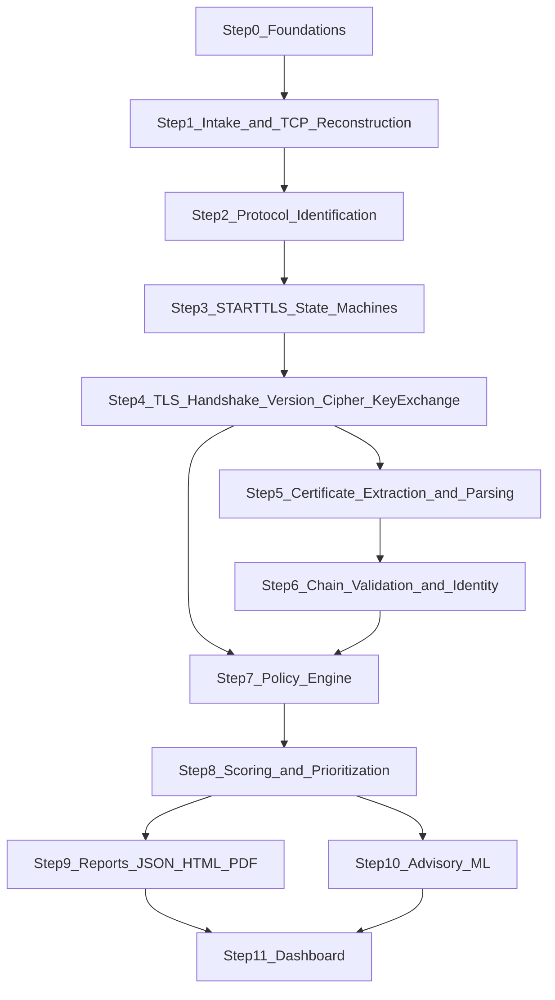

# SecureMail Build Plan

**Status:** Execution plan
**Companion documents:** [OBJECTIVE.MD](./OBJECTIVE.MD) (requirements), [TECHNICAL_DESIGN.md](./TECHNICAL_DESIGN.md) (architecture and rationale)

## 1. Purpose

[TECHNICAL_DESIGN.md](./TECHNICAL_DESIGN.md) answers *what* SecureMail is and *why* each
technology choice was made. This document answers *in what order do we build it, and
what test proves each piece is done*.

Every step below exists to deliver one or more items from the deliverable list in
[OBJECTIVE.MD](./OBJECTIVE.MD) (lines 29-53), grouped only when they are logically
inseparable (for example, TLS version and cipher suite are both read from the same
handshake record). A step is **not complete** until its acceptance tests pass against
committed fixtures. There is no "implement now, test later" step in this plan.

## 2. Ground rules

1. **Zeek is the primary processing engine.** Packet capture ingestion, TCP stream
   reassembly, protocol identification, TLS handshake decoding, and X.509 extraction
   happen in Zeek. Python does not re-implement packet parsing.
2. **Python is the orchestrator, not a second parser.** The `securemail` Python
   package invokes Zeek (and TShark where Zeek is insufficient), normalizes Zeek's
   output into canonical evidence models, applies deterministic policy, computes
   scores, and renders reports. This is also the integration seam for future
   services (API, ML, reporting) referenced in the objective.
3. **CLI-only surface for now.** Every step is driven end-to-end from a command-line
   entry point (`securemail <command>`). No FastAPI service, queue, or database is
   built before the CLI path proves the logic works. TECHNICAL_DESIGN's FastAPI/
   Celery/PostgreSQL architecture (its Section 5) is the target shape for the
   Python package's internal boundaries (routers/application/domain/ports/adapters),
   not something to stand up prematurely.
4. **Deterministic before AI.** Every rule-based deliverable (protocol ID, STARTTLS,
   TLS facts, certificate facts, weak-algorithm detection, forward secrecy) must be
   fully deterministic, versioned, and test-covered before any AI/ML step is
   started. AI/ML steps (Step 10) consume the deterministic output; they never
   replace or gate it.
5. **Evidence states are mandatory, not decorative.** Every fixture's `expected.json`
   must use the six evidence states from TECHNICAL_DESIGN Section 2.3 where they
   apply: `observed`, `verified`, `inferred`, `incomplete`, `conflicting`,
   `not_observable`, `indeterminate`. A test that lets "no weakness detected" pass
   for a check that was actually `not_observable` or `incomplete` is treated as a
   bug in the test, not a passing test.
6. **Test-first for everything deterministic.** For every step through Step 9, the
   fixture and its `expected.json` are authored and reviewed before the
   corresponding Zeek script or Python code is written. Steps 10 and 11 use a
   different, explicitly named approach (see those steps) because "known output"
   does not mean the same thing for ML evaluation or for a UI contract.
7. **One step, one runnable proof.** Each step ends with a specific CLI command that
   an outsider can run against the fixtures directory and see pass.

## 3. Fixture doctrine

Every test fixture is a self-contained directory:

```text
tests/fixtures/<case_id>/
  capture.pcapng           # evidence, byte-preserved, never edited after creation
  expected.json            # declared ground truth, authored BEFORE code
  provenance.json          # source, generator script + args/versions, sha256, capture date
```

`provenance.json` makes every fixture's origin reproducible and auditable:

```json
{
  "source": "lab | scapy | public_corpus",
  "generator": "path/to/script.py or docker-compose file, with exact args",
  "tool_versions": {"postfix": "3.9", "openssl": "3.x", "scapy": "2.x"},
  "sha256": "<capture.pcapng hash>",
  "created_at": "RFC 3339 timestamp",
  "notes": "what this fixture proves and why this source was chosen"
}
```

### 3.1 Source selection (per case, as needed)

| Source | Used for | Why |
|---|---|---|
| **Lab capture** — Dockerized Postfix/Dovecot/Cyrus + `openssl s_server`/`s_client`, a throwaway CA, tcpdump on the bridge network | Real handshakes: SMTP/IMAP/POP3 STARTTLS success, implicit TLS on 465/993/995, TLS 1.2 vs 1.3, ECDHE vs static RSA, weak suites via a legacy-OpenSSL container, and a certificate matrix (expired, not-yet-valid, RSA-1024, SHA-1 signature, self-signed, SAN mismatch, broken chain) | Only a real TLS stack produces byte-accurate handshakes and certificates; hand-crafting these is error-prone and would test our own assumptions instead of reality |
| **Scapy-crafted** | Cases a real stack will not reliably produce on demand: missing SYN, midstream capture start, snaplen truncation, overlapping/conflicting retransmissions, out-of-order segments, STARTTLS capability stripping, plaintext `AUTH`/`LOGIN` after a failed or missing upgrade, malformed TLS records, protocols running on nonstandard ports, IPv6 | Full control over byte-level malformation and capture-quality degradation, which is exactly what Section 2.3/8.2 of TECHNICAL_DESIGN requires us to prove we handle safely |
| **Public corpus** — Wireshark Sample Captures, curated `smtp`/`imap`/`pop3`/`tls` traces | Differential, no-crash regression against traffic we did not generate ourselves, with hand-authored expectations | Confirms our analyzer does not silently depend on quirks of our own lab traffic generator; never the sole source of proof for a rule |

A step may use one, two, or all three sources; each step names which it uses and why.

## 4. Per-step template

Every step below follows this structure:

- **Deliverables covered** — the exact OBJECTIVE.MD bullet(s).
- **Fixtures** — which case(s), from which source(s), and why.
- **Test contract** — the concrete assertions authored first, against `expected.json`.
- **Implementation** — Zeek-side work, then Python-side work.
- **CLI command** — the runnable proof.
- **Exit criteria** — what must be true to call the step done.

## 5. Capability findings that shape step boundaries

Before laying out the steps, two Zeek gaps had to be confirmed because they change
where responsibility sits between Zeek and Python (verified against the Zeek 8.x
script reference):

- `smtp.log` exists out of the box and includes a `tls` field plus
  `smtp_request`/`smtp_reply`/`smtp_starttls` events.
- **There is no `imap.log`.** The built-in IMAP analyzer only exposes
  `imap_capabilities` and `imap_starttls`; it stops decoding once TLS starts.
- **There is no `pop3.log`, and the POP3 analyzer is disabled by default** — its
  script was never ported to run automatically. It must be turned on with
  `Analyzer::register_for_ports` or a DPD payload signature before
  `pop3_request`/`pop3_reply`/`pop3_starttls`/`pop3_unexpected` events fire.
- `ssl.log` provides `version`, `cipher`, `curve`, `server_name`, `resumed`,
  `established`, `last_alert`, `ssl_history` (an ordered letter-code of handshake
  messages, e.g. `C`=client_hello, `S`=server_hello, `X`=certificate,
  `K`=server_key_exchange, `G`=client_key_exchange, `J`=hello_retry_request,
  `L`=alert), `cert_chain_fps`, `subject`, `issuer`, `sni_matches_cert`.
- Loading `policy/protocols/ssl/ssl-log-ext.zeek` adds the fields needed for key
  exchange and forward-secrecy inference: `client_version`, `server_version`,
  `client_ciphers`, `client_curves`, `client_supported_versions`,
  `server_supported_version`, `client_key_share_groups`, `server_key_share_group`,
  `dh_param_size`, `psk_key_exchange_modes`, `sigalgs`, `hashalgs`,
  `client_comp_methods`, `comp_method`.
- `policy/protocols/ssl/validate-certs.zeek` can add `validation_status`/
  `validation_code`, but it validates against Zeek's bundled Mozilla trust list at
  whatever time Zeek runs — not against a pinned, capture-time-aware trust
  snapshot. SecureMail still performs authoritative chain validation in Python
  (Step 6); Zeek's own validation is at most a cross-check.
- `conn.log` (`missed_bytes`, `history`), `weird.log`, `capture_loss.log`, and
  `reporter.log` are the raw material for reconstruction-quality evidence.

**Consequence:** IMAP and POP3 command-level evidence (capabilities, STARTTLS/STLS
transcript, error responses) is SecureMail's own responsibility, not something Zeek
hands us for free. Step 2 makes this an explicit decision gate: start with small
custom Zeek event handlers over the existing (and newly enabled) events, and only
escalate to a purpose-built Spicy analyzer or a bounded TShark second pass if the
built-in events prove insufficient for the state machines in Step 3.

## 6. Step sequence



## 7. Steps

### Step 0 — Foundations

*Enabler step. No OBJECTIVE.MD deliverable is claimed here; every later step depends on it.*

**Fixtures.** None yet — this step builds the harness the other steps' fixtures run
through. One trivial "empty capture" fixture (a PCAP with a handful of unrelated
packets, source: Scapy) is added purely to prove the pipeline runs end to end.

**Test contract.**
- `securemail analyze tests/fixtures/empty/capture.pcapng` exits 0 and produces a
  canonical JSON document that validates against the v0 evidence schema.
- The report's run-identity block contains a non-empty `analyzer_bundle_digest`,
  `capture_sha256`, and `normalization_schema_version`.
- Re-running the same command against the same fixture produces byte-identical
  JSON (idempotency/reproducibility check, per TECHNICAL_DESIGN 5.5).
- Running with no network access available still succeeds (proves the analyzer
  containers are actually network-disabled, not just documented as such).

**Implementation.**
- *Zeek/TShark side:* `Dockerfile.zeek` and `Dockerfile.tshark` pinned by digest,
  built with `--network=none` at run time; a digest lockfile
  (`tools/analyzer-bundle.lock`) recording the Zeek image digest, the SHA-256 of
  `docker/tshark/Dockerfile` (not a local built-image digest; more reproducible,
  still a deviation — see PROJECT_SCAFFOLD Section 8), plus the Zeek policy
  script bundle hash. Zeek invoked with `LogAscii::use_json=T` for structured
  output.
- *Python side:* create the `securemail` package using the layout from
  TECHNICAL_DESIGN 5.3 (`api/ application/ domain/ ports/ adapters/ workers/
  bootstrap.py`), except the first adapter under `api/` is a Typer CLI, not
  FastAPI. Add:
  - `ports/analyzers.py` — `Protocol` interfaces for `ZeekRunner` and
    `TSharkRunner` (subprocess adapters using a fixed argv array, never a shell).
  - `adapters/analyzers/zeek_runner.py`, `tshark_runner.py` — the concrete
    subprocess adapters, each computing and returning the tool's digest.
  - `domain/evidence/` — canonical Pydantic v2 models v0, including the
    `EvidenceState` enum (`observed`, `verified`, `inferred`, `incomplete`,
    `conflicting`, `not_observable`, `indeterminate`) and the `AnalysisRun`
    identity record.
  - `bootstrap.py` — composition root wiring CLI to the (still mostly empty)
    application use case `run_analysis`.
  - `tests/support/fixture_harness.py` — runs a fixture directory end to end and
    diffs the produced JSON against `expected.json` with clear field-level diffs.
  - `tests/fixtures/generators/` — the Scapy/lab generator scripts referenced by
    every later step's `provenance.json`.

**CLI command.**
```bash
securemail analyze tests/fixtures/empty/capture.pcapng --out out/empty.json
```

**Exit criteria.**
- The command above runs fully offline and produces schema-valid, reproducible
  JSON.
- The fixture harness can run any `tests/fixtures/<case_id>` and report pass/fail
  with a diff.
- CI (even a local `make test` target at this stage) runs the harness on the one
  fixture and passes.

### Step 1 — Intake and TCP stream reconstruction

**Deliverable covered:** *Complete TCP stream reconstruction.*

**Fixtures.**
- Scapy-crafted, one fixture per degradation mode: missing SYN, missing FIN,
  mid-stream capture start, snaplen truncation (`captured_len < original_len`),
  overlapping retransmissions with conflicting bytes, out-of-order segments,
  duplicate segments.
- One lab capture as the clean baseline (a plain SMTP session with no loss).

**Test contract.**
- For the clean baseline, `expected.json` declares `reconstruction_quality:
  complete` with zero gap bytes.
- Fully recovered out-of-order segments and identical duplicate/retransmitted
  segments remain `complete`; `observed_conditions` records
  `out_of_order_segments` and/or `duplicate_segments` without degrading quality.
- For every true degradation fixture (missing SYN, missing FIN, mid-stream
  start, snaplen truncation, overlapping retransmissions with conflicting
  bytes), `expected.json` declares `incomplete` or `conflicting` (never
  `complete`), names the specific reason (e.g. `missing_syn`,
  `snaplen_truncation`, `overlapping_retransmission_conflict`), and states the
  exact gap byte count / conflicting byte ranges where applicable. When Zeek
  cannot observe an exact range, `gap_bytes_exact` is false — never invent
  bytes.
- A truncated stream must never be silently reported as a complete stream with
  fewer bytes — the test explicitly asserts the state field is set, not just
  that byte counts look smaller.

**Implementation.**
- *Zeek side:* run Zeek's standard TCP reassembly; no reassembly is
  reimplemented. Capture `conn.log` (`missed_bytes`, `history`), `weird.log`, and
  `capture_loss.log`. Run `capinfos` in preflight to record packet counts,
  timestamp resolution, and snaplen-vs-actual-length mismatches before Zeek runs.
- *Python side:* `domain/evidence/flow.py` — a `Flow` model with a
  `reconstruction_quality` field computed by a pure function that maps
  `conn.log`/`weird.log`/`capture_loss.log` facts to one of `complete`,
  `incomplete`, or `conflicting`, plus a machine-readable reason code and the
  affected byte ranges. SHA-256 of the original capture is computed before any
  analyzer runs (immutability of evidence, per TECHNICAL_DESIGN 8.1).

**CLI command.**
```bash
securemail analyze tests/fixtures/tcp_snaplen_truncation/capture.pcapng
```

**Exit criteria.** All TCP-reconstruction fixtures pass, including every
true degradation mode and the recoverable reorder/duplicate cases (complete
with `observed_conditions`); the "never silently report complete" assertion
is a named, independent test case, not an incidental check.

### Step 2 — Automatic SMTP/IMAP/POP3 identification

**Deliverable covered:** *Automatic identification of SMTP, IMAP, and POP3
protocols.*

**Fixtures.**
- Lab captures: SMTP on 25/587, IMAP on 143, POP3 on 110, each on its standard
  port.
- Scapy-crafted: the same three protocols replayed on nonstandard ports (to
  prove identification is payload-driven, not port-driven), plus one
  intentionally ambiguous/malformed banner exchange that should resolve to
  `indeterminate` rather than a wrong guess.
- Public corpus: one independent SMTP and one independent IMAP capture as a
  regression cross-check.

**Test contract.**
- Each fixture's `expected.json` names the identified protocol, an explicit
  `evidence_state` (`observed` when payload evidence exists), and separate
  `port_hint` vs `payload_evidence` fields so a test can assert they are
  reported independently, not conflated.
- The nonstandard-port fixtures assert the protocol is still correctly
  identified from payload alone.
- The ambiguous fixture asserts `indeterminate`, not a forced guess.

**Implementation.**
- *Zeek side:*
  1. Enable the dormant POP3 analyzer via `Analyzer::register_for_ports` (and/or
     a DPD payload signature) so `pop3_request`/`pop3_reply` events actually
     fire.
  2. Add DPD payload signatures for SMTP, IMAP, and POP3 so identification does
     not depend on well-known ports.
  3. Write `scripts/securemail-email.zeek`, a small custom script that
     subscribes to `smtp_request`/`smtp_reply`, `imap_capabilities`, and the
     newly enabled `pop3_request`/`pop3_reply` events and emits one unified
     `sm_email.log` with protocol, direction, and raw command/response lines.
  4. **Decision gate (recorded here, not deferred):** if the built-in IMAP/POP3
     events prove too coarse for Step 3's state machines, escalate per protocol
     to either a small Spicy analyzer or a bounded TShark second pass
     (`tshark -Y "imap or pop"` with a fixed, allowlisted field list) — never an
     unbounded full-tree dissection.
- *Python side:* `domain/evidence/session.py` — normalizes `sm_email.log` (and,
  where the gate triggers it, the TShark corroboration) into a protocol-tagged
  `EmailSession` with `port_hint` and `payload_evidence` as separate fields, and
  a confidence value when Zeek/TShark disagree.

**CLI command.**
```bash
securemail analyze tests/fixtures/pop3_nonstandard_port/capture.pcapng
```

**Exit criteria.** All three protocols are identified correctly by payload on
both standard and nonstandard ports; the ambiguous fixture reports
`indeterminate`; the Spicy-vs-TShark decision is documented in
`docs/decisions/step2-imap-pop3-depth.md` regardless of which way it goes.

### Step 3 — STARTTLS/STLS negotiation detection and validation

**Deliverable covered:** *STARTTLS negotiation detection and validation.*

**Fixtures.**
- Lab captures: successful STARTTLS/STLS upgrade for each of SMTP, IMAP, and
  POP3; implicit TLS on 465/993/995 for comparison.
- Scapy-crafted: advertised-but-never-requested STARTTLS, requested-but-rejected
  STARTTLS, capability stripped from the server's advertised list (downgrade-
  consistent evidence), plaintext commands issued mid-transition (protocol
  violation), and plaintext `AUTH`/`LOGIN`/`USER`+`PASS` sent after a failed or
  absent upgrade.
- Public corpus: one independent STARTTLS capture per protocol as regression.

**Test contract.**
- Each protocol has its own state machine with named states (at minimum:
  `advertised`, `requested`, `accepted`, `tls_established`,
  `plaintext_fallback`, `violation`) and `expected.json` asserts the exact
  terminal state plus the evidence frames that produced it.
- The stripped-capability fixture asserts a `downgrade_consistent` flag distinct
  from "no STARTTLS seen" — the design's point that passive evidence can be
  *consistent with* stripping without proving an attacker did it.
- The implicit-TLS fixtures assert correlation with the decoded protocol, not a
  port-only conclusion.
- Hypothesis-based property tests generate bounded random sequences over each
  protocol's command/response alphabet and assert the state machine never
  reaches an undefined state and never reports `tls_established` without an
  actual observed TLS ClientHello.

**Implementation.**
- *Zeek side:* consume `smtp_starttls`, `imap_starttls`, and `pop3_starttls`
  (now firing per Step 2), plus the raw command/response lines from
  `sm_email.log`, to know exactly when the plaintext channel stopped.
- *Python side:* `domain/policies/starttls/` — three pure state-machine
  functions (`smtp_upgrade`, `imap_upgrade`, `pop3_upgrade`), each implemented
  as a explicit transition table over a small alphabet of observed events
  (`EHLO`/`CAPA` seen, `STARTTLS`/`STLS` sent, positive/negative response,
  ClientHello observed, post-upgrade capability refresh observed, plaintext
  command observed post-upgrade-attempt). Implicit-TLS correlation lives in
  `domain/policies/starttls/implicit_tls.py`, matching port 465/993/995 against
  the decoded protocol from Step 2's evidence rather than the port number
  alone.

**CLI command.**
```bash
securemail analyze tests/fixtures/imap_starttls_capability_stripped/capture.pcapng
```

**Exit criteria.** All three protocols' state machines pass every fixture
including the adversarial ones; the Hypothesis property tests run in CI and find
no reachable undefined state; `downgrade_consistent` is reported as its own
field, never collapsed into a boolean "STARTTLS ok".

### Step 4 — TLS handshake reconstruction, version, cipher suite, key exchange

**Deliverables covered:** *TLS handshake reconstruction*, *detection of negotiated
TLS versions*, *identification of negotiated cipher suites*, *identification of key
exchange mechanisms.*

**Fixtures.**
- Lab captures: TLS 1.2 with ECDHE, TLS 1.2 with static RSA, TLS 1.2 with static
  ECDH, TLS 1.3 full handshake, TLS 1.3 with a HelloRetryRequest, TLS 1.3
  session resumption via PSK, a legacy-OpenSSL container negotiating a weak
  suite (e.g. RC4 or a export-grade cipher) for completeness of extraction (not
  yet policy judgment — that is Step 7).
- Scapy-crafted: a handshake using the legacy TLS record-layer version field
  while `supported_versions` reports a different negotiated version (tests the
  "resolve legacy record version vs `supported_versions`" rule explicitly), and
  a truncated handshake that stops after ClientHello.
- Public corpus: an independent TLS 1.2 and an independent TLS 1.3 capture as
  regression.

**Test contract.**
- Each fixture's `expected.json` states the negotiated TLS version resolved
  from the correct field (`supported_versions` takes precedence over the legacy
  record version when both are present), the negotiated cipher suite by its
  canonical IANA name and hex code, and the key-exchange mechanism.
- For TLS 1.3 fixtures, `expected.json` explicitly marks the server certificate
  and `CertificateVerify` as `not_observable` (encrypted post-ServerHello) —
  the test must fail if the implementation ever fabricates a certificate result
  for TLS 1.3 from anything other than genuinely decoded evidence.
- The key-exchange assertion is version-aware: for TLS 1.3, the mechanism is
  derived from `key_share`/`supported_groups`/PSK-mode fields, never from the
  cipher-suite name, since TLS 1.3 cipher suites encode neither key exchange
  nor authentication.
- The truncated-handshake fixture asserts `incomplete`, not a guessed version.
- The `ssl_history` letter sequence for each fixture is asserted against the
  expected message order, proving the handshake reconstruction is evidence-
  linked rather than inferred from log fields alone.

**Implementation.**
- *Zeek side:* load `policy/protocols/ssl/ssl-log-ext.zeek` to get
  `client_version`, `server_version`, `client_ciphers`, `client_curves`,
  `client_supported_versions`, `server_supported_version`,
  `client_key_share_groups`, `server_key_share_group`, `dh_param_size`,
  `psk_key_exchange_modes`, `sigalgs`, `hashalgs`, `client_comp_methods`,
  `comp_method`, alongside the base `ssl.log` fields (`version`, `cipher`,
  `curve`, `ssl_history`, `established`, `last_alert`).
- *Python side:*
  - `domain/evidence/handshake.py` — canonical `TlsHandshake` model built from
    `ssl_history` plus the offered/selected parameter fields, carrying frame
    references and a `visibility` flag (`full`, `partial`, `not_observable`).
  - `adapters/reference_data/iana_tls_parameters.py` — a versioned, checked-in
    snapshot of the IANA TLS Parameters registry (cipher suite names/codes,
    supported-group names/codes) loaded as data, not hardcoded per-suite
    `if` statements, so it can be refreshed independently.
  - `domain/policies/tls/key_exchange.py` — pure function mapping
    `(negotiated_version, cipher_suite, key_share_groups, dh_param_size,
    psk_key_exchange_modes)` to a key-exchange classification, explicit about
    what is `inferred` vs `observed`.

**CLI command.**
```bash
securemail analyze tests/fixtures/tls13_hello_retry_request/capture.pcapng
```

**Exit criteria.** Version/cipher/key-exchange are correct on every fixture; the
TLS 1.3 `not_observable` assertions pass; the legacy-record-version-vs-
`supported_versions` conflict fixture resolves correctly; no per-suite logic is
hardcoded outside the versioned IANA data file.

### Step 5 — Certificate extraction and per-certificate analysis

**Deliverables covered:** *Extraction of X.509 certificates*, *certificate
expiration analysis*, *public key algorithm and key length analysis*, *digital
signature algorithm identification.*

**Fixtures.**
- Lab captures (certificate matrix, all on TLS 1.2 so certificates are
  observable): valid current certificate, expired certificate, not-yet-valid
  certificate, RSA-1024 key, RSA-2048 key, ECDSA P-256 key, SHA-1-signed
  certificate, SHA-256-signed certificate, a certificate expiring within a
  configurable warning window.
- Scapy-crafted: a malformed/truncated certificate message (fuzzed ASN.1 within
  a bounded harness) to prove the parser fails safely rather than crashing.
- Public corpus: one independent capture with a full certificate chain as
  regression.

**Test contract.**
- Each fixture's `expected.json` states, per certificate: `syntax_valid`,
  subject/issuer, not-before/not-after, public key algorithm and effective
  security strength (not raw bit length — RSA-2048 and a 256-bit ECDSA key are
  not compared on a raw-bits basis), and the certificate's own signature
  algorithm kept in a field separate from the TLS handshake's
  `CertificateVerify` signature algorithm.
- The expiry fixtures assert two independent booleans:
  `valid_at_capture_time` and `valid_at_analysis_time` (a certificate can be
  expired *now* but was valid when captured, and the report must say both).
- The malformed-certificate fixture asserts the analyzer reports
  `syntax_valid: false` with a reason, and the process does not crash or hang
  (resource-limit test, per TECHNICAL_DESIGN 8.2).
- The RSA-1024 fixture is captured here purely as a **fact** (key size = 1024);
  whether that fact is a *finding* is Step 7's job, not this step's.

**Implementation.**
- *Zeek side:* rely on Zeek's file-analysis framework to extract server (and
  client, if present) certificate DER bytes into content-addressed files linked
  to `cert_chain_fps` in `ssl.log`; enable `x509.log` for basic parsed summary
  fields as a cross-check, not as the source of truth.
- *Python side:*
  - `adapters/artifacts/certificate_store.py` — stores DER bytes by SHA-256,
    linked to capture hash, flow key, and frame reference.
  - `domain/evidence/certificate.py` — canonical `CertificateEvidence` model
    parsed with the `cryptography` library: subject/issuer, validity window,
    public key algorithm + size, effective security-strength mapping table
    (`domain/policies/pki/key_strength.py`, data-driven, e.g. RSA-2048 ≈
    112-bit, P-256 ≈ 128-bit, so RSA and ECC are never compared by raw bit
    count), and signature algorithm.
  - Bound the parser: reject certificates beyond a maximum nesting/size before
    large allocation, and run parsing inside the same non-root, network-
    disabled sandbox constraints as the rest of analysis.

**CLI command.**
```bash
securemail analyze tests/fixtures/cert_expired_rsa1024/capture.pcapng
```

**Exit criteria.** Every certificate fact deliverable is extracted correctly
across the matrix; the two independent expiry booleans are both asserted in
every expiry fixture; the malformed-certificate fixture proves safe failure
under a resource-limit test, not just a happy-path pass.

### Step 6 — Certificate chain validation and identity

**Deliverable covered:** *Certificate chain validation.*

**Fixtures.**
- Lab captures: a certificate chain issued by the lab's throwaway CA
  (well-formed, trusted-if-the-lab-CA-is-in-the-pinned-trust-snapshot),
  self-signed leaf, broken chain (missing intermediate), chain with a SAN that
  does not match the server name used, chain with a SAN that does match.
- Scapy-crafted: none needed here — chain validity is a PKI-logic problem, not
  a packet-shape problem, so lab captures suffice.
- Public corpus: one independent capture with a well-known chain shape (e.g.
  root -> intermediate -> leaf) as regression.

**Test contract.**
- Each fixture's `expected.json` states the independent fields from
  TECHNICAL_DESIGN 4.3: `certificate_observed`, `syntax_valid` (from Step 5),
  `path_valid_at_capture_time`, `path_valid_at_analysis_time`,
  `identity_match`, `revocation_status` (`good`/`revoked`/`unknown`/`stale` —
  expect `unknown` in every fixture here since no OCSP/CRL evidence is
  imported by default), `trust_profile_id`, `trust_store_digest`, and
  `indeterminate_reasons` where applicable.
- The self-signed and broken-chain fixtures assert `path_valid_at_*: false`
  with a specific reason, never a bare boolean with no explanation.
- The SAN-mismatch fixture asserts `identity_match: false` while
  `path_valid_at_*` can still be `true` — the two must be independent fields,
  never merged into one pass/fail.
- A test explicitly asserts that no test in this step causes any network
  request (mocked/blocked DNS and HTTP at the sandbox level).
- A differential test cross-checks the Python `cryptography`-based validation
  result against an OpenSSL CLI invocation (`openssl verify`) for the same
  chain and trust store, and fails if they disagree without a documented
  reason.

**Implementation.**
- *Python side:*
  - `adapters/pki/trust_store.py` — a pinned, offline trust-store snapshot
    (file-based, digested) with an explicit `trust_store_digest`; no AIA/OCSP/
    CRL/CT network calls, per TECHNICAL_DESIGN 4.3 and 8.2.
  - `domain/policies/pki/chain_validation.py` — pure-ish validation using
    `cryptography`'s X.509 verification API with an explicit verification time
    (defaulting to capture time, with a second pass at analysis time),
    producing the independent fields above.
  - `domain/policies/pki/identity.py` — RFC 9525 SAN-based identity matching
    against a declared reference identity source (SNI, or an explicit
    configured expected hostname), with no Common Name fallback.
  - `adapters/pki/openssl_crosscheck.py` — a bounded, argument-fixed
    `openssl verify` subprocess adapter used only in the differential test, not
    in the production result path.

**CLI command.**
```bash
securemail analyze tests/fixtures/cert_chain_san_mismatch/capture.pcapng
```

**Exit criteria.** All chain-validation fixtures pass with every field
independent as specified; the OpenSSL differential test passes or documents
every disagreement; zero network calls occur during this step's tests.

### Step 7 — Deterministic policy engine

**Deliverables covered:** *Detection of weak cryptographic algorithms and
deprecated TLS versions*, *identification of insecure protocol configurations*,
*Forward Secrecy assessment.*

**Fixtures.**
- Reuses fixtures from Steps 3, 4, 5, and 6 (this step adds a policy-evaluation
  layer on top of already-extracted facts, so it needs no new captures) plus a
  small set of Scapy-crafted or lab fixtures added specifically to hit rule
  boundaries: TLS 1.1 exactly, TLS 1.0 exactly, a NULL/export cipher, RC4, a
  TLS 1.2 static-RSA key exchange, a TLS 1.2 static-ECDH key exchange, a
  SHA-1-signed handshake `CertificateVerify`, an RSA-1536 certificate key
  (boundary just above/below the 2048-bit rule).
- One fixture with a TLS 1.3 PSK-only resumption and one with genuinely missing
  handshake evidence, specifically to prove forward secrecy resolves to
  `indeterminate` rather than a guess in both cases.

**Test contract.**
- Every rule has its own unit test asserting: input facts in, finding code and
  severity out, for both the triggering case and the just-inside-policy case
  (boundary testing, e.g. RSA-2048 passes, RSA-1536 fails, under the same
  rule).
- Each finding in `expected.json` carries a stable finding code, the policy
  profile it was evaluated under (`ietf_current`, `nist_federal`,
  `historical_at_capture`), the rule's effective date, and a rationale string
  referencing the relevant standard.
- The forward-secrecy fixtures assert: TLS 1.2 ECDHE → forward secrecy present;
  TLS 1.2 static RSA/DH/ECDH → forward secrecy absent; TLS 1.3 normal (EC)DHE →
  present; TLS 1.3 PSK-only → `indeterminate`; missing handshake evidence →
  `indeterminate`. No fixture is allowed to assert forward secrecy from a
  single observation alone (e.g. no assertion of "ephemeral key was reused" or
  "ticket key was rotated").
- A profile-switch test runs the same fixture under two different policy
  profiles and asserts the findings differ where the profiles disagree (proves
  profiles are actually data-driven, not cosmetic).

**Implementation.**
- *Python side:*
  - `domain/policies/rules/*.yaml` — versioned, effective-dated rule packs (one
    file per profile), each rule declaring: stable ID, source standard,
    applicability (protocol/version/field pattern), effective date, severity,
    rationale, and its own inline test cases.
  - `domain/policies/rule_engine.py` — a small, pure evaluator that loads a
    rule pack and applies it to the canonical evidence from Steps 3-6,
    producing `Finding` records; it never mutates or filters the underlying
    evidence.
  - `domain/policies/tls/forward_secrecy.py` — pure function implementing the
    version-aware table above, defaulting to `indeterminate` whenever a
    required fact (key-exchange classification, PSK mode, or handshake
    completeness) is missing.
  - A signature/digest is computed per rule pack so `AnalysisRun` can record
    exactly which `policy_pack_version` produced a given finding.

**CLI command.**
```bash
securemail analyze tests/fixtures/tls13_psk_only_resumption/capture.pcapng --policy-profile ietf_current
```

**Exit criteria.** Every rule has a passing boundary test; the forward-secrecy
table is fully covered including both `indeterminate` cases; switching policy
profiles measurably changes findings on the profile-switch fixture; no rule
logic exists outside the versioned rule-pack data files.

### Step 8 — Posture scoring and prioritized findings

**Deliverables covered:** *Prioritized security findings*, *comprehensive
cryptographic security posture assessment.*

**Fixtures.**
- Synthetic finding sets (not new PCAPs — this step consumes `Finding` records
  from Step 7) hand-assembled to cover: many low-severity findings on one
  endpoint (dedup test), the same finding recurring across sessions over time
  (recurrence test), a mix of high/medium/low severity with varying evidence
  confidence, and a case with several `not_observable`/`indeterminate` checks
  to prove they show up in coverage denominators rather than vanishing.

**Test contract.**
- Given a hand-computed input finding set and hand-computed expected score
  components (severity, confidence, exposure, recurrence), the test asserts
  the exact posture score output — this is a pure arithmetic contract, so
  `expected.json` contains the intermediate component values, not just the
  final number, so a regression pinpoints which component broke.
- The dedup fixture asserts N raw session-level findings collapse to one
  endpoint-level finding with a recurrence count, not N separate findings.
- The coverage fixture asserts the posture assessment publishes explicit
  `unknown_count` / `not_observable_count` denominators per protocol and per
  check category, and that these never get silently folded into "checks
  passed".
- Prioritization output is tested as an ordering assertion (finding A must rank
  above finding B given their severity/confidence/exposure/recurrence inputs),
  not just a raw score comparison, since ordering is what an analyst actually
  consumes.

**Implementation.**
- *Python side:*
  - `domain/findings/scoring.py` — pure, versioned scoring function taking
    severity, evidence confidence, exposure, recurrence, and (optionally) asset
    criticality, returning both a final score and its named components.
  - `domain/findings/dedup.py` — pure function collapsing session-level
    findings sharing the same finding code and affected endpoint into one
    endpoint-level `Finding` with a recurrence count and a list of
    contributing session references (evidence is preserved, not discarded).
  - `domain/findings/posture.py` — aggregates findings and coverage
    denominators into the `ReportManifest`-level posture summary described in
    TECHNICAL_DESIGN 5.4.

**CLI command.**
```bash
securemail score tests/fixtures/synthetic_findings/mixed_severity.json
```

**Exit criteria.** All hand-computed score vectors match exactly; dedup and
ordering behave as specified; coverage denominators are present and non-zero in
the fixture designed to exercise them.

### Step 9 — Reports: JSON, HTML, PDF

**Deliverable covered:** *Exportable forensic reports in JSON, PDF, and HTML
formats.*

**Approach for this step (explicitly non-PCAP test-first): schema-first +
golden-snapshot.** There is no "capture with a known report" to test against —
the report is a rendering of already-tested facts from Steps 1-8. So the test-
first discipline here is: author the JSON Schema and one frozen, hand-reviewed
example canonical report *before* writing the renderer, then test every
renderer against that frozen example rather than against a PCAP.

**Fixtures.**
- One frozen canonical JSON report (`tests/fixtures/reports/golden_report.json`)
  covering at least one finding of each evidence state, at least one
  `not_observable` certificate case, and at least one hostile string (e.g. a
  banner containing `<script>`, control characters, and Unicode
  right-to-left overrides) deliberately injected into a decoded field to test
  escaping.

**Test contract.**
- The JSON Schema validates the golden report, and a mutation test (removing a
  required field) fails schema validation — proving the schema is not
  vacuously permissive.
- RFC 8785 canonicalization of the golden report is deterministic byte-for-byte
  across repeated runs, and its hash is pinned in the test.
- The HTML snapshot test renders the golden report and asserts the hostile
  string is present only in escaped form (no literal `<script>` tag, no raw
  control characters) — this is a security test, not a formatting test.
- The PDF test asserts extracted text content (via a text-extraction check, not
  byte comparison) contains the expected finding codes and page count is
  within an expected range, with the renderer version and fonts pinned in the
  test fixture's provenance so a future renderer upgrade is caught explicitly
  rather than silently changing output.
- A round-trip test confirms HTML and PDF are both derived from the *same*
  canonical JSON object in memory — never independently re-assembled from raw
  evidence — by asserting every finding code present in the JSON also appears
  in both renders.

**Implementation.**
- *Python side:*
  - `domain/reports/schema.py` — the versioned JSON Schema / Pydantic model for
    the canonical report.
  - `adapters/reports/canonical_json.py` — RFC 8785 canonicalization + SHA-256.
  - `adapters/reports/html_renderer.py` — Jinja2 templates with autoescaping
    enabled and verified on (never disabled per-template).
  - `adapters/reports/pdf_renderer.py` — WeasyPrint rendering the same HTML
    output, with pinned fonts bundled in the repo (not system fonts) so
    rendering is reproducible across machines.

**CLI command.**
```bash
securemail report tests/fixtures/reports/golden_report.json --format json,html,pdf --out out/
```

**Exit criteria.** Schema validation is meaningfully strict (mutation test
proves it); HTML escaping test passes; PDF text/page-count test passes with
pinned renderer/fonts; all three formats are shown to derive from one shared
in-memory report object.

### Step 10 — Advisory ML: risk scoring and anomaly detection

**Deliverables covered:** *AI-based cryptographic risk scoring*, *AI-assisted
anomaly detection for suspicious TLS sessions.*

**Approach for this step (explicitly not test-first in the PCAP sense):
evaluation-harness-first.** TECHNICAL_DESIGN Section 9 is explicit that no
representative public email-TLS risk corpus exists and that rediscovering rules
that are already deterministic (Step 7) has no defensible ML value. So instead
of "write a fixture with known output, then write code," this step is: build
the evaluation harness and its acceptance thresholds first, then build the
simplest model that can pass them, only escalating model complexity when a
baseline measurably fails.

**Fixtures / evaluation data.**
- A synthetic endpoint-cohort generator (`tests/support/synthetic_cohorts.py`)
  producing multi-week per-endpoint session-feature time series with seeded,
  labeled anomalies (e.g. "TLS version drops from 1.3 to 1.0 on day 40 for
  endpoint X", "certificate issuer changes and handshake failure rate jumps
  from 0.2% to 18%"), so detection delay and precision are measurable against
  a known ground truth even though it is synthetic, not a PCAP.

**Test contract (the harness, authored first).**
- Detection delay: seeded anomalies must be flagged within N cohort-windows of
  their introduction (N declared and justified before any model is written).
- Top-K precision: among the top-K ranked anomalies per evaluation window,
  precision must exceed a stated floor against the seeded labels.
- Baseline gate: a robust-statistics baseline (median/MAD, categorical rarity)
  must be run and scored *first*; Isolation Forest (or anything more complex)
  is only added to the codebase once it is shown, on this harness, to beat the
  baseline by a stated margin — this comparison itself is a committed test.
- Authority test (hard requirement, always enforced regardless of model
  choice): given a deterministic `Finding` from Step 7 and any anomaly score,
  the combined report never suppresses, downgrades, or rewrites the
  deterministic finding. This is tested by asserting the deterministic
  findings list is byte-identical whether or not the ML stage ran.
- Every model output ships with a concrete, evidence-linked reason string
  (e.g. "first TLS 1.0 selection for this endpoint in 180 days"), and a test
  asserts a reason string is always present and references a real evidence
  field, never a generic "anomaly detected".

**Implementation.**
- *Python side:*
  - `adapters/ml/baselines.py` — median/MAD and categorical-rarity scorers.
  - `adapters/ml/isolation_forest.py` — added only after the baseline gate
    test above is committed and passing against the baseline, per
    TECHNICAL_DESIGN 9.3.
  - `application/advisory_pipeline.py` — orchestrates feature extraction from
    already-computed canonical evidence (never raw packets) and runs strictly
    after and separately from the deterministic policy engine, writing its
    output to a distinct `AnomalyResult` record that is never merged into
    `Finding`.
  - Everything runs in shadow mode: the CLI has a `--advisory` flag that is
    off by default, and the report clearly separates the "Deterministic
    Findings" section from the "Advisory / ML" section.

**CLI command.**
```bash
securemail evaluate-ml tests/support/synthetic_cohorts/cohort_seeded_v1/
```

**Exit criteria.** The evaluation harness runs and reports detection delay and
top-K precision against declared thresholds; the baseline-beats-nothing and
model-beats-baseline comparisons are both committed, passing tests; the
authority test (deterministic findings unaffected by ML) passes; every advisory
output carries a concrete reason string.

### Step 11 — Interactive dashboard

**Deliverable covered:** *Interactive visualization dashboard for security
monitoring and analysis.*

**Approach for this step: contract-first.** The dashboard has no "known output
from a PCAP" either — its correctness is about faithfully presenting and
navigating already-validated data. So the test-first anchor here is the API/
data contract (the same canonical JSON from Step 9), established before any UI
code, with the UI tested against that contract via browser automation.

**Fixtures.**
- Reuses the golden report from Step 9, plus 2-3 additional canonical reports
  assembled from earlier steps' fixtures to populate a multi-case, multi-
  severity view (needed to test filtering/sorting meaningfully).

**Test contract.**
- Contract tests: read-only FastAPI routes added over the existing application
  operations (no new business logic in the routes) return exactly the same
  canonical JSON the CLI produces for the same input — a diff test between
  `securemail report ... --format json` output and the API response body.
- Playwright end-to-end tests: upload/select a case, drill down from a finding
  to its underlying evidence frame reference, and verify the UI visually and
  structurally separates observed facts, deterministic conclusions, ML
  advisories, and analyst notes (matching TECHNICAL_DESIGN 5.2's stage
  separation) — asserted via distinct, labeled UI regions, not just visual
  inspection.
- An authorization test confirms a case's data is not visible without the
  correct case-scoped access, even though full RBAC is out of scope until
  Phase 2 of TECHNICAL_DESIGN — at minimum, an explicit "no case selected"
  state must never leak another case's data.

**Implementation.**
- *Python side:* `api/routers/reports.py` — thin FastAPI routes calling the
  same `application/` use cases the CLI calls; no logic duplicated between CLI
  and API.
- *Frontend:* React + TypeScript + Vite + TanStack Query/Table + Apache
  ECharts, per TECHNICAL_DESIGN Section 6, consuming the canonical JSON
  contract directly.

**CLI/verification command.**
```bash
uvicorn securemail.api.main:app --reload &
npx playwright test tests/e2e/dashboard.spec.ts
```

**Exit criteria.** API responses are byte-identical (module the run timestamp)
to CLI JSON output for the same input; Playwright suite passes including the
evidence drill-down and the four-way separation of observed/deterministic/ML/
analyst content; the no-case-selected isolation test passes.

## 8. Deliverable traceability

Every deliverable listed in [OBJECTIVE.MD](./OBJECTIVE.MD) (lines 33-53) is mapped
below to its owning step, its primary evidence source, and the honest achievable
state for that deliverable, per TECHNICAL_DESIGN's feasibility constraints
(Section 2.3). "Full" means the deliverable is fully determinable whenever the
relevant protocol evidence exists in the capture; "where observable" and "best
effort" are technical accuracy statements, not deferred scope; "advisory" means
the output supports but never overrides a deterministic result.

| # | OBJECTIVE.MD deliverable | Owning step | Evidence source | Achievable state |
|---|---|---|---|---|
| 1 | Automatic identification of SMTP, IMAP, and POP3 protocols | Step 2 | Zeek (enabled POP3 analyzer + DPD signatures + custom event script) | Full |
| 2 | STARTTLS negotiation detection and validation | Step 3 | Zeek events (`smtp_starttls`/`imap_starttls`/`pop3_starttls`) + Python state machines | Full, with explicit `downgrade_consistent` distinguished from proof of attack |
| 3 | Complete TCP stream reconstruction | Step 1 | Zeek TCP reassembly (`conn.log`, `weird.log`, `capture_loss.log`) | Best effort; completeness and conflicts are explicit, never silently assumed |
| 4 | TLS handshake reconstruction | Step 4 | Zeek `ssl.log` + `ssl-log-ext` | Full for TLS 1.2; where observable for TLS 1.3 (post-ServerHello is encrypted) |
| 5 | Detection of negotiated TLS versions | Step 4 | Zeek `ssl.log`/`ssl-log-ext` (`supported_versions` resolved over legacy record version) | Full |
| 6 | Identification of negotiated cipher suites | Step 4 | Zeek `ssl.log` + versioned IANA TLS-parameters data | Full |
| 7 | Identification of key exchange mechanisms | Step 4 | Zeek `ssl-log-ext` (`key_share`/`curve`/`dh_param_size`/PSK modes) | Full where observable; TLS 1.3 requires version-aware inference, never suite-name inference |
| 8 | Extraction of X.509 certificates | Step 5 | Zeek file-extraction + `x509.log` | Full when TLS 1.2 or when secrets/telemetry make TLS 1.3 certs observable; `not_observable` otherwise |
| 9 | Certificate chain validation | Step 6 | Python `cryptography` against a pinned offline trust snapshot, OpenSSL cross-check | Conditional on certificate observability; independent fields, no network fetches |
| 10 | Certificate expiration analysis | Step 5 | Python `cryptography` | Full when certificate observed; reports validity at capture time and at analysis time separately |
| 11 | Public key algorithm and key length analysis | Step 5 | Python `cryptography` | Full when certificate observed; reported as effective security strength, not raw bit count |
| 12 | Digital signature algorithm identification | Step 5 | Python `cryptography` | Full when certificate observed; certificate-signature and handshake-signature algorithms kept separate |
| 13 | Detection of weak cryptographic algorithms and deprecated TLS versions | Step 7 | Versioned rule packs over Step 4/5 facts | Full via deterministic, effective-dated rules |
| 14 | Identification of insecure protocol configurations | Step 7 | Versioned rule packs over Step 3/4 facts | Full via deterministic, role-specific rules |
| 15 | Forward Secrecy assessment | Step 7 | Version-aware rule over Step 4 key-exchange facts | Full for TLS 1.2 (EC)DHE vs static; `indeterminate` for TLS 1.3 PSK-only/0-RTT or missing evidence |
| 16 | AI-based cryptographic risk scoring | Step 10 | Advisory ML pipeline over Steps 4-7 evidence | Advisory; deterministic severity (Step 7/8) remains authoritative |
| 17 | AI-assisted anomaly detection for suspicious TLS sessions | Step 10 | Advisory ML pipeline, baseline-gated | Advisory, shadow mode; never suppresses a deterministic finding |
| 18 | Prioritized security findings | Step 8 | Deterministic scoring/dedup over Step 7 findings | Full deterministic ordering now; ML-assisted refinement later without overriding it |
| 19 | Comprehensive cryptographic security posture assessment | Step 8 | Aggregated findings + coverage denominators | Full, including explicit unknown/not-observable counts |
| 20 | Exportable forensic reports in JSON, PDF, and HTML formats | Step 9 | Canonical JSON schema + Jinja2/WeasyPrint | Full; JSON authoritative, HTML/PDF deterministic renders of the same object |
| 21 | Interactive visualization dashboard for security monitoring and analysis | Step 11 | React/ECharts over the same canonical JSON contract | Full for the case/session/finding/evidence workflows scoped in this plan |

All 21 deliverables are covered by exactly one owning step (with Steps 4 and 5
each covering multiple deliverables that share one underlying evidence record, as
noted in Section 1). No deliverable is left unaddressed, and every deliverable's
"achievable state" column is the same honest language used in
[TECHNICAL_DESIGN.md](./TECHNICAL_DESIGN.md) Section 12 — this plan does not
relax those constraints, it only sequences the work needed to prove them.

