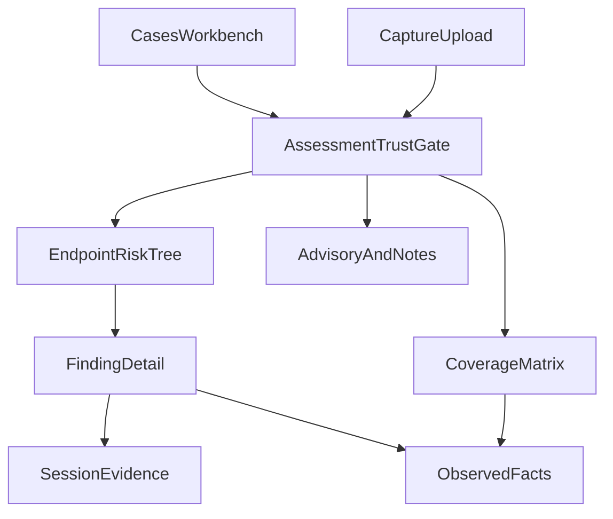

# Analyst-first dashboard implementation

**Status: approved / implemented.** This is a post-Step-11 UI contract based
on [`analyzer.md`](../../analyzer.md). It is intentionally exhaustive: every
analyst question, visualization, semantic constraint, known data gap, and
worked reading in that source is assigned an implementation owner and an
acceptance proof below.

This approved implementation extends the implemented
[dashboard navigation contract](dashboard-navigation-simplification.md); it
does not reopen the analyzer pipeline, policy engine, scoring model, upload
worker, or filesystem control plane.

## 1. Outcome

The dashboard will guide an analyst through this order:

1. confirm the capture, run, and policy identity;
2. decide whether the assessment is complete enough to trust;
3. triage the highest-priority endpoint weaknesses;
4. locate the affected service and contributing sessions;
5. follow each conclusion to canonical facts and packet-frame references;
6. review remediation identifiers, standards, and rationale;
7. inspect passes, unknowns, and not-observable checks separately;
8. review advisory output and human notes without mixing either into findings.

The result is an analyst workbench over the existing
`securemail.report/v1` object. The browser may build presentation-only indexes
and groupings, but it must not parse packets, run policy rules, re-score a
finding, turn a pass into a finding, or change deterministic output.

The phase is complete only when Screens 0–1 and visualizations A–G from
`analyzer.md` are implemented, all acceptance criteria in §13 pass, and the
traceability ledger in §15 has no unimplemented row.

## 2. Scope boundaries

### In scope

- Workbench catalog at `/cases` with the exact triage fields and ordering.
- Trust-first case overview at `/cases/:case_id`.
- Coverage matrix and four-slice coverage summary.
- Endpoint-first risk tree with alternate grouping modes.
- Exact six-component score explanation.
- STARTTLS/STLS session timeline.
- Finding-to-evidence lineage and frame context.
- Certificate chain, path, identity, time, and revocation presentation.
- Separate observed-fact, deterministic, advisory, and analyst-note regions.
- Role-focused presentation presets over the same canonical report.
- Honest UI treatments for passive-capture limitations and report-contract
  gaps.
- Accessibility, reduced-motion, hostile-text, case-isolation, bounded-render,
  unit, API-contract, and Playwright proofs.

### Existing behavior retained

- `/` redirects to `/cases`; unknown frontend routes redirect to `/cases`.
- `/upload` remains the PCAP/PCAPNG intake, stage, cancel, and error workflow.
- A completed upload opens `/cases/{case_id}?run={run_id}`.
- The dark-only shell, logo, Upload capture action, and extensionless SPA
  fallback remain unchanged.
- FastAPI remains a thin wrapper over application use cases. No business logic
  moves into a route.
- Analysis remains Zeek-first and network-disabled inside analyzer containers.
- HTML/PDF downloads continue to render the same canonical object.
- Back to catalog clears report/job query caches so stale case data cannot
  leak.

### Not added by this phase

- No PostgreSQL, queue service, OIDC, multi-user ownership, or new control
  plane.
- No live DNS, AIA, OCSP, CRL, CT, MTA-STS, or other network enrichment.
- No remediation prose generator. The UI shows the shipped
  `remediation_id`, `rationale`, and `standards[]` only.
- No analyst-note write API and no finding disposition workflow. Existing notes
  are read-only; absent capabilities are stated plainly.
- No cross-run diff, trend, or automatic “verify the fix” result.
- No report signing; unavailable signature state remains visible in
  provenance.
- No granular `/findings/{id}` or `/evidence/{id}` API. The report is the query
  boundary.
- No full `AnomalyResult` reconstruction. Advisory cards use only canonical
  `code` and `reason`.
- No policy-profile switch in the browser. A different profile requires a new
  analysis; the UI never recomputes policy.

## 3. Non-negotiable presentation semantics

These are release blockers, not design preferences.

1. Result, confidence (`basis_state` / field `evidence_state`), and visibility
   appear together on findings and referenced facts.
2. `incomplete`, `conflicting`, `indeterminate`, `not_observable`, and policy
   `unknown` use unresolved purple/grey semantics, never pass green.
3. Green is reserved for an individual `PolicyCheck.outcome = pass` based on
   usable evidence. `assessment_state = complete` uses a neutral/cyan badge,
   because complete can include failures.
4. `risk_score` is labelled **Highest endpoint priority (0–100)**. It is never
   called “case risk,” “percent secure,” “health,” “readiness,” or an overall
   mail-system grade.
5. `risk_score = null` renders as **Not proven** or an em dash. It never becomes
   zero, an empty green bar, or a successful state.
6. Coverage always reconciles as:

   ```text
   applicable = passed + failed + unknown + not_observable
   ```

   Non-applicable rules are absent, not passes.
7. Session findings come from `findings[]`; endpoint prioritization comes from
   `posture.prioritized_findings[]`. The UI does not deduplicate again and does
   not drop `contributing_occurrences[]`.
8. Facts and policy conclusions remain visibly distinct. A weak fact such as
   TLS 1.0 is not labelled a finding until the canonical report supplies one.
9. Certificate path and identity are independent. Revocation `unknown` never
   becomes “not revoked.” A TLS 1.3 unobservable certificate is not shown as an
   empty healthy certificate table.
10. `downgrade_consistent` is always accompanied by “Pattern consistent with
    downgrade — not proof of an attacker.”
11. Advisory content carries “Does not change deterministic findings.”
    `ADVISORY_INSUFFICIENT_HISTORY` is not rendered as clear/normal.
12. Analyzer and report strings are hostile. All visible values pass through
    the forensic-text renderer; no string is interpreted as HTML.

The current `AnalystRings` readiness/clear percentages, “case risk” label,
catalog risk progress bar, and certificate-health percentages violate these
semantics and must be removed rather than restyled.

## 4. Current-state gap analysis

| Area | Current implementation | Required change |
|---|---|---|
| Routes, shell, upload | Implemented | Retain and regression-test. |
| Catalog isolation | Implemented | Retain explicit case/run queries and cache clearing. |
| Catalog triage | Partial | Consume existing severity/advisory summary fields; show separate unknown and not-observable counts; add generated-time tie-break; remove average-risk and percentage bar semantics. |
| Trust gate | Partial | Replace the small header badge with an always-visible assessment, risk, coverage, limitation, stage-error, and provenance banner above findings. |
| Evidence semantics | Partial | Remove invented readiness/health percentages and centralize state/outcome visual tokens. |
| Coverage | Partial | Keep four-slice overall donut, correct its caption, add protocol × category matrix and filtered policy-check ledger. |
| Endpoint action queue | Partial flat table | Add endpoint → security domain → finding tree and alternate grouping modes. Keep the table as a secondary searchable view if useful. |
| Score explanation | Missing | Add labelled six-addend bar and arithmetic check. |
| STARTTLS/STLS proof | Missing | Add selected-session terminal-state timeline with evidence frames and downgrade caveat. |
| Finding lineage | Partial | Fix qualified field paths, handle derived references, show occurrences and same-UID record chain. |
| Certificate review | Missing | Add presented chain plus independent path/identity/time/revocation columns and the not-observable state. |
| Four lanes | Implemented as tabs | Preserve the four accessible regions and strengthen labels/copy. |
| Role-focused cuts | Missing | Add presentation presets without changing canonical data or policy. |
| Analyst notes | Read-only | Keep read-only and explain that this build has no write path. |
| Advisory detail | Summary only | Show only canonical code/reason and state that detector detail is not retained. |

## 5. Information architecture and state

The route map does not change. Case detail becomes a progressive workbench:



The existing case tabs may remain, but their responsibilities are fixed:

| Tab | Required content |
|---|---|
| Overview | Trust banner, endpoint-first risk tree, overall coverage, limitations. |
| Findings | Alternate groupings, searchable flat ledger, finding detail drawer. |
| Evidence | Coverage matrix/check ledger, flows, sessions, handshakes, certificates, STARTTLS timeline, lineage targets. |
| Analysis context | Advisory / ML, Analyst conclusions, full provenance. |

### Case-local interaction state

UI state is keyed by
`case_id + analysis_run_id + generated_at`, so state cannot carry between
reports. It contains only:

- trust-gate acknowledgement/collapse;
- selected case tab;
- risk-tree grouping and expanded nodes;
- selected finding/session/handshake/certificate;
- coverage cell and policy-check filters;
- role-focus preset.

It is not persisted to the report, catalog, or server. Changing the route or
receiving a different report identity resets it.

## 6. Data projection and joins

### Source contracts

No new HTTP resource is required. The implementation reads:

- `GET /api/v1/cases` for bounded catalog summaries;
- `GET /api/v1/cases/{case_id}/report` for a catalog report;
- `GET /api/v1/analyses/{run_id}` for job metadata when `?run=` is present;
- `GET /api/v1/analyses/{run_id}/report` for an uploaded report;
- existing HTML/PDF artifact routes.

`frontend/src/core/model.ts` must model every already-published `CaseSummary`
field: `severity_counts`, `advisory_present`, and
`analyst_conclusions_present`, in addition to the currently used fields. The
generated canonical-report types remain generated from the checked-in JSON
Schema and must never be hand-edited.

### Presentation projection

`selectors.ts` builds one memoized, ephemeral `AnalystCaseProjection` from a
validated `CanonicalReport`. It contains:

- trust and provenance display values;
- a zero-filled 4 × 4 coverage matrix;
- endpoint groups with service role, protocols, sessions, and findings;
- security-domain, remediation-family, rule-code, and protocol indexes;
- a UID evidence graph for flow/session/handshake/certificate joins;
- session timelines and certificate chains;
- advisory and note display items.

This projection is not a second domain model and is never serialized. Scores,
outcomes, severities, findings, checks, and counts are copied or grouped, not
recalculated.

### Stable joins

- Flow, session, and handshake records join on `uid`.
- Certificates join to a handshake on `uid`; a certificate reference resolves
  by the canonical composite key
  `uid:role:chain_index:der_sha256` as well as by `uid` for older reports.
- A finding stays grouped under its canonical `affected_endpoint`; the browser
  does not parse that string to recover host/port.
- Protocol comes from the matching `PolicyCheck.protocol`, then a same-UID
  session, otherwise `unclassified`.
- Service role is shown only when a same-UID payload-identified session and
  flow responder port uniquely support one built-in role. Port alone never
  upgrades an unclassified protocol. Ambiguous/missing joins remain
  `unclassified` or `indeterminate`.
- Security domain is a presentation mapping keyed by live rule code and
  remediation family. Unknown future codes go to **Other deterministic
  conclusions**, never disappear.

### Evidence-reference resolution

`evidence_resolver.ts` is fixed before new lineage UI is enabled:

1. Resolve the canonical record key.
2. Accept an unqualified path such as `version.selected` for existing golden
   reports.
3. For live engine paths, strip exactly one prefix only when it matches the
   reference target: `flow.`, `session.`, `handshake.`, or `certificate.`.
4. Resolve known `derived.*` display facts from the same canonical report:
   - `derived.service_role` uses the same-UID session protocol and flow
     responder port;
   - `derived.observed_commands` is the ordered, uppercased list of non-empty
     `session.events[].command` values;
   - `derived.transport_tls_established` is true only for a same-UID established
     handshake or explicit-upgrade state `tls_established`;
   - `derived.forward_secrecy.outcome` follows the fixed TLS-version / key-
     exchange table in `analyzer.md` and returns `indeterminate` when the
     canonical fields cannot support a conclusion.
5. A derived resolver is for displaying the policy input only. It does not run
   a rule or change an outcome. Parity tests compare it with committed policy
   fixtures covering every derived path.
6. Unknown paths remain **Field unavailable**. The raw `field_path`, record key,
   reference state, and any supplied frame stay visible; no value is invented.

If `EvidenceReference.frame_number` is null, the UI says **No direct frame
linked**. Related session events, handshake messages, or certificate source
frames may appear as **record context**, but must not be labelled the exact
finding frame.

### Filename handling

`original_filename` is available only from an analysis job, not from
`CanonicalReport` or the catalog summary. A `?run=` case may show it as escaped
job metadata. A catalog-only case shows **Filename not retained in canonical
report** and still displays case ID, run ID when present, capture ID, and the
source SHA-256. The UI does not infer a filename from an artifact name.

## 7. Screen and visualization implementation

### 7.1 Screen 0 — case workbench

Each catalog row/card shows:

- escaped case ID and optional title;
- generated time;
- assessment state;
- **Highest endpoint priority** as an integer or **Not proven**;
- finding count;
- high, medium, low, and informational severity chips, including zeros;
- separate unknown and not-observable counts;
- advisory-present indicator.

Default order is:

1. non-null `risk_score` descending, with null after scored cases;
2. `unknown_count + not_observable_count` descending;
3. valid `generated_at` descending;
4. `case_id` ascending for deterministic final ordering.

Search and assessment filters remain. Null risk does not feed “urgent” counts,
does not produce a green bar, and is never included in an average. Selecting a
case opens Screen 1; finishing an upload does the same.

### 7.2 Screen 1 — assessment trust gate

The trust banner is above tabs, charts, and findings and remains visible on
every case subview. It contains:

- assessment badge: complete / limited / none;
- **Highest endpoint priority (0–100)** or **Not proven**;
- “N applicable: P passed, F failed, U unknown, O not observable”;
- limitations: truncated capture, incomplete/conflicting flow counts,
  not-observable certificate count, unknown/not-observable check counts, notes,
  and `stage_errors[]`;
- provenance strip: short/copyable capture SHA-256, policy profile, policy pack
  digest, analyzer digest, generated time;
- expandable full provenance: run/configuration/trust-store/renderer/signature
  fields.

When assessment state is limited/none, or any limitation/stage error is
present, the limitations panel opens by default. Findings remain reachable but
use secondary visual emphasis until the analyst chooses **Acknowledge limits
and continue**. Acknowledgement is case-local UI state and does not assert that
the limitation is resolved.

### 7.3 Visualization A — coverage matrix

Render four protocol rows (`smtp`, `imap`, `pop3`, `unclassified`) and four
category columns (`transport`, `mail_protocol`, `tls_handshake`,
`certificate`). Missing map entries become an explicit zero-count cell, not a
pass.

Each cell exposes pass, fail, unknown, and not-observable counts with text and
colour/pattern. Selecting a cell opens or filters a policy-check ledger using
`policy_checks[]`. The ledger shows code, title, endpoint, record type/key,
protocol, category, outcome, and evidence state. Passes live here only; they do
not appear in the finding tree.

The companion donut uses exactly four slices. Its centre shows applicable
count, not a health percentage. A text alternative repeats all four counts and
the reconciliation equation.

### 7.4 Visualization B — endpoint-first risk tree

Default hierarchy:

```text
Endpoint
└── service role + protocol
    └── security domain
        └── prioritized finding, score descending
```

Endpoint nodes show endpoint, service role, protocol, session count, TLS versus
cleartext session counts, highest score, and unresolved-check count. Finding
rows show code, title, severity, outcome, score, basis state, and unique
occurrences.

The fixed security domains are:

1. Cleartext and credential exposure
2. STARTTLS / STLS upgrade integrity
3. TLS protocol version
4. Cipher suite strength
5. Key exchange and forward secrecy
6. Handshake signatures
7. Certificate keys, signatures, validity, path, and identity
8. Other deterministic conclusions

The mapping covers every rule ID in all three checked-in policy packs. A test
fails when a newly shipped rule lacks an intentional mapping. Runtime fallback
still prevents an unknown code from disappearing.

Alternate grouping modes are endpoint, remediation family, rule code, and
protocol. Changing the grouping changes presentation only. Within every leaf,
use canonical ordering: score descending, negative before indeterminate,
severity descending, code, endpoint.

### 7.5 Visualizations C and E — finding detail

The finding drawer becomes a responsive two-column view.

**Judgment column**

- code, title, outcome, severity, score, basis/evaluation states;
- endpoint, protocol, policy profile, pack digest, and rule effective dates;
- six-part stacked score bar with labelled points for severity, confidence,
  exposure, recurrence, asset criticality, and blast radius;
- visible arithmetic and a defensive assertion that
  `min(100, sum(components))` equals canonical `score`;
- recurrence count, unique occurrences, and every contributing session UID;
- rationale, `remediation_id`, and `standards[]` together.

**Evidence column**

- every `evidence_references[]` entry;
- record type/key, field path, evidence state, frame number, resolved value,
  and resolution status;
- related record context clearly distinguished from a direct frame reference;
- a same-UID lineage strip:
  Capture → Flow → Session → Handshake → Certificate → Finding;
- each node coloured by evidence state, never merely by finding presence;
- occurrence links that open the selected session evidence pane.

If the score components do not reconcile, render the canonical score and a
neutral **Component data inconsistent** warning; never repair the score in the
browser.

### 7.6 Visualization D — STARTTLS/STLS timeline

For a selected session, show the canonical progression:

```text
advertised → requested → accepted → tls_established
                              ↘ plaintext_fallback
                              ↘ violation
```

Highlight the canonical terminal `ExplicitUpgrade.state`. Attach
`evidence_frames[]` to that state, and list matching protocol events in frame
order. Prior steps are structural context unless a canonical event supports
them; they are not independently labelled observed.

The pane also shows protocol, payload evidence, port hint, corroboration,
identification confidence, implicit-TLS correlation, and session evidence
state. If there is no explicit upgrade, say **No explicit upgrade state was
recorded** rather than showing a successful path.

### 7.7 Visualization F — certificate chain and identity

For a selected handshake, group presented certificates by UID and order them
by `chain_index`, server leaf first. The display calls this the **presented
chain**; it does not invent missing issuers or a validated path.

The leaf view has independent columns for:

- path validity at capture and analysis, including reason codes;
- identity match, reference identity/source, mismatch and indeterminate
  reasons;
- validity at capture versus analysis and expiry warning;
- key algorithm/size/curve/effective strength;
- certificate signature algorithm, clearly separate from handshake
  `CertificateVerify`;
- revocation status, with `unknown` shown explicitly.

Syntax errors and incomplete chain indexes are visible. If
`server_certificate_state = not_observable`, render a grey unresolved
certificate state with the copy “Not observable (typical for TLS 1.3 without
authorized secrets)” and do not show a zero-issue/healthy summary.

### 7.8 Observed-fact explorer

Observed Facts remains a dedicated accessible region and exposes bounded
records rather than health summaries:

- capture preflight and run identity;
- flows with endpoints, reconstruction quality, reason, gaps, conflicts, and
  observed noise conditions;
- sessions with payload identity, port hint, correlation, command/reply events,
  frames, and upgrade state;
- handshakes with visibility, establishment/resumption/HRR/alert, version,
  cipher, key exchange, signature, certificate states, and messages;
- certificates with all fields listed in §7.6 of `analyzer.md`.

Existing topology/heatmap components may remain only as secondary navigation
if their cells are state-based and their labels do not claim “healthy,”
“clear,” or “secure.” Raw record tables/details remain available for keyboard
and screen-reader users.

### 7.9 Visualization G — advisory and analyst notes

Render four unmistakable region labels across the case experience:

1. Observed Facts
2. Deterministic Conclusions
3. Advisory / ML
4. Analyst Conclusions

Advisory uses a dashed/purple treatment and always shows **Does not change
deterministic findings**. Only canonical code and reason are rendered.
`ADVISORY_INSUFFICIENT_HISTORY` says baseline not ready;
`ADVISORY_NONE` is shown as no detected advisory only when the report actually
contains it.

Analyst conclusions are escaped, read-only report content. When absent, show
**No analyst conclusions were published. This dashboard does not currently
provide a notes write path.** Never auto-fill a sign-off.

### 7.10 Role-focused cuts

A **View focus** control changes the initially expanded area without hiding
data:

| Focus | Initial expansion |
|---|---|
| Standard | Trust gate → endpoint tree |
| Incident / IR | Trust gate → high-severity credential/version/upgrade findings |
| Mail-platform owner | Findings grouped by remediation family |
| Protocol engineer | Coverage matrix → STARTTLS timeline → handshake messages |
| PKI reviewer | Certificate chain → `CERT_*` findings |
| Historical auditor | Policy provenance and historical rule labels |

If the active report is not `historical_at_capture`, Historical auditor focus
shows **A new analysis with historical_at_capture is required** and links to
the upload workflow. It does not switch the report profile or run policy in the
browser.

## 8. Security-domain and remediation mappings

Presentation mappings live in one typed table, not scattered conditionals.
They cover the taxonomy in `analyzer.md` and are validated against the live
policy packs.

| Domain | Rule families |
|---|---|
| Cleartext / credentials | `IMAP_LOGIN_WITHOUT_TLS`, `POP3_PASS_WITHOUT_TLS`, `MAIL_SUBMISSION_CLEARTEXT`, `MAIL_ACCESS_CLEARTEXT` |
| Upgrade integrity | `UPGRADE_ACCEPTED_WITHOUT_TLS_TRANSITION`, `UPGRADE_PLAINTEXT_FALLBACK` |
| TLS version | `TLS_NEGOTIATED_*`, including historical `*_DISCOURAGED` |
| Cipher strength | `TLS_CIPHER_*`, `NIST_TLS_SUITE_NOT_APPROVED` |
| Key exchange / FS | `TLS12_*`, `TLS_FORWARD_SECRECY_*` except handshake signature rules |
| Handshake signatures | `TLS_HANDSHAKE_SIGNATURE_*` |
| Certificates | `CERT_*` |

Remediation group labels come from the stable prefix only:

- `tls.*` — protocol/cipher/key-exchange observation and configuration;
- `pki.*` — certificate key/signature/path/identity work;
- `mail.*` — transport requirement and upgrade behavior;
- `imap.*` / `pop3.*` — protocol-specific cleartext authentication.

The UI does not label NIST non-approval as general cryptographic weakness and
does not turn historical `SHOULD NOT` findings into current `MUST NOT` copy.
Canonical title, rationale, standard, profile, and effective dates remain
visible together.

## 9. Honest handling of passive-evidence limits

The following display copy is required when applicable:

| Condition | Dashboard treatment |
|---|---|
| Unseen server capability | “Not observed in this capture”; never pass. |
| TLS 1.3 certificate/signature unavailable | Not-observable unresolved card. |
| Revocation lacks imported evidence | `unknown`; never “not revoked.” |
| No SNI/configured identity | Identity not assessed; show indeterminate reason. |
| CN-only certificate | Show SAN-only RFC 9525 result; no CN fallback. |
| PSK-only TLS 1.3 | Forward secrecy indeterminate. |
| Truncated/incomplete/conflicting capture | Open trust gate; no secure conclusion. |
| Unknown inventory context | Show exposure/criticality/blast radius `unknown` and their explicit score addends. |
| First-capture advisory | Insufficient history, not “no anomaly.” |
| Downgrade-looking sequence | Consistent pattern, no attacker attribution. |
| Non-standard implicit TLS without correlation | Not observable/indeterminate, never inferred from port alone. |
| Report signature unavailable | Provenance states unavailable. |

The dashboard does not claim overall system security, unseen configuration
security, SPF/DKIM/DMARC health, phishing/malware/account health, legal
attestation, ephemeral-key reuse, or ticket rotation.

## 10. File-level implementation plan

| Path | Responsibility |
|---|---|
| `frontend/src/core/model.ts` | Complete the existing `CaseSummary` interface and guards. |
| `frontend/src/core/selectors.ts` | Build trust, coverage, endpoint, domain, role, timeline, certificate, and role-focus projections; no policy/scoring changes. |
| `frontend/src/core/evidence_resolver.ts` | Qualified paths, derived display facts, UID graph, direct-vs-context frame status. |
| `frontend/src/core/forensic_text.ts` | Continue the single hostile-text presentation boundary. |
| `frontend/src/pages/catalog_page.tsx` | Workbench row fields, exact ordering, null-risk treatment. |
| `frontend/src/pages/case_page.tsx` | Fetch job metadata for `?run=`, preserve cache isolation, key local state by report identity. |
| `frontend/src/components/case_view.tsx` | Trust-first composition and four-region navigation. |
| `frontend/src/components/trust_banner.tsx` | Assessment, limitation, stage-error, and provenance gate. |
| `frontend/src/components/coverage_matrix.tsx` | 4 × 4 matrix, four-slice summary, policy-check filtering. |
| `frontend/src/components/risk_tree.tsx` | Endpoint-first and alternate finding groupings. |
| `frontend/src/components/score_components.tsx` | Six-addend score bar and reconciliation warning. |
| `frontend/src/components/finding_details.tsx` | Two-column judgment/evidence drawer, occurrences, standards/remediation. |
| `frontend/src/components/evidence_lineage.tsx` | Same-UID evidence chain and frame context. |
| `frontend/src/components/session_timeline.tsx` | STARTTLS/STLS and implicit-TLS session evidence. |
| `frontend/src/components/certificate_chain.tsx` | Presented chain and independent validation columns. |
| `frontend/src/components/charts.tsx` | Retain only semantically valid severity/coverage/inventory charts. |
| `frontend/src/components/analyst_rings.tsx` | Delete after callers/tests are migrated. |
| `frontend/src/components/evidence_bento.tsx` | Remove health percentages or replace with literal fact counts/states. |
| `frontend/src/components/evidence_heatmap.tsx` | Keep only state-based record navigation; remove inferred health. |
| `frontend/src/styles.css` | Central state/outcome tokens, responsive tree/drawer/matrix, forced-colour and reduced-motion support. |
| `frontend/src/test/report_fixture.ts` | Minimal unit fixtures for all states and interactions. |
| `tests/fixtures/dashboard/assemble.py` | Contract-first dashboard cases assembled from committed canonical fixtures. |
| `tests/e2e/dashboard.spec.ts` | End-to-end analyst journeys and semantic regressions. |

No source file under `src/securemail/domain/`, analyzer, policy, scoring, or
report assembly is changed by default. If implementation discovers that a
canonical value cannot be displayed without duplicating domain judgment, stop
and amend/approve this proposal before changing the report schema.

## 11. Implementation sequence

### Phase 0 — contract and fixture first

Add failing selector/component/Playwright contracts and dashboard reports for:

- complete assessment with prioritized weaknesses;
- limited assessment with no findings and null risk;
- no applicable checks (`assessment_state = none`);
- cleartext credentials with repeated sessions;
- accepted upgrade without TLS, plaintext fallback, and downgrade-consistent
  copy;
- TLS 1.0 and TLS 1.3 certificate-not-observable cases;
- multi-certificate chain with independent path/identity outcomes;
- pass/fail/unknown/not-observable coverage across multiple cells;
- insufficient-history advisory, no advisory section, and analyst notes;
- qualified and unqualified evidence paths, every `derived.*` path, null frame,
  and hostile strings.

Use committed PCAP/evidence/report fixtures as sources. Do not regenerate or
edit evidential PCAP files for a dashboard-only phase.

### Phase 1 — projection and resolver

Complete catalog types; implement the UID evidence graph, stable joins,
security-domain mapping, grouping selectors, role projection, coverage
zero-fill, timeline projection, certificate-chain projection, qualified path
resolution, and derived display facts. Finish unit tests before component work.

### Phase 2 — workbench and trust gate

Implement Screen 0 ordering/fields and Screen 1 persistent trust banner.
Remove risk-as-percentage, average risk, green complete-state, and readiness
semantics.

### Phase 3 — coverage and action queue

Implement the matrix/check ledger, four-slice summary, endpoint tree, alternate
groupings, and role-focus presets. Keep findings visible but secondary while an
unacknowledged limited/none trust gate is open.

### Phase 4 — proof and remediation

Implement score components, two-column finding detail, occurrences, direct
references, same-UID lineage, STARTTLS timeline, and presented certificate
chain.

### Phase 5 — facts, context, and hardening

Finish the bounded fact explorer, advisory/notes copy, provenance detail,
responsive behavior, keyboard behavior, screen-reader alternatives, forced
colours, reduced motion, hostile-text tests, and render bounds.

### Phase 6 — integration and documentation

Run the full proof set, update live docs to describe only implemented behavior,
remove the evidence-resolver item from known limitations only after its live
fixture proof passes, and archive this contract under `plans/completed/` when
all exit criteria are met.

## 12. Boundedness, accessibility, and security

- Derive every view from the already bounded canonical report. Do not add an
  unbounded fetch or render raw packet payloads.
- Paginate or virtualize long finding/check/record ledgers. Initial render is
  capped per existing schema limits; no component recursively expands the full
  evidence tree by default.
- Every visualization has a textual table/list alternative containing the same
  values.
- Trees, tabs, drawers, filters, and timelines are fully keyboard reachable
  with visible focus, correct roles/names, and predictable Escape behavior.
- Colour is never the only carrier of state. Labels and, where useful, patterns
  distinguish pass/fail/unknown/not-observable.
- WCAG AA contrast and `prefers-reduced-motion` remain acceptance requirements.
- Copy/full-hash controls copy plain canonical text without executing or
  interpreting it.
- Long identifiers and hostile bidi/control characters cannot overlap, escape
  cards, create elements, or alter reading order.
- The coverage summary has a labelled CSS donut plus a textual four-outcome
  alternative; it has no health or readiness meaning. Motion is disabled under
  reduced-motion preferences.
- No component logs report objects, protocol text, credentials, packet payloads,
  or certificate identifiers to the console.

## 13. Acceptance criteria

| ID | Proof |
|---|---|
| AD-01 | Routes, upload/progress/cancel/downloads, dark shell, SPA fallback, and API routes retain existing tests. |
| AD-02 | Catalog shows every `CaseSummary` field required by §7.1 and sorts by score → unresolved count → generated time → case ID. Null risk says Not proven and has no green/percentage encoding. |
| AD-03 | Every case subview starts with the trust banner. Limited/none opens limitations and requires an explicit local acknowledgement before findings receive primary emphasis. |
| AD-04 | A semantic-token test proves unresolved states/checks never receive the pass token; complete assessment is not pass green. |
| AD-05 | Coverage matrix renders all 16 cells, zero-fills absent slices, reconciles overall counts, and filters the policy-check ledger on selection. Donut/text alternative have four outcomes. |
| AD-06 | Default risk tree is endpoint → domain → score. All live policy rule IDs map intentionally; alternate remediation/code/protocol groupings preserve the same finding IDs and order. |
| AD-07 | Finding detail displays all six canonical addends, their sum/cap relationship, score meaning, unique occurrences, contributing occurrences, and unknown inventory labels. |
| AD-08 | STARTTLS success/fallback/violation/no-upgrade fixtures render the correct terminal state and frames; downgrade copy explicitly rejects attribution. |
| AD-09 | Qualified, unqualified, certificate-composite, and derived references resolve in unit tests. Unknown paths and null frames remain explicit. Live analyze-produced fixture paths no longer show false `dangling_field`. |
| AD-10 | Certificate fixture proves presented ordering; separate path/identity/time/revocation columns; TLS 1.3 not-observable fixture shows unresolved silhouette/copy and no healthy claim. |
| AD-11 | Four accessible labelled regions remain separate. Advisory includes the non-authoritative badge; absent notes explain the missing write path. |
| AD-12 | Each role-focus preset opens the specified section without filtering out data. Historical focus never changes policy in-browser. |
| AD-13 | Hostile HTML, C0/C1, bidi, long hashes/names, narrow viewport, forced colours, keyboard-only, screen-reader labels, and reduced motion pass component/Playwright tests. |
| AD-14 | Catalog → case A → case B → catalog and failed upload flows show no stale data; report-identity change resets local selections and acknowledgement. |
| AD-15 | Selectors never alter canonical findings/checks/scores. A deep-freeze test proves input reports are not mutated. ML presence/absence leaves deterministic finding bytes unchanged. |
| AD-16 | Every limitation in §9 and every contract gap in §2 has explicit UI copy or an explicit non-goal test; none is represented as success. |
| AD-17 | `make lint`, `make test`, `make frontend-build`, `make e2e`, and `make docs-check` pass. Live docs and known-limitations entries match the completed code. |

## 14. Test and release evidence

### Frontend unit/component tests

- `frontend/src/core/selectors.test.ts`
  - catalog ordering;
  - coverage reconciliation/zero-fill;
  - UID joins and service roles;
  - every security-domain mapping;
  - canonical finding ordering and grouping conservation;
  - score-component consistency;
  - session/certificate projections;
  - no input mutation.
- `frontend/src/core/evidence_resolver.test.ts`
  - qualified/unqualified paths;
  - certificate keys;
  - all four derived facts;
  - dangling record/field and null-frame behavior.
- Focused component tests for trust gate, matrix, risk tree, score bar,
  timeline, lineage, and certificate chain.
- `frontend/src/App.test.tsx` for routes, four regions, role focus, report-
  identity reset, and no-case isolation.

### API/fixture tests

- `tests/unit/test_report_queries.py` continues to prove all catalog summary
  fields and bounded report parsing.
- `tests/test_report_api.py` continues to prove catalog/CLI canonical identity
  and explicit case isolation.
- `tests/unit/test_dashboard_fixture_dataset.py` validates each dashboard case,
  its expected scenario tags, and catalog entries.

### Playwright journeys

1. Workbench filters and opens the default highest-priority case.
2. Limited/no-finding case says Not proven, opens limitations, and never
   congratulates the analyst.
3. Finding → score → occurrence → evidence reference → session/frame.
4. Coverage cell → exact policy-check subset.
5. STARTTLS violation/downgrade and TLS 1.3 certificate-not-observable paths.
6. PKI reviewer focus opens chain and preserves path/identity independence.
7. Advisory and notes remain outside deterministic findings.
8. Hostile text, keyboard operation, reduced motion, mobile layout, and case
   isolation.
9. PCAP upload reaches the same trust-first case view and keeps artifact links.

## 15. `analyzer.md` traceability ledger

| Source section | Implementation | Acceptance |
|---|---|---|
| §1 answer boundary | Trust copy, scope copy, null-risk behavior | AD-03, AD-16 |
| §2 four lanes | Four labelled regions and separate data owners | AD-11, AD-15 |
| §3 evidence states | Central semantic tokens and state labels | AD-04 |
| §4 analyst journey | Screens 0–1 and progressive workbench | AD-02, AD-03 |
| §5 primary tree | Endpoint/domain/finding tree plus lineage | AD-06, AD-09 |
| §6 fact → check → finding → posture | Projection-only selectors; no recomputation | AD-05, AD-15 |
| §7.1 capture/run | Trust and provenance banner | AD-03 |
| §7.2 flows | Fact explorer and lineage flow node | AD-09, AD-13 |
| §7.3 sessions | Session facts and payload/port separation | AD-08, AD-16 |
| §7.4 upgrades/implicit TLS | Session timeline and honest correlation | AD-08 |
| §7.5 handshake/FS | Handshake facts, messages, derived display resolver | AD-09 |
| §7.6 certificates | Presented chain and independent validation | AD-10 |
| §7.7 checks/coverage | Matrix, ledger, trust assessment | AD-03, AD-05 |
| §8 taxonomy/remediation | Typed domain and remediation mappings | AD-06 |
| §9 scoring | Exact component bar and priority wording | AD-07 |
| §10.1 visual semantics | Token contract and removal of health/readiness UI | AD-04 |
| §10.2 workbench | Catalog implementation | AD-02 |
| §10.3 overview | Trust gate | AD-03 |
| §10.4 coverage | Matrix and donut | AD-05 |
| §10.5 risk tree | Default and alternate groupings | AD-06 |
| §10.6 score bar | Six addends | AD-07 |
| §10.7 STARTTLS | Session timeline | AD-08 |
| §10.8 lineage | Two-column detail and UID chain | AD-09 |
| §10.9 certificates | Chain/path/identity/not-observable UI | AD-10 |
| §10.10 advisory/notes | Separate regions and authority copy | AD-11 |
| §10.11 role cuts | View-focus presets | AD-12 |
| §11 passive limits | Required limitation treatments | AD-16 |
| §12 contract gaps | Explicit non-goals/unavailable states | AD-16 |
| §13 worked readings | Dedicated fixtures and Playwright copy assertions | AD-02, AD-03, AD-08, AD-11 |
| §14 field map | Source-contract and join specification | AD-09, AD-15 |
| §15 operating rule | Overall exit criterion; no traceability gaps | AD-17 |

## 16. Exit criteria

This proposal may be marked completed only when:

- AD-01 through AD-17 pass;
- every row in §15 is implemented and linked to a test;
- no current readiness/health percentage remains unless it is an exact,
  labelled ratio of canonical counts with unknown/not-observable preserved;
- the live dashboard resolves analyze-produced evidence paths;
- all supported `analyzer.md` surfaces are available without a new backend
  control plane or browser-side policy evaluation;
- unavailable product capabilities remain explicit rather than simulated;
- `docs/user-guide/dashboard-workflows.md`,
  `docs/architecture/frontend-data-flow.md`,
  `docs/development/frontend-development.md`,
  `docs/development/testing.md`, and
  `docs/status/known-limitations.md` describe the implemented result;
- this file is moved to `plans/completed/` and the proposal indexes are updated.

## Related pages

- [Analyst evidence and risk tree](../../analyzer.md)
- [Dashboard navigation simplification](dashboard-navigation-simplification.md)
- [Capture-upload dashboard contract](../completed/capture-dashboard.md)
- [Frontend data flow](../../docs/architecture/frontend-data-flow.md)
- [Dashboard workflows](../../docs/user-guide/dashboard-workflows.md)
- [Known limitations](../../docs/status/known-limitations.md)

## Implementation anchors

- `frontend/src/pages/catalog_page.tsx`
- `frontend/src/components/case_view.tsx`
- `frontend/src/core/selectors.ts`
- `frontend/src/core/evidence_resolver.ts`
- `tests/fixtures/dashboard/assemble.py`
- `tests/e2e/dashboard.spec.ts`

## Test evidence

- Planned acceptance criteria AD-01 through AD-17 in §13
- Planned unit/component/API/Playwright coverage in §14
